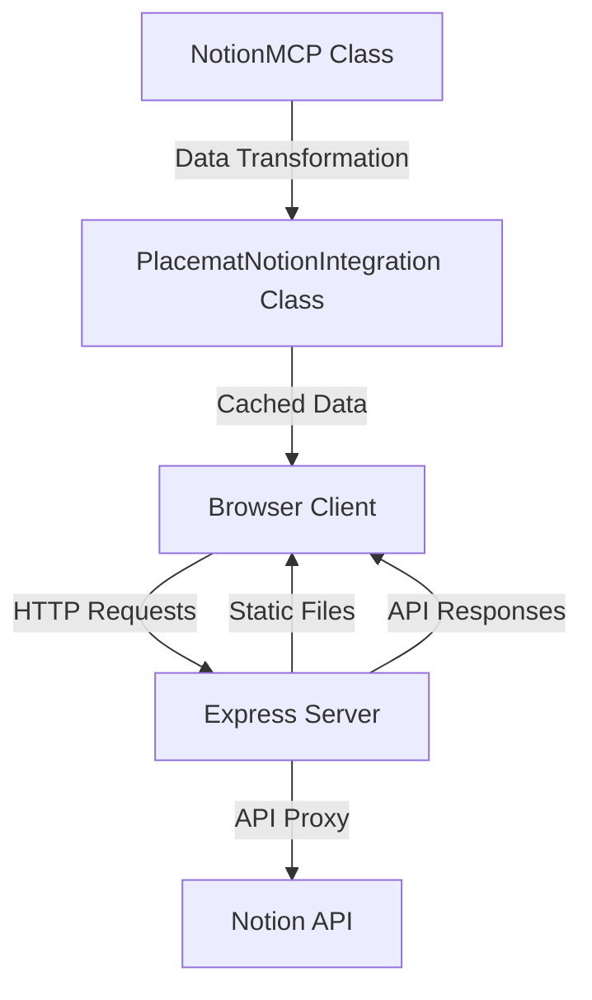

# Design Document: ACT Placemat Notion Integration

## Overview

The ACT Placemat Notion Integration feature will enhance the existing application by implementing a robust, reliable connection between the web interface and Notion databases. This design document outlines the architecture, components, data models, and implementation strategy for creating a seamless integration that meets all the requirements specified in the requirements document.

The integration will follow the Model Context Protocol (MCP) pattern, providing a standardized way to interact with Notion data while ensuring proper error handling, caching, and fallback mechanisms. The design prioritizes reliability, performance, and user experience while maintaining the simplicity of the single-file architecture that characterizes the ACT Placemat application.

## Architecture

### High-Level Architecture



### System Components

1. **Frontend (Single-File HTML/CSS/JS)**
   - User interface for displaying and interacting with project data
   - Progressive enhancement approach for core functionality without JavaScript
   - Client-side filtering and data manipulation
   - Responsive design for mobile and desktop

2. **Backend (Express.js Server)**
   - API proxy for secure Notion communication
   - Environment configuration management
   - Static file serving
   - Health check endpoints

3. **Notion Integration Layer**
   - `NotionMCP` class for direct Notion API interaction
   - `PlacematNotionIntegration` class for application-specific data handling
   - Caching mechanism for performance optimization
   - Mock data fallback for development and error scenarios

4. **Data Flow**
   - Initial load: Client requests data → Server proxies to Notion → Transform response → Cache → Display
   - Refresh: User triggers refresh → Clear cache → Fetch new data → Update UI
   - Auto-update: Background timer → Check for changes → Notify user if updates available

## Components and Interfaces

### 1. NotionMCP Class

The core class responsible for direct interaction with the Notion API.

```javascript
class NotionMCP {
  constructor(config = {}) {
    // Initialize with token, API version, database IDs
  }
  
  // Core API methods
  async queryDatabase(databaseId, filters = {}, sorts = []) {}
  
  // Data fetching methods
  async fetchProjects() {}
  async fetchOpportunities() {}
  async fetchOrganizations() {}
  async fetchPeople() {}
  async fetchArtifacts() {}
  
  // Response parsing methods
  parseNotionResponse(response, entityType) {}
  parseNotionProject(page) {}
  
  // Helper methods for property extraction
  extractText(property) {}
  extractSelect(property) {}
  extractMultiSelect(property) {}
  // ...other extraction methods
}
```

### 2. PlacematNotionIntegration Class

Application-specific wrapper around NotionMCP with caching and convenience methods.

```javascript
class PlacematNotionIntegration {
  constructor(config = {}) {
    this.notion = new NotionMCP(config);
    this.cache = new Map();
    this.cacheTimeout = 5 * 60 * 1000; // 5 minutes
  }
  
  // Data access with caching
  async getProjects(useCache = true) {}
  async getOpportunities(useCache = true) {}
  async getAllData(useCache = true) {}
  
  // Cache management
  async refreshProjects() {}
  async refreshAll() {}
  
  // Auto-refresh functionality
  setupAutoRefresh(callback, interval = 5 * 60 * 1000) {}
}
```

### 3. Express Server API

```javascript
// Notion API proxy endpoint
app.post('/api/notion/query', async (req, res) => {
  // Handle Notion API requests securely
})

// Health check endpoint
app.get('/api/health', (req, res) => {
  // Return server and configuration status
})
```

### 4. Frontend Components

```javascript
// UI Components
const AreaCards = {
  render: (areas, onSelect) => { /* Render area selection cards */ }
};

const ProjectList = {
  render: (projects, filters) => { /* Render filtered project list */ }
};

const FilterPanel = {
  render: (filters, onChange) => { /* Render filter controls */ }
};

const NotificationSystem = {
  show: (message, type) => { /* Display notifications to user */ }
};
```

## Data Models

### Project Object

```javascript
{
  id: string,              // Notion page ID
  name: string,            // Project title
  area: string,            // One of 5 main areas
  description: string,     // Project description
  status: string,          // Active, Building, Harvest
  funding: string,         // Funded, Needs Funding, etc.
  lead: string,            // Project leader/organization
  beneficiaries: string,   // Who benefits from project
  practices: array,        // How the work is done
  tests: array,            // Specific experiments
  stories: string,         // Community stories available
  tags: array,             // Project tags/categories
  lastModified: string     // ISO timestamp
}
```

### Area Mapping

```javascript
const areaMapping = {
  'Story & Sovereignty': 'story-sovereignty',
  'Economic Freedom': 'economic-freedom',
  'Community Engagement': 'community-engagement',
  'Operations & Infrastructure': 'operations-infrastructure',
  'Research & Development': 'research-development'
};
```

### Filter State

```javascript
{
  area: string | null,     // Selected area
  status: string | null,   // Project status filter
  funding: string | null,  // Funding status filter
  search: string,          // Search text
  tags: array              // Selected tags
}
```

### Cache Structure

```javascript
Map<string, {
  data: any,              // Cached data
  timestamp: number       // When the data was cached
}>
```

## Error Handling

1. **API Connection Errors**
   - Implement retry mechanism with exponential backoff
   - Fall back to cached data when available
   - Display user-friendly error messages
   - Log detailed errors for debugging

2. **Data Parsing Errors**
   - Implement robust property extraction with fallbacks
   - Handle missing or malformed data gracefully
   - Provide default values for critical fields

3. **Configuration Errors**
   - Validate environment variables on startup
   - Provide clear setup instructions for missing configuration
   - Fall back to mock data for development environments

4. **Network Connectivity Issues**
   - Detect offline status and notify user
   - Queue updates for when connectivity is restored
   - Optimize for intermittent connections on mobile devices

## Testing Strategy

1. **Unit Testing**
   - Test property extraction methods with various Notion response formats
   - Test caching mechanism functionality
   - Test filter and search logic

2. **Integration Testing**
   - Test API proxy with mock Notion responses
   - Test error handling and fallback mechanisms
   - Test auto-refresh functionality

3. **End-to-End Testing**
   - Test complete data flow from Notion to UI
   - Test responsive design across device sizes
   - Test offline functionality and recovery

4. **Performance Testing**
   - Measure load times with various dataset sizes
   - Test caching effectiveness
   - Optimize for mobile network conditions

## Implementation Considerations

### Progressive Enhancement

The application will follow a progressive enhancement approach:
1. Basic HTML structure loads first
2. CSS styling applies for visual layout
3. JavaScript enhances with interactive features
4. Notion data loads asynchronously

This ensures that users can see and interact with the basic interface even before all data is loaded or if JavaScript fails.

### Mobile Optimization

1. Responsive design using CSS Grid and Flexbox
2. Touch-friendly UI elements with appropriate sizing
3. Reduced data transfer for mobile connections
4. Optimized rendering for smaller screens

### Security Considerations

1. Notion API token stored only in server environment variables
2. All Notion API requests proxied through server
3. Input validation for all user-provided filter parameters
4. CORS configuration to prevent unauthorized access

### Caching Strategy

1. In-memory cache with 5-minute expiration
2. Cache invalidation on manual refresh
3. Background polling for updates
4. Separate cache entries for different data types

## Design Decisions and Rationales

### Single-File Frontend Architecture

The ACT Placemat uses a single-file architecture (HTML, CSS, and JavaScript in one file) for simplicity and ease of deployment. This design maintains that approach while enhancing the Notion integration capabilities.

**Rationale:** This approach minimizes HTTP requests, simplifies deployment, and makes the codebase more accessible to community contributors who may not be familiar with complex build systems.

### Server-Side Notion API Proxy

All Notion API requests are proxied through the Express server rather than made directly from the client.

**Rationale:** This approach keeps the Notion API token secure (server-side only), provides a consistent interface for the client, and allows for additional processing, error handling, and caching on the server.

### Caching with Time-Based Expiration

Data is cached with a 5-minute expiration to balance freshness with performance.

**Rationale:** This reduces load on both the client and the Notion API while ensuring users see reasonably up-to-date information. The manual refresh option allows users to get the latest data when needed.

### Mock Data Fallback

The system includes mock data that can be used when Notion is unavailable or during development.

**Rationale:** This ensures the application remains functional even when Notion is down or not configured, improving reliability and developer experience.

### Progressive Disclosure UI

The interface uses a progressive disclosure pattern, showing area cards first and then revealing projects when an area is selected.

**Rationale:** This approach simplifies the initial user experience, reduces cognitive load, and improves performance by loading and rendering only the necessary data.