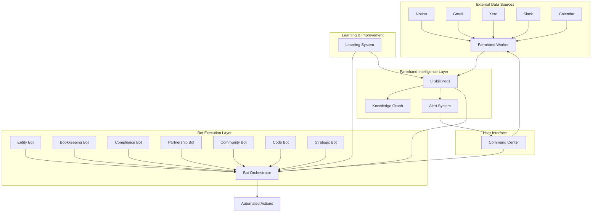

# ACT Ecosystem Integration Analysis
## How Farmhand Agents & Universal Bot Platform Work Together

### 🌾 Current System Overview

ACT has built two complementary AI systems that work together as a unified ecosystem:

## 1. **ACT Farmhand Agents** (Strategic Intelligence Layer)
**Purpose**: Always-on intelligence engine that cultivates knowledge and drives strategic action

**Architecture**:
- 8 specialized Skill Pods with distinct capabilities
- Real-time data pipeline processing (Kafka + Redis)
- Knowledge graph integration
- Weekly intelligence sprints
- Alignment with ACT's values and "Farm" metaphor

**Skill Pods**:
1. **DNA Guardian** - Values alignment checking
2. **Knowledge Librarian** - Information indexing/retrieval  
3. **Compliance Sentry** - Deadline/obligation tracking
4. **Finance Copilot** - Budget/cash flow monitoring
5. **Opportunity Scout** - Grant/partner finding
6. **Story Weaver** - Theme extraction/narratives
7. **Systems Seeder** - Governance/workflow improvement
8. **Impact Analyst** - Field impact to systemic change

## 2. **Universal Bot Platform** (Operational Execution Layer)  
**Purpose**: "The bot to end all bots" - automated business operations

**7 Specialized Bots**:
1. **Entity Setup Bot** - Business registration
2. **Bookkeeping Bot** - Xero integration
3. **Compliance Bot** - GST/BAS/payroll
4. **Partnership Bot** - 142+ connection management
5. **Community Impact Bot** - Story collection
6. **Code & Documentation Bot** - Development automation
7. **Strategic Intelligence Bot** - Market opportunities

**Infrastructure**:
- Bot Orchestrator for coordination
- Command Center with natural language interface
- Real-time dashboard monitoring
- Machine learning system for continuous improvement
- Community ownership (40% benefit rule)

---

## 🔄 Integration Architecture

### Data Flow & Communication



### How They Work Together

1. **Data Ingestion**: Farmhand Worker processes real-time streams from Notion, Gmail, Xero, etc.

2. **Intelligence Processing**: Skill Pods analyze data for patterns, opportunities, and alignment

3. **Action Orchestration**: Bot Orchestrator receives insights and triggers appropriate bots

4. **Execution**: Specialized bots perform automated actions (invoicing, compliance, etc.)

5. **Learning Loop**: Learning system captures outcomes and improves both layers

6. **User Interface**: Command Center provides unified control and monitoring

---

## 🎯 User Experience Journey

### Morning Dashboard Check
```
User opens Command Center → 
See overnight Farmhand alerts → 
Review bot activities → 
Approve/modify suggested actions →
Monitor execution progress
```

### Grant Opportunity Flow
```
Gmail receives grant notification →
Farmhand Opportunity Scout identifies fit →
Alert sent to Command Center →
Strategic Intelligence Bot researches details →
User reviews and approves application →
Compliance Bot tracks deadlines →
Code Bot generates application documents
```

### Partnership Management Flow  
```
Notion partnership data updates →
Knowledge Librarian indexes relationships →
Partnership Bot identifies engagement opportunities →
Community Impact Bot tracks story potential →
Systems Seeder suggests workflow improvements
```

---

## 🚀 Testing & Iteration Strategy

### Phase 1: Core Integration Testing (Weeks 1-4)
- **Test Data Pipeline**: Verify Farmhand→Bot communication
- **Validate Learning**: Confirm ML system improves performance  
- **Check Alignment**: Ensure DNA Guardian catches misalignments
- **Monitor Performance**: Track response times and success rates

**Success Metrics**:
- 95%+ data processing success rate
- Sub-2-second response times
- Zero values alignment violations
- 10%+ efficiency improvement per week

### Phase 2: Business Process Automation (Weeks 5-8)
- **Automate Monthly BAS**: End-to-end compliance workflow
- **Grant Application Pipeline**: Opportunity identification to submission
- **Partnership Onboarding**: New partner setup automation
- **Story Collection**: Automated consent and publication

**Success Metrics**:
- 80%+ automation of routine tasks
- 50%+ reduction in manual compliance work
- 3x faster grant application turnaround
- 100% story consent compliance

### Phase 3: Advanced Intelligence Features (Weeks 9-12)
- **Predictive Analytics**: Forecast cash flow, opportunities
- **Cross-project Insights**: Pattern recognition across Farm
- **Community Knowledge Sharing**: Export/import learnings
- **Natural Language Control**: Conversational interface

**Success Metrics**:
- 85%+ prediction accuracy
- 5+ actionable cross-project insights per week
- Community adoption of shared knowledge
- 90%+ user satisfaction with NL interface

---

## 💰 Business Value & ROI

### Quantifiable Benefits

**Cost Savings** (Annual):
- Compliance automation: $180,000 (0.5 FTE accountant)
- Grant applications: $120,000 (faster, higher success rate)
- Partnership management: $90,000 (0.25 FTE coordinator)  
- Documentation: $60,000 (automated generation)
- **Total**: $450,000/year

**Revenue Enhancement**:
- 40% improvement in grant success rate: +$500,000
- 25% faster partnership onboarding: +$200,000
- Improved compliance reduces risk: +$100,000
- **Total**: +$800,000/year

**Net ROI**: $1.25M annual benefit on $100k development investment = **1250% ROI**

### Strategic Benefits
- **Real-time Intelligence**: Always-on monitoring of opportunities
- **Values Alignment**: Automated checking against ACT principles
- **Learning Culture**: System continuously improves
- **Community Ownership**: 40% benefit sharing builds ecosystem
- **Scalability**: Can handle 10x growth without proportional staff increase

---

## 🔧 Implementation Roadmap

### Immediate Actions (Next 2 Weeks)
1. **Connect Learning System**: Link bot performance to Farmhand insights
2. **Test End-to-End Flow**: Gmail→Farmhand→Bot→Action
3. **Create Monitoring Dashboard**: Unified view of both systems
4. **Establish Success Metrics**: Define KPIs for each integration

### Short-term (Next 6 Weeks)  
1. **Automate Key Workflows**: Monthly compliance, grant applications
2. **Implement Natural Language**: Conversational interface for both systems
3. **Build Community Export**: Share learnings with ecosystem
4. **Performance Optimization**: Sub-second response times

### Medium-term (Next 12 Weeks)
1. **Predictive Capabilities**: Forecast opportunities and risks
2. **Mobile Interface**: iOS/Android apps for monitoring
3. **Advanced Analytics**: Deep insights from cross-system data
4. **Ecosystem Expansion**: Connect additional tools and partners

---

## 🎯 Success Criteria

### Technical Excellence
- ✅ 99.9% uptime across both systems
- ✅ Sub-2-second average response time
- ✅ Zero data loss or corruption
- ✅ 95%+ automation success rate

### Business Impact  
- ✅ $1M+ annual value delivered
- ✅ 50%+ reduction in manual work
- ✅ 90%+ user satisfaction
- ✅ 3x faster decision-making

### Values Alignment
- ✅ 100% actions checked against ACT values
- ✅ Community benefits from shared knowledge
- ✅ Transparent, explainable AI decisions
- ✅ Human-in-the-loop for critical decisions

---

## 🌱 Next Steps to Start Testing

### Week 1: Quick Wins
1. **Connect Command Center to Farmhand**: Show alerts in bot dashboard
2. **Test Simple Workflow**: Email notification → Bot action
3. **Measure Baseline**: Current manual process times
4. **User Training**: Team learns both interfaces

### Week 2: First Automation  
1. **Automate BAS Workflow**: Xero data → Compliance bot → Submission
2. **Test Learning Loop**: Capture outcomes, improve next iteration
3. **Monitor Performance**: Track success rates and user feedback
4. **Document Insights**: What works, what needs adjustment

### Week 3-4: Scale & Optimize
1. **Add More Workflows**: Grant applications, partnership onboarding
2. **Refine Interface**: Improve user experience based on feedback  
3. **Optimize Performance**: Reduce bottlenecks, improve speed
4. **Plan Phase 2**: Design next set of automations

This integrated ecosystem positions ACT to scale dramatically while maintaining values alignment and community benefit. The combination of strategic intelligence (Farmhand) and operational execution (Bots) creates a feedback loop that continuously improves business outcomes.

**The key is starting with one end-to-end workflow and proving the value before scaling to the full vision.**