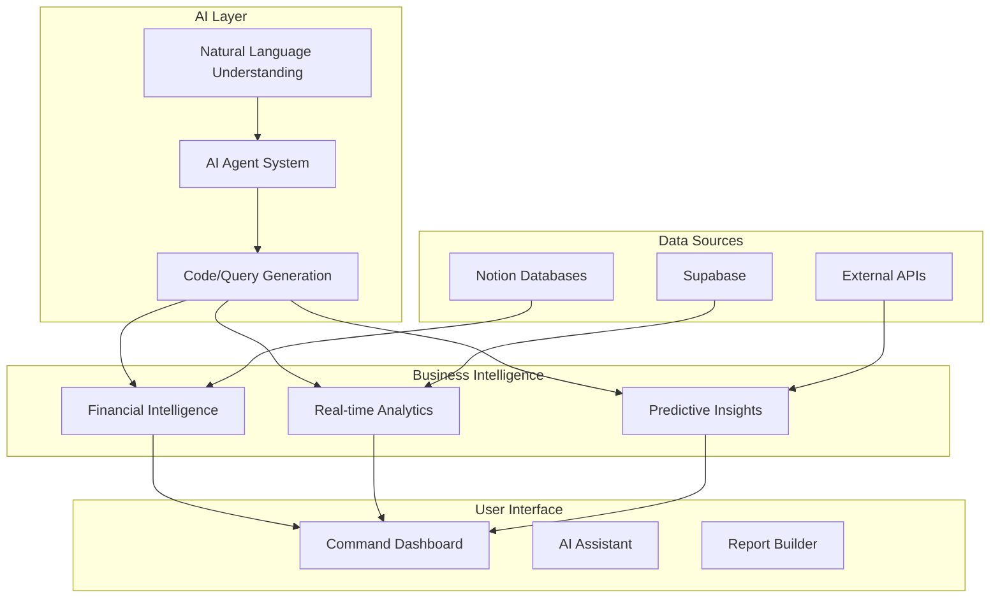

# 🚀 ACT AI Workhouse Platform - Business Intelligence Command Center

## Executive Summary

Transform the ACT ecosystem's massive data infrastructure into a **GitHub-style AI workhouse** - a unified business intelligence platform that combines:
- AI-powered bookkeeping and financial intelligence
- Real-time business insights and analytics
- Natural language querying and actions
- Automated workflows and decision support
- Community engagement metrics and opportunities

## 🎯 Vision: The Ultimate Business Command Center

### What We're Building
A **Vercel v0 meets GitHub Copilot Workspace meets Power BI** platform specifically designed for ACT's unique ecosystem:

```
[Natural Language Input] → [AI Processing] → [Business Action]
"Show me our burn rate and runway" → Analysis → Interactive Dashboard
"Find grant opportunities for our PICC project" → Search → Matched Opportunities
"Generate Q1 financial report" → Processing → Professional PDF + Insights
```

## 🏗️ Architecture Overview

### Core Components



## 💼 Business Intelligence Features

### 1. **AI-Powered Financial Command Center**

#### Smart Bookkeeping
```typescript
interface FinancialIntelligence {
  // Real-time financial metrics
  burnRate: {
    current: number;
    trend: 'increasing' | 'decreasing' | 'stable';
    projection: number[];
    alerts: Alert[];
  };
  
  // Automated categorization
  transactions: {
    autoCategories: Category[];
    anomalies: Transaction[];
    insights: string[];
  };
  
  // Predictive analytics
  cashFlow: {
    runway: number; // months
    scenarios: Scenario[];
    recommendations: Action[];
  };
}
```

#### Natural Language Queries
- "What's our burn rate this quarter?"
- "Show me all transactions over $10k"
- "Project our runway with 20% revenue increase"
- "Generate P&L for last 6 months"

### 2. **GitHub-Style Activity Dashboard**

#### Contribution Graph for Business Metrics
```typescript
interface ActivityDashboard {
  // GitHub-style heat map for business activity
  activityGrid: {
    grants: DailyActivity;
    partnerships: DailyActivity;
    milestones: DailyActivity;
    engagement: DailyActivity;
  };
  
  // Streak tracking
  streaks: {
    currentStreak: number;
    longestStreak: number;
    type: 'revenue' | 'engagement' | 'delivery';
  };
  
  // Achievement system
  achievements: Achievement[];
}
```

### 3. **Intelligent Opportunity Matching**

#### AI-Powered Grant & Partnership Discovery
```typescript
interface OpportunityIntelligence {
  // Automated matching
  matches: {
    grants: Grant[];
    partnerships: Partner[];
    score: number; // AI confidence
    reasoning: string;
  };
  
  // Application assistance
  applicationAI: {
    draftGeneration: boolean;
    requirementsCheck: Check[];
    successPrediction: number;
  };
}
```

## 🛠️ Technical Stack

### Frontend Architecture

#### **Option 1: Next.js 14 + Vercel AI SDK** (Recommended)
```typescript
// Modern, AI-native stack
const techStack = {
  framework: 'Next.js 14 App Router',
  ui: 'shadcn/ui + Tailwind CSS',
  ai: 'Vercel AI SDK 3.0',
  charts: 'Recharts + D3.js',
  state: 'Zustand',
  realtime: 'Supabase Realtime',
  auth: 'NextAuth.js'
};
```

#### **Option 2: Cursor/Windsurf Development Environment**
- Use Cursor for rapid AI-assisted development
- Windsurf for enterprise features and compliance
- Both support Claude 3.5 Sonnet for code generation

### Backend Architecture

```typescript
// Microservices approach
const services = {
  'intelligence-api': {
    framework: 'FastAPI',
    ai: ['OpenAI', 'Claude', 'Perplexity'],
    database: 'PostgreSQL + Vector DB'
  },
  'financial-processor': {
    framework: 'Node.js + TypeScript',
    queue: 'BullMQ',
    cache: 'Redis'
  },
  'analytics-engine': {
    framework: 'Python',
    processing: 'Pandas + NumPy',
    ml: 'scikit-learn'
  }
};
```

### AI Model Integration

```typescript
// Multi-model approach for different tasks
const aiModels = {
  chat: 'Claude 3.5 Sonnet', // General assistance
  analysis: 'GPT-4o', // Data analysis
  search: 'Perplexity Sonar', // Real-time web data
  code: 'GitHub Copilot API', // Query generation
  vision: 'GPT-4 Vision', // Document processing
};
```

## 📊 Key Dashboards & Interfaces

### 1. **Executive Command Center**
```
┌─────────────────────────────────────────────────────┐
│  💰 Financial Health            🎯 Goals & OKRs      │
│  ├─ Burn: $45k/mo ↓            ├─ Q1: 78% ████░    │
│  ├─ Runway: 14 months          ├─ Partnerships: 4/5  │
│  └─ MRR: $28k ↑                └─ Grants: $250k/500k │
│                                                      │
│  📈 Activity Heatmap           🔔 AI Insights        │
│  [GitHub-style contribution    "Grant deadline in    │
│   graph showing daily          3 days for $50k       │
│   business activities]         opportunity"          │
└─────────────────────────────────────────────────────┘
```

### 2. **AI Assistant Interface**
```
┌─────────────────────────────────────────────────────┐
│  🤖 ACT Intelligence                                 │
├─────────────────────────────────────────────────────┤
│  You: "What's our best revenue opportunity?"        │
│                                                      │
│  AI: Based on analysis of your projects and market: │
│      1. EPA Grant ($75k) - 85% match score         │
│      2. Corporate Partnership with BHP - High fit   │
│      3. Scale Empathy Ledger to 5 new councils     │
│                                                      │
│  [Generate Report] [Create Proposal] [Schedule]     │
└─────────────────────────────────────────────────────┘
```

### 3. **Project Intelligence Dashboard**
```
┌─────────────────────────────────────────────────────┐
│  Project: Empathy Ledger                            │
├─────────────────────────────────────────────────────┤
│  Revenue: $125k YTD    Impact: 1,250 people         │
│  Status: ████████░░    Timeline: On Track           │
│                                                      │
│  AI Recommendations:                                │
│  • Apply for Social Innovation Grant by Nov 30      │
│  • Connect with Similar project in Melbourne        │
│  • Optimize pricing model (suggested: $199/mo)      │
└─────────────────────────────────────────────────────┘
```

## 🚀 Implementation Roadmap

### Phase 1: Foundation (Week 1-2)
```typescript
const phase1 = {
  setup: [
    'Next.js 14 project with Vercel AI SDK',
    'Supabase connection + auth',
    'Basic dashboard layout with shadcn/ui'
  ],
  features: [
    'Natural language query interface',
    'Basic financial metrics display',
    'Simple data visualizations'
  ]
};
```

### Phase 2: AI Integration (Week 3-4)
```typescript
const phase2 = {
  ai: [
    'Claude/GPT-4 integration for queries',
    'Automated insight generation',
    'Predictive analytics models'
  ],
  features: [
    'Smart bookkeeping categorization',
    'Opportunity matching algorithm',
    'Report generation system'
  ]
};
```

### Phase 3: Advanced Features (Week 5-6)
```typescript
const phase3 = {
  advanced: [
    'Real-time collaboration features',
    'Custom workflow automation',
    'Advanced ML predictions'
  ],
  polish: [
    'Performance optimization',
    'Mobile responsive design',
    'Export/integration capabilities'
  ]
};
```

## 💡 Unique Selling Points

### 1. **Context-Aware AI**
- Understands ACT's specific business model
- Trained on Australian grant landscape
- Knows your project history and relationships

### 2. **GitHub-Style Workflow**
```bash
# Business operations as code
act commit "Applied for EPA grant"
act push financial-report --to board
act merge partnership --with "BHP"
```

### 3. **Proactive Intelligence**
- Alerts for matching opportunities
- Automated report generation
- Predictive cash flow warnings

## 🎨 UI/UX Principles

### Design Philosophy
- **GitHub Aesthetic**: Dark mode, monaco font, activity graphs
- **Vercel Simplicity**: Clean, minimal, fast
- **Power BI Functionality**: Rich data viz, drill-downs

### Key Interfaces
```typescript
const interfaces = {
  command: 'CMD+K style palette for all actions',
  chat: 'Persistent AI assistant in sidebar',
  dashboard: 'Customizable widget-based layout',
  reports: 'Notion-style document editor'
};
```

## 🔥 Killer Features

### 1. **One-Click Financial Reports**
Generate investor-ready reports with AI insights

### 2. **Opportunity Radar**
Real-time scanning of grants, partnerships, and opportunities

### 3. **Project Success Predictor**
ML model predicting project outcomes based on historical data

### 4. **Network Intelligence Graph**
Visual representation of your ecosystem connections and opportunities

### 5. **Automated Bookkeeping**
Bank feed integration with AI categorization

## 📈 Success Metrics

```typescript
const metrics = {
  efficiency: {
    timeToInsight: '< 3 seconds',
    reportGeneration: '< 30 seconds',
    accuracyRate: '> 95%'
  },
  business: {
    revenueIncrease: '20%',
    grantSuccessRate: '2x improvement',
    timeOnAdmin: '50% reduction'
  }
};
```

## 🏁 Getting Started

### Quick Start Commands
```bash
# Clone and setup
git clone act-ai-workhouse
cd act-ai-workhouse
npm install

# Configure AI keys
cp .env.example .env.local
# Add your OpenAI, Claude, Perplexity keys

# Start development
npm run dev

# Access at http://localhost:3000
```

### Initial Configuration
```typescript
// config/ai-workhouse.ts
export const config = {
  organization: 'ACT',
  timezone: 'Australia/Sydney',
  currency: 'AUD',
  fiscalYearStart: 'July',
  
  aiModels: {
    primary: 'claude-3.5-sonnet',
    fallback: 'gpt-4o',
    search: 'perplexity-sonar'
  },
  
  integrations: {
    notion: process.env.NOTION_API_KEY,
    supabase: process.env.SUPABASE_URL,
    banking: process.env.BANKING_API
  }
};
```

## 🎯 Next Steps

1. **Validate Requirements**: Review this spec with stakeholders
2. **Choose Development Path**: Cursor vs traditional development
3. **Set Up Infrastructure**: Vercel, Supabase, API keys
4. **Build MVP**: Focus on core financial + opportunity features
5. **Iterate with AI**: Use Cursor/Windsurf for rapid development

---

**This is your business command center. A place where AI doesn't just assist—it accelerates your entire operation.**

*Let's make it fucking rad! 🚀*