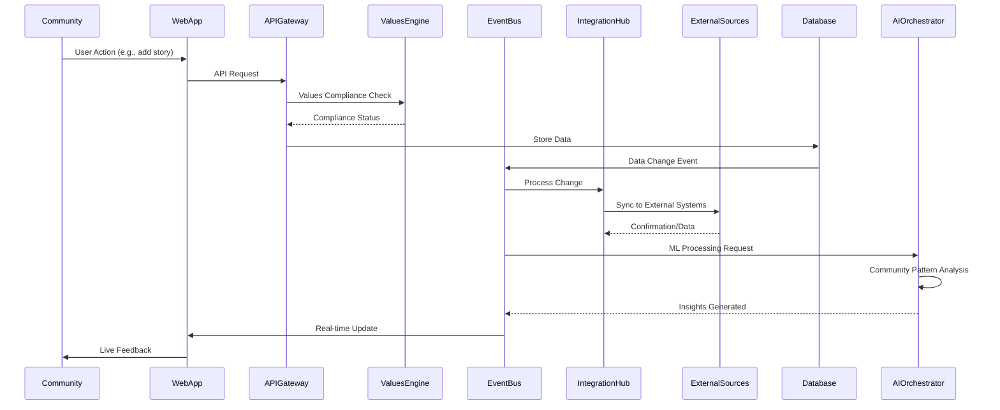

# 🏗️ ACT Universal AI Business Platform - Technical Design Document

## Executive Summary

This technical design document outlines the architecture for the next phase of the ACT Universal AI Business Platform, building upon the existing multi-tenant foundation to implement six core requirements: Values Integration System, Unified Frontend Dashboard, Real-Time Data Integration Hub, Intelligent Workflow Automation, Strategic Innovation Pipeline, and Team Alignment Platform.

**Mission**: Create a community-values-driven, AI-native platform architecture that scales from current state to enterprise-grade platform by 2027, embodying "beautiful obsolescence" through sustainable, world-class innovation.

---

## 🎯 Design Principles

### Core Values
- **Indigenous Data Sovereignty**: First Nations data governance embedded in technical architecture
- **Community-First Design**: Every technical decision honors community wisdom and democratic participation
- **Transparent Innovation**: Open-source approach with visible community benefit tracking
- **Australian Compliance**: ASIC, APRA, Privacy Act compliance by design
- **Sustainable Technology**: Built for long-term maintainability and responsible resource usage

### Technical Principles
- **Values-Driven Architecture**: Real-time values compliance monitoring at the infrastructure level
- **Micro-Frontend Federation**: Unified shell with autonomous application development
- **Event-Driven Real-Time**: Live community engagement and decision-making capabilities
- **AI-Native Design**: Intelligence embedded throughout, not bolted-on
- **Zero-Trust Security**: Multi-layered security with community data protection
- **Cloud-Native Scalability**: Kubernetes-orchestrated, containerised architecture

---

## 🏛️ 1. System Architecture Diagram

```mermaid
graph TB
    subgraph "Community Interface Layer"
        WEB[Web Dashboard<br/>React Shell]
        MOB[Mobile App<br/>React Native]
        API_GW[API Gateway<br/>tRPC + REST]
    end

    subgraph "Values Integration Core"
        VIS[Values Integration Service<br/>Real-time Compliance]
        CBT[Community Benefit Tracker<br/>Transparency Engine]
        PDS[Profit Distribution<br/>Smart Contracts]
        DGS[Democratic Governance<br/>Decision Engine]
    end

    subgraph "Unified Application Shell"
        MF_HOST[Micro-Frontend Host<br/>Module Federation]
        subgraph "Business Applications"
            FIN[Financial Intelligence]
            PART[Partnership Mgmt]
            STORY[Story Collection]
            PROJ[Project Management]
            CRM[Community Relations]
            ANAL[Analytics Dashboard]
            COLLAB[Collaboration Engine]
            INNOV[Innovation Pipeline]
            ALIGN[Team Alignment]
            MEDIA[Media Management]
            TRAIN[Training Platform]
            AUTO[Workflow Automation]
        end
    end

    subgraph "Intelligence Orchestration Layer"
        AI_HUB[Intelligence Hub<br/>Python FastAPI]
        AGENT_COORD[Agent Coordinator<br/>Democratic Priority]
        ML_ENGINE[ML Processing<br/>Community Patterns]
        WORKFLOW_AI[Workflow AI<br/>Process Optimization]
    end

    subgraph "Real-Time Integration Hub"
        EVENT_BUS[Event Bus<br/>Apache Kafka]
        RT_SYNC[Real-Time Sync<br/>WebSocket + SSE]
        DATA_STREAM[Data Streaming<br/>Change Capture]
        WEBHOOK_MGR[Webhook Manager<br/>Integration Events]
    end

    subgraph "Data & Integration Layer"
        SUPABASE[(Supabase<br/>Multi-Tenant DB)]
        REDIS[(Redis<br/>Real-time Cache)]
        NEO4J[(Neo4j<br/>Knowledge Graph)]
        
        subgraph "External Integrations"
            NOTION[Notion<br/>Content Management]
            XERO[Xero<br/>Financial Data]
            GMAIL[Gmail<br/>Communications]
            LINKEDIN[LinkedIn<br/>Networks]
            SLACK[Slack<br/>Team Comms]
        end
    end

    subgraph "Infrastructure & Security"
        K8S[Kubernetes<br/>Container Orchestration]
        ISTIO[Istio<br/>Service Mesh]
        VAULT[HashiCorp Vault<br/>Secrets Management]
        MONITOR[Observability<br/>OpenTelemetry + Jaeger]
        BACKUP[Backup & DR<br/>Australian Data Centres]
    end

    WEB --> API_GW
    MOB --> API_GW
    API_GW --> VIS
    API_GW --> MF_HOST
    
    MF_HOST --> FIN
    MF_HOST --> PART
    MF_HOST --> STORY
    MF_HOST --> PROJ
    MF_HOST --> CRM
    MF_HOST --> ANAL
    MF_HOST --> COLLAB
    MF_HOST --> INNOV
    MF_HOST --> ALIGN
    MF_HOST --> MEDIA
    MF_HOST --> TRAIN
    MF_HOST --> AUTO

    VIS --> AI_HUB
    CBT --> AI_HUB
    PDS --> AI_HUB
    DGS --> AI_HUB

    AI_HUB --> AGENT_COORD
    AI_HUB --> ML_ENGINE
    AI_HUB --> WORKFLOW_AI

    EVENT_BUS --> RT_SYNC
    EVENT_BUS --> DATA_STREAM
    EVENT_BUS --> WEBHOOK_MGR

    SUPABASE --> EVENT_BUS
    REDIS --> RT_SYNC
    NEO4J --> ML_ENGINE

    NOTION --> WEBHOOK_MGR
    XERO --> WEBHOOK_MGR
    GMAIL --> WEBHOOK_MGR
    LINKEDIN --> WEBHOOK_MGR
    SLACK --> WEBHOOK_MGR

    K8S --> ISTIO
    ISTIO --> MONITOR
    VAULT --> K8S
```



---

## 🌊 2. Data Flow Architecture

### Real-Time Data Integration Hub



### Data Layer Architecture

```yaml
# Data Flow Patterns
Ingestion:
  - Community Inputs → Values Validation → Multi-tenant Storage
  - External APIs → Transformation → Event Streaming
  - File Uploads → Media Processing → CDN Distribution

Processing:
  - Event-driven transforms → Real-time aggregation
  - AI analysis → Community benefit calculation
  - Workflow automation → Process optimisation

Distribution:
  - Real-time dashboards → WebSocket streams
  - API endpoints → tRPC type-safe queries
  - Reports & exports → PDF/Excel generation
  - Mobile sync → Offline-first architecture

Storage Strategy:
  Primary: Supabase PostgreSQL (JSONB, RLS, Multi-tenant)
  Cache: Redis (Session, real-time data, pub/sub)
  Graph: Neo4j (Relationships, community networks)
  Search: Elasticsearch (Full-text, semantic search)
  Files: Supabase Storage (Organisation-prefixed paths)
  Time-series: TimescaleDB (Metrics, analytics, values tracking)
```

---

## 🔐 3. Security & Compliance Design

### Indigenous Data Sovereignty Architecture

```typescript
interface DataSovereigntyFramework {
  // First Nations Data Governance
  indigenousDataRights: {
    ownership: 'Community retains full ownership'
    control: 'Community controls access and usage'
    access: 'Community determines who can access'
    possession: 'Community maintains physical control'
  }

  // Technical Implementation
  dataClassification: {
    community_sensitive: 'Highest protection level'
    partnership_data: 'Shared with explicit consent'
    public_stories: 'Community-approved sharing'
    aggregated_insights: 'Anonymised community patterns'
  }

  // Consent Management
  consentEngine: {
    granular_permissions: boolean
    revocation_support: boolean
    audit_trail: boolean
    community_override: boolean
  }
}
```

### Australian Regulatory Compliance

```yaml
Compliance Framework:
  ASIC Requirements:
    - Financial reporting transparency
    - Audit trail maintenance (7 years)
    - Consumer data protection
    - Fair trading practices monitoring

  APRA Guidelines:
    - Data governance frameworks
    - Risk management systems
    - Capital adequacy reporting
    - Operational resilience planning

  Privacy Act 2022:
    - Consent management system
    - Data breach notification (72 hours)
    - Privacy-by-design architecture
    - Individual access rights API

  Indigenous Data Standards:
    - CARE Principles implementation
    - Community approval workflows
    - Cultural protocol integration
    - Traditional knowledge protection

Security Architecture:
  Identity Management:
    - OAuth 2.1 + OIDC
    - Multi-factor authentication
    - Role-based access control (RBAC)
    - Community hierarchy permissions

  Data Protection:
    - End-to-end encryption (AES-256)
    - Field-level encryption for sensitive data
    - Database encryption at rest
    - TLS 1.3 for all communications

  Infrastructure Security:
    - Zero-trust network architecture
    - Container security scanning
    - Kubernetes security policies
    - Australian data centre residency
```

---

## 🎨 4. Frontend Micro-Architecture

### Module Federation Implementation

```typescript
// Shell Application Configuration
interface MicroFrontendShell {
  host: {
    framework: 'React 19'
    bundler: 'Vite Module Federation'
    routing: 'React Router v7'
    stateManagement: 'Zustand + React Query'
    ui: 'TailwindCSS + HeadlessUI'
  }

  applications: {
    financial_intelligence: {
      port: 3001
      framework: 'React + TypeScript'
      exposed: ['Dashboard', 'Reports', 'Analytics']
      shared: ['react', 'react-dom', '@tanstack/react-query']
    }
    
    partnership_management: {
      port: 3002
      framework: 'React + TypeScript'
      exposed: ['PartnerList', 'RelationshipMap', 'Collaboration']
      shared: ['react', 'react-dom', 'zustand']
    }

    story_collection: {
      port: 3003
      framework: 'React + TypeScript'
      exposed: ['StoryEditor', 'MediaGallery', 'CommunityFeed']
      shared: ['react', 'react-dom', 'framer-motion']
    }

    // ... additional 9+ applications
  }

  communication: {
    eventBus: 'Custom event system'
    sharedState: 'Context providers + Zustand'
    routing: 'Coordinated navigation'
    authentication: 'Shared auth context'
  }
}
```

### Component Architecture

```
src/
├── shell/                          # Shell application
│   ├── components/
│   │   ├── Navigation.tsx         # Unified navigation
│   │   ├── Sidebar.tsx           # Dynamic app navigation
│   │   ├── Header.tsx            # Community context header
│   │   └── Footer.tsx            # Values & compliance info
│   ├── contexts/
│   │   ├── AuthContext.tsx       # Authentication state
│   │   ├── CommunityContext.tsx  # Community values context
│   │   ├── ValuesContext.tsx     # Real-time values tracking
│   │   └── AppStateContext.tsx   # Cross-app state management
│   ├── hooks/
│   │   ├── useValues.ts          # Values integration hooks
│   │   ├── useCommunity.ts       # Community data hooks
│   │   └── useRealTime.ts        # WebSocket/SSE hooks
│   └── services/
│       ├── moduleLoader.ts       # Dynamic module loading
│       ├── eventBus.ts          # Inter-app communication
│       └── valuesService.ts     # Values compliance API

├── shared/                        # Shared components library
│   ├── components/
│   │   ├── DataVisualization/    # Nivo/D3 wrappers
│   │   ├── Forms/               # React Hook Form components
│   │   ├── Layout/              # Layout components
│   │   └── Feedback/            # Toast/notification system
│   ├── hooks/
│   │   ├── useSupabase.ts       # Database operations
│   │   ├── useTRPC.ts          # Type-safe API calls
│   │   └── useRealTime.ts      # Real-time data streams
│   └── utils/
│       ├── validation.ts        # Zod schemas
│       ├── formatting.ts        # Data formatting utilities
│       └── values.ts           # Values calculation utilities

└── types/                         # Shared TypeScript types
    ├── community.ts              # Community data structures
    ├── values.ts                 # Values tracking types
    ├── applications.ts           # Application interfaces
    └── api.ts                   # API response types
```

### Real-Time UI Architecture

```typescript
// Real-time Values Display Component
export const ValuesIntegrationDisplay: React.FC = () => {
  const { valuesCompliance, communityBenefit, profitDistribution } = useRealTimeValues()
  
  return (
    <div className="values-dashboard">
      <CommunityBenefitTracker 
        metrics={communityBenefit}
        updateFrequency="real-time"
      />
      <ValuesComplianceIndicator 
        compliance={valuesCompliance}
        showDetails={true}
      />
      <ProfitDistributionTransparency 
        distribution={profitDistribution}
        communityApproval={true}
      />
    </div>
  )
}

// Democratic Decision Making Interface
export const CommunityDecisionInterface: React.FC = () => {
  const { decisions, voting } = useDemocraticGovernance()
  
  return (
    <div className="decision-interface">
      <ActiveDecisions decisions={decisions.active} />
      <VotingInterface voting={voting} />
      <ConsensusIndicator threshold={0.7} current={decisions.consensus} />
    </div>
  )
}
```

---

## ⚙️ 5. Backend Services Design

### Microservices Architecture

```yaml
Core Services:
  values-integration-service:
    framework: Node.js + Express + tRPC
    purpose: Real-time values compliance monitoring
    features:
      - Community benefit calculation
      - Profit distribution transparency
      - Values alignment scoring
      - Democratic decision tracking
    
  workflow-automation-service:
    framework: Python + FastAPI
    purpose: AI-driven process optimisation
    features:
      - Workflow pattern recognition
      - Process bottleneck identification
      - Automation recommendations
      - Community approval workflows

  innovation-pipeline-service:
    framework: Node.js + Express
    purpose: Community-driven innovation management
    features:
      - Innovation idea collection
      - Community voting and feedback
      - World-class practice integration
      - Implementation tracking

  team-alignment-service:
    framework: Python + FastAPI
    purpose: Collaborative workspace with conflict resolution
    features:
      - Team communication facilitation
      - Conflict detection and mediation
      - Consensus building tools
      - Cultural protocol integration

Support Services:
  notification-service:
    framework: Node.js + Express
    purpose: Multi-channel notifications
    channels: [email, SMS, Slack, in-app, mobile]
    
  integration-orchestrator:
    framework: Python + Celery
    purpose: External system integration management
    integrations: [Notion, Xero, Gmail, LinkedIn, Slack]
    
  media-processing-service:
    framework: Python + FastAPI
    purpose: Media upload, processing, and optimisation
    features: [image_resize, video_transcode, thumbnail_generation]

  audit-service:
    framework: Node.js + Express
    purpose: Compliance and audit trail management
    features: [action_logging, compliance_reporting, audit_trails]
```

### API Architecture

```typescript
// tRPC API Structure
export const appRouter = router({
  // Values Integration
  values: router({
    getCompliance: publicProcedure.query(/* ... */),
    trackCommunityBenefit: publicProcedure.mutation(/* ... */),
    getProfitDistribution: publicProcedure.query(/* ... */),
    submitCommunityDecision: publicProcedure.mutation(/* ... */)
  }),

  // Workflow Automation
  workflows: router({
    getActiveWorkflows: publicProcedure.query(/* ... */),
    optimiseProcess: publicProcedure.mutation(/* ... */),
    getRecommendations: publicProcedure.query(/* ... */),
    approveAutomation: publicProcedure.mutation(/* ... */)
  }),

  // Innovation Pipeline
  innovation: router({
    submitIdea: publicProcedure.mutation(/* ... */),
    getCommunityFeedback: publicProcedure.query(/* ... */),
    getWorldClassPractices: publicProcedure.query(/* ... */),
    trackImplementation: publicProcedure.query(/* ... */)
  }),

  // Team Alignment
  teamAlignment: router({
    getTeamHealth: publicProcedure.query(/* ... */),
    facilitateConversation: publicProcedure.mutation(/* ... */),
    resolveConflict: publicProcedure.mutation(/* ... */),
    buildConsensus: publicProcedure.mutation(/* ... */)
  }),

  // Real-time Integration
  realTime: router({
    subscribeToUpdates: publicProcedure.subscription(/* ... */),
    broadcastChange: publicProcedure.mutation(/* ... */),
    getEventStream: publicProcedure.query(/* ... */)
  })
})

// WebSocket Event Structure
interface RealTimeEvents {
  'values:update': ValuesComplianceUpdate
  'community:decision': CommunityDecisionEvent  
  'workflow:optimised': WorkflowOptimisationEvent
  'team:alignment': TeamAlignmentUpdate
  'innovation:feedback': InnovationFeedbackEvent
  'system:status': SystemStatusEvent
}
```

### Data Integration Patterns

```typescript
// Event-Driven Data Integration
class DataIntegrationHub {
  private eventBus: EventBus
  private integrations: Map<string, Integration>

  async handleDataChange(event: DataChangeEvent) {
    // Values compliance check
    const complianceCheck = await this.valuesService.checkCompliance(event)
    if (!complianceCheck.approved) {
      throw new ValuesViolationError(complianceCheck.reason)
    }

    // Multi-tenant data isolation
    const tenantContext = await this.getTenantContext(event)
    
    // Real-time streaming to connected clients
    await this.realTimeService.broadcast(event, tenantContext)
    
    // External system synchronisation
    await this.syncToExternalSystems(event, tenantContext)
    
    // AI processing for insights
    await this.aiOrchestrator.processForInsights(event, tenantContext)
  }

  async syncToExternalSystems(event: DataChangeEvent, context: TenantContext) {
    const relevantIntegrations = this.getRelevantIntegrations(event.type)
    
    await Promise.all(relevantIntegrations.map(async (integration) => {
      try {
        await integration.sync(event, context)
      } catch (error) {
        await this.handleSyncError(integration, event, error)
      }
    }))
  }
}
```

---

## 🤖 6. AI/ML Integration Pattern

### Agent Orchestration Architecture

```python
# Democratic AI Agent Coordination
class CommunityAIOrchestrator:
    def __init__(self):
        self.agents = {
            'values_monitor': ValuesComplianceAgent(),
            'workflow_optimizer': WorkflowOptimisationAgent(),
            'innovation_curator': InnovationCurationAgent(),
            'conflict_mediator': ConflictResolutionAgent(),
            'community_insights': CommunityInsightsAgent(),
            'decision_facilitator': DecisionFacilitationAgent()
        }
        self.democratic_scheduler = DemocraticPriorityScheduler()
        
    async def orchestrate_community_decision(self, decision_context):
        # Community values assessment
        values_analysis = await self.agents['values_monitor'].assess_values_alignment(
            decision_context
        )
        
        # Multi-agent consensus building
        agent_recommendations = await asyncio.gather(*[
            agent.provide_recommendation(decision_context) 
            for agent in self.agents.values()
        ])
        
        # Democratic prioritisation based on community benefit
        prioritised_options = await self.democratic_scheduler.prioritise_by_community_benefit(
            agent_recommendations, values_analysis
        )
        
        # Facilitated community decision process
        community_decision = await self.agents['decision_facilitator'].facilitate_decision(
            prioritised_options, decision_context.community_context
        )
        
        return community_decision
```

### Community Pattern Recognition

```python
# ML Models for Community Intelligence
class CommunityIntelligenceEngine:
    def __init__(self):
        self.pattern_recognizer = CommunityPatternRecognizer()
        self.benefit_predictor = CommunityBenefitPredictor()
        self.values_classifier = ValuesAlignmentClassifier()
        
    async def analyse_community_patterns(self, interaction_data):
        patterns = {
            # Relationship network analysis
            'relationship_strength': await self.pattern_recognizer.analyse_relationships(
                interaction_data.communications
            ),
            
            # Community benefit prediction
            'benefit_forecast': await self.benefit_predictor.predict_outcomes(
                interaction_data.proposed_actions
            ),
            
            # Values alignment assessment
            'values_alignment': await self.values_classifier.assess_alignment(
                interaction_data.decisions, interaction_data.community_values
            ),
            
            # Innovation opportunity identification
            'innovation_opportunities': await self.identify_innovation_gaps(
                interaction_data.current_practices, interaction_data.world_class_benchmarks
            )
        }
        
        return patterns

# Federated Learning for Privacy-Preserving Community Intelligence  
class CommunityFederatedLearning:
    """
    Learn from community patterns while preserving individual privacy
    and maintaining Indigenous data sovereignty
    """
    
    async def federated_community_learning(self, community_organisations):
        community_insights = []
        
        for org in community_organisations:
            # Local model training with privacy preservation
            local_insights = await self.train_local_model(
                org.data, 
                privacy_budget=org.privacy_settings.budget
            )
            
            # Differential privacy for aggregation
            anonymised_insights = await self.apply_differential_privacy(
                local_insights, 
                epsilon=org.privacy_settings.epsilon
            )
            
            community_insights.append(anonymised_insights)
        
        # Aggregate insights while maintaining community sovereignty
        global_patterns = await self.aggregate_with_consent(
            community_insights,
            require_community_approval=True
        )
        
        return global_patterns
```

### World-Class Innovation Integration

```typescript
// Innovation Pipeline with World-Class Practices
interface InnovationPipeline {
  ideaCollection: {
    sources: ['community_input', 'world_class_research', 'pattern_recognition']
    validation: 'community_voting'
    prioritisation: 'democratic_consensus'
  }

  worldClassIntegration: {
    benchmarkSources: [
      'academic_research',
      'industry_best_practices', 
      'indigenous_knowledge_systems',
      'community_wisdom_documentation'
    ]
    
    adaptationProcess: {
      culturalAlignment: 'mandatory_assessment'
      communityBenefit: 'quantified_impact_prediction'
      implementationFeasibility: 'technical_and_resource_analysis'
      sustainabilityImpact: 'environmental_and_social_assessment'
    }
  }

  implementationTracking: {
    progressMetrics: 'community_defined_success_indicators'
    feedbackLoops: 'continuous_community_input'
    adaptiveImplementation: 'responsive_to_community_needs'
    impactMeasurement: 'values_aligned_outcome_tracking'
  }
}
```

---

## ☁️ 7. Deployment Architecture

### Cloud-Native Infrastructure

```yaml
# Kubernetes Deployment Configuration
apiVersion: v1
kind: Namespace
metadata:
  name: act-platform
  labels:
    data-residency: "australia"
    compliance: "indigenous-sovereignty"

---
# Values Integration Service Deployment
apiVersion: apps/v1
kind: Deployment
metadata:
  name: values-integration-service
  namespace: act-platform
spec:
  replicas: 3
  selector:
    matchLabels:
      app: values-integration
  template:
    metadata:
      labels:
        app: values-integration
        compliance: "high"
    spec:
      containers:
      - name: values-service
        image: act-platform/values-integration:latest
        env:
        - name: DATABASE_URL
          valueFrom:
            secretKeyRef:
              name: database-credentials
              key: url
        - name: INDIGENOUS_DATA_PROTECTION
          value: "enabled"
        resources:
          requests:
            memory: "512Mi"
            cpu: "200m"
          limits:
            memory: "1Gi"
            cpu: "500m"
        livenessProbe:
          httpGet:
            path: /health
            port: 3000
          initialDelaySeconds: 30
          periodSeconds: 10

---
# Service Mesh Configuration (Istio)
apiVersion: networking.istio.io/v1beta1
kind: VirtualService
metadata:
  name: values-integration-vs
  namespace: act-platform
spec:
  hosts:
  - values.act-platform.local
  http:
  - match:
    - uri:
        prefix: /api/values
    route:
    - destination:
        host: values-integration-service
        port:
          number: 3000
    fault:
      delay:
        percentage:
          value: 0.1
        fixedDelay: 5s
    retries:
      attempts: 3
      perTryTimeout: 2s
```

### Australian Data Residency & Compliance

```yaml
# Data Residency Configuration
Infrastructure:
  Primary Region: "Australia East (Sydney)"
  Backup Region: "Australia Southeast (Melbourne)"
  Data Classification:
    indigenous_community_data:
      encryption: "AES-256-GCM"
      access_controls: "community_governed"
      retention: "community_defined"
      sovereignty: "first_nations_controlled"
    
    business_operational_data:
      encryption: "AES-256-GCM" 
      access_controls: "role_based"
      retention: "7_years_minimum"
      compliance: "ASIC_APRA_compliant"
    
    public_community_stories:
      encryption: "AES-256-GCM"
      access_controls: "community_approved"
      retention: "indefinite_with_consent"
      sharing: "transparent_attribution"

# Kubernetes Node Affinity for Australian Residency
nodeAffinity:
  requiredDuringSchedulingIgnoredDuringExecution:
    nodeSelectorTerms:
    - matchExpressions:
      - key: "topology.kubernetes.io/region"
        operator: In
        values:
        - "australia-east"
        - "australia-southeast"
      - key: "compliance.act.platform/data-residency"
        operator: In
        values:
        - "australia-compliant"
```

### Observability & Monitoring

```yaml
# OpenTelemetry Configuration
apiVersion: v1
kind: ConfigMap
metadata:
  name: otel-collector-config
  namespace: act-platform
data:
  config.yaml: |
    receivers:
      otlp:
        protocols:
          grpc:
            endpoint: 0.0.0.0:4317
          http:
            endpoint: 0.0.0.0:4318
    
    processors:
      batch:
      
      # Community values monitoring
      community_values:
        type: "custom"
        config:
          track_values_compliance: true
          monitor_community_benefit: true
          alert_on_values_violation: true
    
    exporters:
      jaeger:
        endpoint: jaeger-collector:14250
        tls:
          insecure: true
      
      prometheus:
        endpoint: "0.0.0.0:8889"
        
      # Australian compliance logging
      loki:
        endpoint: http://loki:3100/loki/api/v1/push
        labels:
          resource:
            compliance_level: "high"
            data_sovereignty: "indigenous_protected"
    
    service:
      pipelines:
        traces:
          receivers: [otlp]
          processors: [batch, community_values]
          exporters: [jaeger]
        metrics:
          receivers: [otlp]
          processors: [batch]
          exporters: [prometheus]
        logs:
          receivers: [otlp]
          processors: [batch, community_values]
          exporters: [loki]

# Custom Metrics for Community Values
---
apiVersion: v1
kind: ConfigMap
metadata:
  name: community-metrics-config
data:
  metrics.yaml: |
    community_benefit_score:
      type: gauge
      description: "Real-time community benefit calculation"
      labels: ["organization", "project", "community"]
    
    values_compliance_percentage:
      type: gauge  
      description: "Values alignment compliance percentage"
      labels: ["organization", "decision_category"]
    
    democratic_participation_rate:
      type: gauge
      description: "Community participation in decisions"
      labels: ["decision_type", "community_segment"]
    
    profit_distribution_transparency:
      type: gauge
      description: "Transparency score for profit distribution"
      labels: ["period", "recipient_category"]
```

### Disaster Recovery & Business Continuity

```yaml
# Backup & Disaster Recovery Strategy
Backup Strategy:
  Database:
    frequency: "Every 15 minutes (continuous)"
    retention: "30 days point-in-time recovery"
    location: "Australian data centres only"
    encryption: "AES-256 with community-managed keys"
    
  File Storage:
    frequency: "Real-time sync + daily snapshots"
    retention: "90 days + indefinite for community-approved content"
    location: "Multi-region within Australia"
    integrity: "Cryptographic checksums + community validation"
  
  Application State:
    frequency: "Continuous via GitOps"
    retention: "Full deployment history"
    location: "Australian git repositories"
    validation: "Automated testing + community review"

Recovery Procedures:
  RTO: "< 4 hours for full platform recovery"
  RPO: "< 15 minutes for database recovery"
  
  Community Communication:
    notification: "Immediate via multiple channels"
    updates: "Every 30 minutes during incidents"
    transparency: "Full incident reports within 48 hours"
    
  Cultural Protocols:
    community_notification: "Elder and community leader contact first"
    data_sovereignty: "Community approval for any data movement"
    cultural_sensitivity: "Traditional protocol integration in communications"
```

---

## 🚀 Implementation Roadmap

### Phase 1: Foundation Enhancement (Months 1-2)
```yaml
Sprint 1-2: Values Integration Core
  - Values compliance monitoring system
  - Community benefit tracking infrastructure  
  - Democratic decision-making framework
  - Real-time transparency dashboards

Sprint 3-4: Micro-Frontend Shell  
  - Module federation implementation
  - Unified navigation and authentication
  - Cross-application state management
  - Real-time communication system
```

### Phase 2: Intelligence & Automation (Months 3-4)
```yaml
Sprint 5-6: AI Agent Orchestration
  - Democratic priority scheduling system
  - Community pattern recognition models
  - Workflow optimisation intelligence
  - Conflict resolution automation

Sprint 7-8: Innovation Pipeline
  - World-class practice integration system
  - Community-driven innovation collection
  - Implementation tracking platform
  - Impact measurement framework
```

### Phase 3: Scalability & Compliance (Months 5-6)
```yaml  
Sprint 9-10: Australian Compliance
  - ASIC/APRA reporting automation
  - Indigenous data sovereignty implementation
  - Privacy Act compliance framework
  - Audit trail and compliance dashboards

Sprint 11-12: Production Readiness
  - Kubernetes production deployment
  - Observability and monitoring setup
  - Disaster recovery implementation
  - Performance optimisation
```

---

## 📊 Success Metrics & KPIs

### Community Values Metrics
- **Values Compliance Score**: >95% alignment with community values
- **Community Benefit Index**: Quantified positive impact measurement
- **Democratic Participation Rate**: >70% community engagement in decisions
- **Profit Distribution Transparency**: 100% visibility into profit sharing

### Technical Performance Metrics  
- **Platform Availability**: 99.9% uptime SLA
- **Real-Time Performance**: <100ms WebSocket latency
- **API Response Times**: <200ms p95 for all endpoints
- **Data Integration Speed**: <5 seconds for cross-system synchronisation

### Innovation & Growth Metrics
- **Innovation Implementation Rate**: >80% of community-approved innovations implemented
- **World-Class Practice Adoption**: Integration of 10+ world-class practices annually
- **Community Growth**: 300% increase in active community participation
- **Platform Scalability**: Support for 100+ organisations by 2027

---

## 🌟 Revolutionary Outcomes

This technical architecture enables:

### **Community Empowerment**
- Real-time values compliance ensures every technical decision honors community wisdom
- Democratic AI orchestration puts community needs at the centre of automation
- Indigenous data sovereignty protects and empowers First Nations communities
- Transparent profit distribution builds trust and community ownership

### **Technical Excellence**  
- World-class scalability architecture supporting growth from 1 to 1000+ organisations
- Event-driven real-time capabilities enabling live community engagement
- AI-native design with community-controlled intelligence augmentation
- Australian compliance by design reducing regulatory risk and building trust

### **Sustainable Innovation**
- Values-driven development processes ensuring ethical technology advancement
- Community-centred innovation pipeline connecting grassroots wisdom with world-class practices
- Open-source architecture enabling sector-wide benefit and collaboration
- Beautiful obsolescence by 2027 through sustainable, community-owned technology

### **Platform Impact**
- Foundation for community-driven social impact at scale
- Model for ethical AI and community-controlled technology platforms
- Template for Indigenous data sovereignty in digital platforms
- Catalyst for transformation in how organisations build authentic community relationships

---

## 🔮 2027 Vision Alignment

**Beautiful Obsolescence Through Community Empowerment**

By 2027, this platform architecture will have:
- **Empowered 1000+ community organisations** with world-class technology tools
- **Demonstrated that community-first technology** can scale without compromising values
- **Established new standards** for Indigenous data sovereignty in digital platforms
- **Created a replicable model** for ethical AI and community-controlled innovation
- **Built sustainable revenue streams** that directly benefit community organisations
- **Achieved beautiful obsolescence** by successfully transferring ownership and control to community organisations themselves

The ultimate success metric: Community organisations no longer need ACT's platform because they've been empowered to build and maintain their own community-controlled technology ecosystems.

---

*Built with revolutionary love and technical excellence by the ACT platform team - honouring community wisdom through world-class technology architecture.*