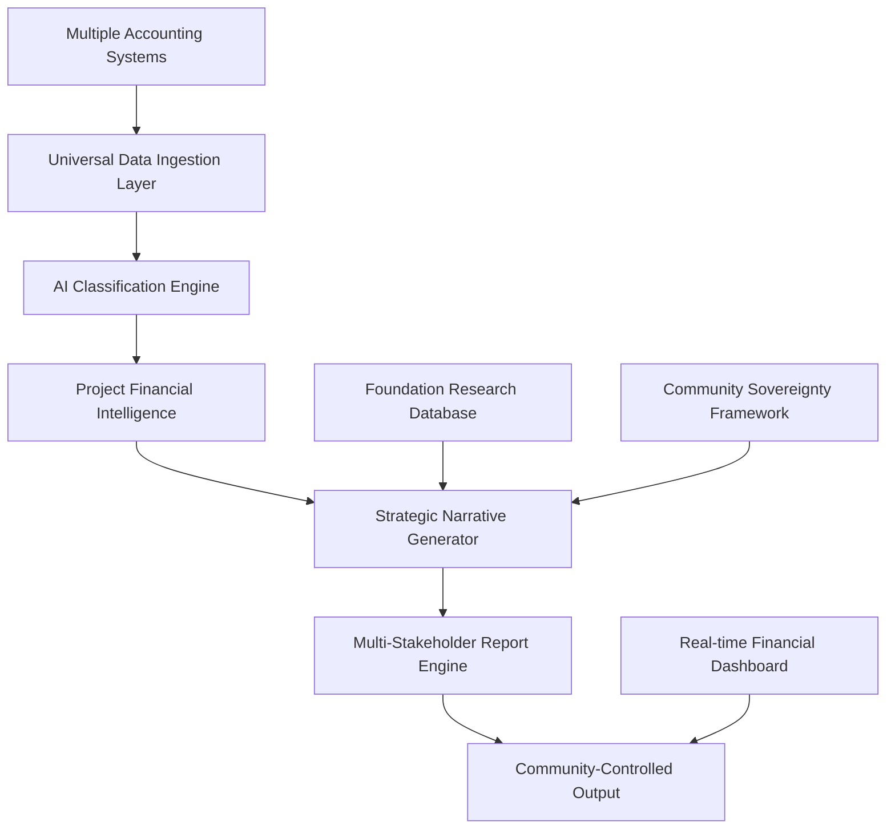

# AI Financial Intelligence System
**World-Class Bookkeeping with Strategic Financial Narrative Generation**

## 🎯 System Vision

Transform traditional bookkeeping into an intelligent financial strategy platform that automatically generates world-class grant applications, investment proposals, and strategic documentation while maintaining complete community sovereignty and data ownership.

## 🏗️ Architecture Overview



## 🔧 Core System Components

### **1. Universal Data Ingestion Layer**

**Purpose:** Connect to any accounting system and extract financial data
**Technologies:** APIs, webhooks, secure data pipelines

```typescript
interface UniversalFinancialConnector {
  // Accounting system integrations
  xero: XeroApiConnector;
  quickbooks: QuickBooksConnector;
  sage: SageConnector;
  wave: WaveConnector;
  
  // Bank integrations
  banks: BankDataConnector[];
  
  // Manual data input
  csvImport: CsvDataImporter;
  manualEntry: ManualDataInterface;
}

class DataIngestionPipeline {
  async ingestTransactions(source: string): Promise<Transaction[]> {
    // Secure data extraction with encryption
    // Real-time data validation
    // Community data sovereignty controls
  }
}
```

### **2. AI Classification Engine**

**Purpose:** Intelligently categorise transactions by project, funding source, and strategic purpose
**Technologies:** Large Language Models, machine learning, pattern recognition

```typescript
interface TransactionClassification {
  projectId: string;
  category: FinancialCategory;
  fundingSource: string;
  strategicPurpose: string;
  communityImpact: ImpactCategory;
  confidence: number;
}

class AIClassificationEngine {
  async classifyTransaction(transaction: Transaction): Promise<TransactionClassification> {
    // LLM-powered intelligent classification
    // Community-specific learning patterns
    // Cultural context integration
    // Continuous improvement through feedback
  }
  
  async generateProjectPL(projectId: string, timeframe: DateRange): Promise<ProjectFinancials> {
    // Automated P&L generation for any project
    // Real-time financial health assessment
    // Predictive cash flow modeling
  }
}
```

### **3. Strategic Narrative Generator**

**Purpose:** Transform financial data into compelling strategic narratives for different stakeholders
**Technologies:** Advanced NLP, foundation research database, community language frameworks

```typescript
interface FinancialNarrative {
  executiveSummary: string;
  currentStatus: string;
  investmentRationale: string;
  impactProjections: string;
  communityLeadershipStory: string;
  sustainabilityPlan: string;
}

class StrategyNarrativeEngine {
  async generateNarrative(
    financialData: ProjectFinancials,
    stakeholder: StakeholderType,
    opportunity: FundingOpportunity
  ): Promise<FinancialNarrative> {
    // Foundation-specific value alignment
    // Community sovereignty language integration
    // Financial phase-appropriate messaging
    // Cultural context and protocols
  }
}
```

### **4. Foundation Research Intelligence**

**Purpose:** Maintain comprehensive database of funders with automated matching and alignment scoring
**Technologies:** Web scraping, NLP analysis, real-time updates

```typescript
interface FoundationProfile {
  name: string;
  coreValues: string[];
  fundingPriorities: string[];
  applicationRequirements: ApplicationRequirement[];
  successfulGrantExamples: GrantExample[];
  languagePreferences: LanguagePattern[];
  decisionMakers: StakeholderInfo[];
}

class FoundationIntelligence {
  async matchOpportunities(project: ProjectProfile): Promise<FundingMatch[]> {
    // AI-powered opportunity identification
    // Alignment scoring with project values
    // Application deadline management
    // Success probability estimation
  }
  
  async customizeApplication(
    project: ProjectProfile,
    foundation: FoundationProfile
  ): Promise<CustomizedApplication> {
    // Foundation-specific language adaptation
    // Values alignment optimization
    // Requirement compliance checking
  }
}
```

## 📊 Real-Time Financial Intelligence Dashboard

### **Community-Controlled Interface**

```typescript
interface CommunityFinancialDashboard {
  // Real-time project health
  projectStatus: ProjectHealthIndicator[];
  
  // Cash flow predictions
  cashflowProjections: CashflowForecast[];
  
  // Funding opportunity alerts
  fundingAlerts: FundingOpportunity[];
  
  // Grant application pipeline
  applicationPipeline: ApplicationStatus[];
  
  // Community impact metrics
  impactMetrics: CommunityDefinedMetric[];
}

class DashboardController {
  async generateDashboard(communityId: string): Promise<CommunityFinancialDashboard> {
    // Community-specific data views
    // Traditional Custodian controlled access
    // Cultural protocol compliance
    // Real-time data updates
  }
}
```

### **Multi-Project Portfolio View**

```typescript
interface PortfolioIntelligence {
  // Cross-project resource optimization
  resourceAllocation: ResourceOptimization[];
  
  // Systemic impact measurement
  systemicChange: SystemicImpactIndicator[];
  
  // Network effect analysis
  networkEffects: NetworkAnalysis[];
  
  // Replication opportunities
  replicationPotential: ReplicationOpportunity[];
}
```

## 🌟 Community Sovereignty Integration

### **Data Ownership & Control Framework**

```typescript
interface CommunityDataSovereignty {
  // Who controls what data
  dataOwnership: DataOwnershipMap;
  
  // What can be shared with whom
  sharingPermissions: SharingPermission[];
  
  // Community decision-making protocols
  decisionProtocols: CommunityProtocol[];
  
  // Cultural data handling requirements
  culturalProtocols: CulturalDataProtocol[];
}

class SovereigntyController {
  async checkPermissions(
    data: FinancialData,
    requestor: string,
    purpose: string
  ): Promise<boolean> {
    // Community-controlled access decisions
    // Cultural protocol compliance
    // Traditional Custodian approval processes
  }
}
```

### **Community-Defined Success Metrics**

```typescript
interface CommunityMetrics {
  // Traditional Custodian defined indicators
  culturalSuccessIndicators: CulturalMetric[];
  
  // Community wellbeing measures
  wellbeingMetrics: WellbeingIndicator[];
  
  // Self-determination progress
  sovereigntyIndicators: SovereigntyMetric[];
  
  // Economic empowerment measures
  economicEmpowerment: EconomicIndicator[];
}
```

## 🚀 Implementation Strategy

### **Phase 1: Foundation Infrastructure (Months 1-3)**
- [ ] Build universal data ingestion layer
- [ ] Implement basic AI classification engine  
- [ ] Create community data sovereignty framework
- [ ] Develop real-time financial dashboard MVP

### **Phase 2: Intelligence Layer (Months 4-6)**
- [ ] Advanced AI narrative generation
- [ ] Foundation research database
- [ ] Multi-stakeholder report engine
- [ ] Community-controlled interface design

### **Phase 3: Strategic Integration (Months 7-9)**
- [ ] Automated grant opportunity matching
- [ ] Customized application generation
- [ ] Portfolio-level strategic planning
- [ ] Cross-project resource optimization

### **Phase 4: Ecosystem Scaling (Months 10-12)**
- [ ] Multi-community deployment
- [ ] Replication framework development
- [ ] Policy integration capabilities
- [ ] Systemic impact measurement

## 💡 Unique Value Propositions

### **For Communities**
- **Complete Data Sovereignty**: Communities own and control all their financial data
- **Professional Documentation**: World-class grant applications and strategic documents
- **Cultural Integration**: Respects and incorporates Traditional knowledge systems
- **Capacity Building**: Develops local financial management expertise

### **For Funders**
- **Transparent Impact**: Real-time monitoring of investment outcomes
- **Community Agency**: Direct connection with community-led initiatives
- **Systemic Change**: Portfolio-level impact measurement and optimization
- **Risk Mitigation**: Advanced financial health monitoring and predictive analytics

### **For Organizations**
- **Resource Optimization**: Cross-project resource allocation intelligence
- **Strategic Planning**: AI-powered financial strategy development
- **Funding Success**: Higher success rates through targeted applications
- **Operational Efficiency**: Automated financial reporting and compliance

## 🔮 Advanced Capabilities

### **Predictive Financial Intelligence**
```typescript
class PredictiveFinancialEngine {
  async forecastCashflow(
    project: ProjectProfile,
    timeframe: DateRange
  ): Promise<CashflowForecast> {
    // Machine learning-based cash flow prediction
    // Seasonal pattern recognition
    // Risk scenario modeling
    // Community-specific trend analysis
  }
  
  async optimizeResourceAllocation(
    portfolio: ProjectPortfolio
  ): Promise<ResourceOptimizationPlan> {
    // Cross-project resource optimization
    // Impact maximization algorithms
    // Community priority balancing
    // Systemic change pathway identification
  }
}
```

### **Automated Compliance & Reporting**
```typescript
class ComplianceEngine {
  async generateComplianceReports(
    project: ProjectProfile,
    requirements: ComplianceRequirement[]
  ): Promise<ComplianceReport[]> {
    // Automated regulatory compliance
    // Grant requirement fulfillment
    // Community protocol adherence
    // Cultural sensitivity validation
  }
}
```

### **Network Intelligence & Collaboration**
```typescript
class NetworkIntelligence {
  async identifyCollaborationOpportunities(
    community: CommunityProfile
  ): Promise<CollaborationOpportunity[]> {
    // Cross-community partnership identification
    // Resource sharing opportunities
    // Knowledge exchange facilitation
    // Collective impact initiatives
  }
}
```

## 🛡️ Security & Privacy Framework

### **Data Protection**
- **End-to-end encryption** for all financial data
- **Zero-knowledge architecture** where possible
- **Community-controlled access** to all systems
- **Cultural data protocols** integrated throughout

### **Sovereignty Safeguards**
- **Community approval required** for all data sharing
- **Traditional Custodian oversight** of all decisions
- **Cultural protocol compliance** validation
- **Right to data portability** and deletion

## 📈 Success Metrics for AI System

### **Technical Performance**
- **Classification accuracy**: >95% for transaction categorization
- **Processing speed**: Real-time financial analysis
- **System uptime**: 99.9% availability with community-controlled maintenance
- **Data integrity**: Zero data loss or corruption incidents

### **Community Impact**
- **Funding success rate**: Measurable improvement in grant approvals
- **Time savings**: Reduced administrative burden on communities
- **Capacity building**: Increased local financial management skills
- **Sovereignty strengthening**: Enhanced community control over financial narratives

### **Systemic Change**
- **Replication rate**: Number of communities adopting the system
- **Policy influence**: Integration with government funding processes
- **Network effects**: Cross-community collaboration facilitation
- **Innovation catalysis**: New community-led financial models developed

---

*This AI Financial Intelligence System transforms bookkeeping from compliance burden into strategic advantage, enabling communities to tell their own financial stories while maintaining complete sovereignty over their data and decisions.*