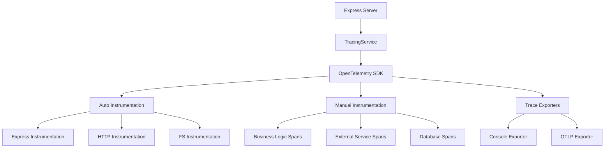

# OpenTelemetry Tracing Integration Guide

## Table of Contents
1. [Overview](#overview)
2. [Service Architecture](#service-architecture)
3. [Configuration](#configuration)
4. [Usage Patterns](#usage-patterns)
5. [Instrumentation](#instrumentation)
6. [Trace Analysis](#trace-analysis)
7. [Performance Monitoring](#performance-monitoring)
8. [Troubleshooting](#troubleshooting)
9. [Best Practices](#best-practices)

## Overview

The ACT Placemat platform implements comprehensive distributed tracing using OpenTelemetry to provide complete observability across all system operations. This enables real-time performance monitoring, error correlation, and system optimization.

### Key Benefits
- **Complete Request Tracing**: Track requests across all services and components
- **Performance Monitoring**: Real-time latency and throughput metrics
- **Error Correlation**: Link errors to specific operations and contexts
- **System Optimization**: Identify bottlenecks and optimization opportunities
- **Debugging Support**: Detailed trace data for troubleshooting

### Architecture Components
- **Tracing Service**: Core OpenTelemetry implementation
- **Automatic Instrumentation**: Express.js, HTTP, and database operations
- **Manual Instrumentation**: Custom business logic tracing
- **Trace Exporters**: Console output with configurable OTLP support
- **Context Propagation**: Maintains trace context across service boundaries

## Service Architecture

### Core Tracing Service
**Location**: `/apps/backend/src/services/tracingService.js`

```javascript
class TracingService {
  constructor() {
    this.sdk = null;
    this.tracer = null;
    this.isInitialized = false;
    this.config = {
      serviceName: 'act-placemat-backend',
      environment: process.env.NODE_ENV || 'development',
      enableConsoleSpans: true,
      enableAutoInstrumentation: true,
      enableHttpInstrumentation: true,
      enableExpressInstrumentation: true,
      enableFsInstrumentation: false,
      traceExporter: 'console'
    };
  }
}
```

### Service Dependencies



## Configuration

### Environment Variables

```javascript
// OpenTelemetry configuration
const config = {
  // Service identification
  OTEL_SERVICE_NAME: 'act-placemat-backend',
  OTEL_SERVICE_VERSION: '1.0.0',
  OTEL_RESOURCE_ATTRIBUTES: 'service.name=act-placemat-backend,service.version=1.0.0',
  
  // Export configuration
  OTEL_EXPORTER_OTLP_ENDPOINT: process.env.OTEL_ENDPOINT || '',
  OTEL_EXPORTER_OTLP_HEADERS: process.env.OTEL_HEADERS || '',
  
  // Instrumentation controls
  OTEL_AUTO_INSTRUMENTATION: process.env.OTEL_AUTO_INSTRUMENTATION !== 'false',
  OTEL_HTTP_INSTRUMENTATION: process.env.OTEL_HTTP_INSTRUMENTATION !== 'false',
  OTEL_EXPRESS_INSTRUMENTATION: process.env.OTEL_EXPRESS_INSTRUMENTATION !== 'false',
  
  // Sampling configuration
  OTEL_TRACES_SAMPLER: process.env.OTEL_TRACES_SAMPLER || 'always_on',
  OTEL_TRACES_SAMPLER_ARG: process.env.OTEL_TRACES_SAMPLER_ARG || '',
  
  // Resource detection
  OTEL_RESOURCE_DETECTOR: 'env,host,os,process'
};
```

### Service Configuration Options

```javascript
const tracingConfig = {
  // Core settings
  serviceName: 'act-placemat-backend',
  environment: 'production',
  
  // Instrumentation toggles
  enableConsoleSpans: true,
  enableAutoInstrumentation: true,
  enableHttpInstrumentation: true,
  enableExpressInstrumentation: true,
  enableFsInstrumentation: false,
  
  // Export settings
  traceExporter: 'console', // 'console' | 'otlp' | 'jaeger'
  otlpEndpoint: 'http://localhost:4318/v1/traces',
  
  // Sampling configuration
  samplingRate: 1.0, // 100% sampling for development
  
  // Resource attributes
  resourceAttributes: {
    'service.name': 'act-placemat-backend',
    'service.version': '1.0.0',
    'environment': 'production',
    'team': 'act-platform'
  }
};
```

## Usage Patterns

### Automatic Instrumentation

The service automatically instruments common operations:

```javascript
// Express routes are automatically traced
app.get('/api/projects', async (req, res) => {
  // Automatic span creation with attributes:
  // - http.method: GET
  // - http.route: /api/projects
  // - http.status_code: 200
  // - http.request_content_length: 0
  // - http.response_content_length: 1024
  
  const projects = await projectService.getProjects();
  res.json(projects);
});

// HTTP client requests are automatically traced
const response = await fetch('https://api.notion.com/v1/databases', {
  headers: { Authorization: `Bearer ${apiKey}` }
});
// Creates span with:
// - http.method: GET
// - http.url: https://api.notion.com/v1/databases
// - http.status_code: 200
// - http.response_content_length: 2048
```

### Manual Span Creation

For custom business logic and operations:

```javascript
// Simple span creation
async function processUserData(userData) {
  return await tracingService.startActiveSpan('user.process_data', async (span) => {
    try {
      span.setAttributes({
        'user.id': userData.id,
        'user.operation': 'data_processing',
        'data.size': JSON.stringify(userData).length
      });
      
      const result = await performDataProcessing(userData);
      
      span.setAttributes({
        'operation.success': true,
        'result.count': result.length
      });
      
      return result;
      
    } catch (error) {
      span.recordException(error);
      span.setStatus({
        code: trace.SpanStatusCode.ERROR,
        message: error.message
      });
      throw error;
    }
  });
}

// Complex business operation with nested spans
async function createProjectWithValidation(projectData) {
  return await tracingService.startActiveSpan('business.create_project', {
    attributes: {
      'operation.type': 'project_creation',
      'project.name': projectData.name
    }
  }, async (span) => {
    
    // Step 1: Validation
    await tracingService.startActiveSpan('validation.project_data', async (validationSpan) => {
      validationSpan.setAttributes({
        'validation.fields': Object.keys(projectData).length,
        'validation.type': 'schema_validation'
      });
      
      await validateProjectData(projectData);
      
      validationSpan.setAttributes({
        'validation.passed': true
      });
    });
    
    // Step 2: Database operation
    const project = await tracingService.startActiveSpan('database.insert_project', async (dbSpan) => {
      dbSpan.setAttributes({
        'db.operation': 'insert',
        'db.table': 'projects'
      });
      
      const result = await database.projects.create(projectData);
      
      dbSpan.setAttributes({
        'db.rows_affected': 1,
        'project.id': result.id
      });
      
      return result;
    });
    
    // Step 3: External notification
    await tracingService.startActiveSpan('external.send_notification', async (notifySpan) => {
      notifySpan.setAttributes({
        'external.service': 'notification_service',
        'notification.type': 'project_created'
      });
      
      await notificationService.sendProjectCreated(project);
      
      notifySpan.setAttributes({
        'notification.sent': true
      });
    });
    
    span.setAttributes({
      'project.created': true,
      'project.id': project.id,
      'operation.duration': Date.now() - span.startTime
    });
    
    return project;
  });
}
```

### External Service Call Tracing

Special utility for tracing external service interactions:

```javascript
// Using traceExternalCall utility
async function fetchNotionProjects() {
  return await traceExternalCall('notion', 'get_projects', async (span) => {
    span.setAttributes({
      'external.service': 'notion',
      'external.operation': 'database_query',
      'external.api_version': 'v1'
    });
    
    const response = await notionClient.databases.query({
      database_id: 'abc123'
    });
    
    span.setAttributes({
      'external.response_size': response.results.length,
      'external.has_more': response.has_more,
      'external.success': true
    });
    
    return response.results;
  });
}

// Integration with error taxonomy
async function robustExternalCall() {
  return await errorTaxonomyService.executeWithRetry(
    async () => {
      return await traceExternalCall('xero', 'get_invoices', async (span) => {
        span.setAttributes({
          'external.service': 'xero',
          'external.operation': 'fetch_invoices',
          'external.api_version': '2.0'
        });
        
        const invoices = await xeroClient.accounting.getInvoices();
        
        span.setAttributes({
          'external.invoice_count': invoices.invoices.length,
          'external.success': true
        });
        
        return invoices;
      });
    },
    {
      service: 'xero',
      policyName: 'api',
      onRetry: (classification, attempt, delay) => {
        // Retry events are automatically traced with context
        console.log(`Retrying Xero call: attempt ${attempt}, delay ${delay}ms`);
      }
    }
  );
}
```

## Instrumentation

### Automatic Instrumentation Setup

```javascript
// Express.js automatic instrumentation
const expressInstrumentation = new ExpressInstrumentation({
  requestHook: (span, info) => {
    span.setAttributes({
      'http.route': info.route,
      'user.id': info.req.user?.id,
      'request.id': info.req.id
    });
  },
  responseHook: (span, info) => {
    span.setAttributes({
      'http.response_size': info.res.get('content-length') || 0,
      'cache.hit': info.res.get('x-cache') === 'HIT'
    });
  }
});

// HTTP client instrumentation
const httpInstrumentation = new HttpInstrumentation({
  requestHook: (span, info) => {
    span.setAttributes({
      'http.target_service': extractServiceName(info.request.host),
      'http.retries': info.request.retries || 0
    });
  },
  responseHook: (span, info) => {
    span.setAttributes({
      'http.response_time': Date.now() - span.startTime,
      'http.from_cache': info.response.headers['x-cache'] === 'HIT'
    });
  }
});
```

### Custom Middleware Integration

```javascript
// Request ID middleware with tracing
app.use((req, res, next) => {
  req.id = generateRequestId();
  
  // Add request ID to current span
  const currentSpan = trace.getActiveSpan();
  if (currentSpan) {
    currentSpan.setAttributes({
      'request.id': req.id,
      'user.id': req.user?.id,
      'client.ip': req.ip
    });
  }
  
  next();
});

// Error handling middleware with tracing
app.use((error, req, res, next) => {
  const currentSpan = trace.getActiveSpan();
  if (currentSpan) {
    currentSpan.recordException(error);
    currentSpan.setStatus({
      code: trace.SpanStatusCode.ERROR,
      message: error.message
    });
    currentSpan.setAttributes({
      'error.type': error.constructor.name,
      'error.handled': true
    });
  }
  
  res.status(500).json({ error: 'Internal Server Error' });
});
```

### Database Operation Tracing

```javascript
// Supabase query tracing
async function tracedSupabaseQuery(table, operation, query) {
  return await tracingService.startActiveSpan(`database.${operation}`, {
    attributes: {
      'db.system': 'postgresql',
      'db.operation': operation,
      'db.table': table,
      'db.provider': 'supabase'
    }
  }, async (span) => {
    const startTime = Date.now();
    
    try {
      const { data, error } = await query;
      
      if (error) {
        span.recordException(new Error(error.message));
        span.setStatus({
          code: trace.SpanStatusCode.ERROR,
          message: error.message
        });
        throw error;
      }
      
      const duration = Date.now() - startTime;
      
      span.setAttributes({
        'db.rows_affected': Array.isArray(data) ? data.length : (data ? 1 : 0),
        'db.duration': duration,
        'db.success': true
      });
      
      return data;
      
    } catch (error) {
      span.recordException(error);
      span.setStatus({
        code: trace.SpanStatusCode.ERROR,
        message: error.message
      });
      throw error;
    }
  });
}

// Usage example
const users = await tracedSupabaseQuery(
  'users',
  'select',
  supabaseClient.from('users').select('*').eq('status', 'active')
);
```

## Trace Analysis

### Trace Structure Example

```javascript
// Complete request trace structure
{
  traceId: "1234567890abcdef",
  spans: [
    {
      spanId: "abcdef1234567890",
      name: "GET /api/projects",
      kind: "server",
      startTime: "2024-01-15T10:30:00.000Z",
      endTime: "2024-01-15T10:30:00.245Z",
      duration: 245,
      attributes: {
        "http.method": "GET",
        "http.route": "/api/projects",
        "http.status_code": 200,
        "request.id": "req_abc123",
        "user.id": "user_456"
      },
      children: [
        {
          spanId: "1234567890abcdef",
          name: "security.validate_request",
          kind: "internal",
          startTime: "2024-01-15T10:30:00.002Z",
          endTime: "2024-01-15T10:30:00.015Z",
          duration: 13,
          attributes: {
            "security.validation_type": "authentication",
            "security.passed": true,
            "user.role": "admin"
          }
        },
        {
          spanId: "fedcba0987654321",
          name: "external.notion_query",
          kind: "client",
          startTime: "2024-01-15T10:30:00.020Z",
          endTime: "2024-01-15T10:30:00.180Z",
          duration: 160,
          attributes: {
            "external.service": "notion",
            "external.operation": "database_query",
            "external.url": "https://api.notion.com/v1/databases/abc123/query",
            "external.response_size": 15420,
            "external.success": true
          }
        },
        {
          spanId: "567890abcdef1234",
          name: "database.cache_results",
          kind: "internal",
          startTime: "2024-01-15T10:30:00.185Z",
          endTime: "2024-01-15T10:30:00.195Z",
          duration: 10,
          attributes: {
            "cache.operation": "set",
            "cache.key": "projects_user_456",
            "cache.ttl": 3600
          }
        }
      ]
    }
  ]
}
```

### Span Attributes Standard

```javascript
// HTTP spans
const httpAttributes = {
  // Request
  'http.method': 'GET',
  'http.url': 'https://api.example.com/users',
  'http.route': '/api/users',
  'http.scheme': 'https',
  'http.host': 'api.example.com',
  'http.target': '/users?limit=10',
  
  // Response
  'http.status_code': 200,
  'http.response_content_length': 1024,
  'http.response_content_type': 'application/json',
  
  // Custom
  'user.id': 'user_123',
  'request.id': 'req_abc',
  'operation.type': 'data_fetch'
};

// Database spans
const databaseAttributes = {
  'db.system': 'postgresql',
  'db.name': 'act_placemat',
  'db.operation': 'select',
  'db.table': 'projects',
  'db.rows_affected': 25,
  'db.duration': 45,
  'db.connection_pool.size': 10,
  'db.connection_pool.active': 3
};

// External service spans
const externalAttributes = {
  'external.service': 'notion',
  'external.operation': 'database_query',
  'external.api_version': 'v1',
  'external.rate_limit.remaining': 980,
  'external.rate_limit.reset': '2024-01-15T11:00:00Z',
  'external.response_size': 2048,
  'external.from_cache': false
};

// Business logic spans
const businessAttributes = {
  'operation.type': 'user_registration',
  'operation.complexity': 'high',
  'validation.rules_applied': 15,
  'processing.items_count': 100,
  'result.success': true,
  'error.retry_count': 2
};
```

## Performance Monitoring

### Key Metrics Tracked

```javascript
// Request performance metrics
const requestMetrics = {
  // Latency metrics
  response_time_p50: 45,      // 50th percentile
  response_time_p90: 120,     // 90th percentile
  response_time_p95: 250,     // 95th percentile
  response_time_p99: 890,     // 99th percentile
  
  // Throughput metrics
  requests_per_second: 1250,
  requests_per_minute: 75000,
  concurrent_requests: 45,
  
  // Error metrics
  error_rate: 2.1,            // percentage
  timeout_rate: 0.5,          // percentage
  retry_rate: 1.8,            // percentage
  
  // Resource metrics
  memory_usage: 68.5,         // percentage
  cpu_usage: 23.1,            // percentage
  connection_pool_usage: 60   // percentage
};

// Service-specific metrics
const serviceMetrics = {
  notion: {
    avg_response_time: 180,
    success_rate: 98.2,
    rate_limit_hit_rate: 0.1,
    circuit_breaker_state: 'closed'
  },
  supabase: {
    avg_response_time: 45,
    success_rate: 99.8,
    connection_pool_usage: 40,
    slow_query_count: 2
  },
  xero: {
    avg_response_time: 320,
    success_rate: 96.5,
    oauth_refresh_rate: 0.02,
    circuit_breaker_state: 'half_open'
  }
};
```

### Performance Analysis Queries

```javascript
// Find slowest operations
function findSlowestOperations(traces) {
  return traces
    .filter(span => span.kind === 'server')
    .sort((a, b) => b.duration - a.duration)
    .slice(0, 10)
    .map(span => ({
      operation: span.name,
      duration: span.duration,
      url: span.attributes['http.url'],
      timestamp: span.startTime
    }));
}

// Analyze error patterns
function analyzeErrorPatterns(traces) {
  const errors = traces.filter(span => 
    span.status?.code === trace.SpanStatusCode.ERROR
  );
  
  const errorsByType = errors.reduce((acc, span) => {
    const errorType = span.attributes['error.type'] || 'unknown';
    acc[errorType] = (acc[errorType] || 0) + 1;
    return acc;
  }, {});
  
  return {
    total_errors: errors.length,
    error_rate: (errors.length / traces.length) * 100,
    errors_by_type: errorsByType,
    most_common_error: Object.keys(errorsByType)
      .sort((a, b) => errorsByType[b] - errorsByType[a])[0]
  };
}

// Service dependency analysis
function analyzeServiceDependencies(traces) {
  const dependencies = new Map();
  
  traces.forEach(span => {
    if (span.kind === 'client') {
      const service = span.attributes['external.service'];
      if (service) {
        if (!dependencies.has(service)) {
          dependencies.set(service, {
            call_count: 0,
            total_duration: 0,
            error_count: 0
          });
        }
        
        const dep = dependencies.get(service);
        dep.call_count++;
        dep.total_duration += span.duration;
        
        if (span.status?.code === trace.SpanStatusCode.ERROR) {
          dep.error_count++;
        }
      }
    }
  });
  
  return Array.from(dependencies.entries()).map(([service, stats]) => ({
    service,
    calls: stats.call_count,
    avg_duration: stats.total_duration / stats.call_count,
    error_rate: (stats.error_count / stats.call_count) * 100
  }));
}
```

## Troubleshooting

### Common Issues and Solutions

#### Issue: Spans Not Appearing
```javascript
// Problem: Missing or incomplete spans
// Solution: Check initialization order

// ❌ Wrong - tracing initialized after Express
app.listen(3000);
await tracingService.initialize();

// ✅ Correct - tracing initialized first
await tracingService.initialize();
app.listen(3000);
```

#### Issue: Missing Context Propagation
```javascript
// Problem: Child spans not linked to parent
// Solution: Ensure proper async context

// ❌ Wrong - context lost in setTimeout
setTimeout(() => {
  tracingService.startActiveSpan('delayed_operation', async (span) => {
    // This span won't be linked to parent
  });
}, 1000);

// ✅ Correct - preserve context
const currentSpan = trace.getActiveSpan();
setTimeout(() => {
  trace.setSpan(context.active(), currentSpan);
  tracingService.startActiveSpan('delayed_operation', async (span) => {
    // This span will be properly linked
  });
}, 1000);
```

#### Issue: Performance Impact
```javascript
// Problem: Too many spans affecting performance
// Solution: Use sampling and conditional tracing

// Conditional span creation
if (tracingService.shouldCreateSpan('detailed_operation')) {
  await tracingService.startActiveSpan('detailed_operation', async (span) => {
    // Detailed tracing only when needed
  });
} else {
  // Skip tracing for high-frequency operations
  await performOperation();
}

// Sampling configuration
const samplingConfig = {
  // Sample 10% of routine operations
  routine_operations: 0.1,
  // Sample 100% of error scenarios
  error_scenarios: 1.0,
  // Sample 50% of external service calls
  external_calls: 0.5
};
```

### Debugging Commands

```javascript
// Check tracing service status
const status = tracingService.getStatus();
console.log('Tracing Status:', status);

// List active spans
const activeSpans = tracingService.getActiveSpans();
console.log('Active Spans:', activeSpans.length);

// Export recent traces
const recentTraces = tracingService.exportTraces({
  timeRange: '1h',
  includeErrors: true
});

// Validate instrumentation
const instrumentationStatus = tracingService.validateInstrumentation();
console.log('Instrumentation Health:', instrumentationStatus);
```

## Best Practices

### Span Naming Convention

```javascript
// ✅ Good span names
'http.get_/api/projects'
'database.select_users'
'external.notion_query'
'business.user_registration'
'cache.redis_get'

// ❌ Avoid these patterns
'operation'                    // Too generic
'get_users_from_database_123'  // Too specific/includes IDs
'HTTP GET'                     // Not descriptive enough
'super_complex_operation_that_does_many_things' // Too long
```

### Attribute Guidelines

```javascript
// ✅ Good attributes
{
  'operation.type': 'data_processing',
  'user.id': 'user_123',
  'database.table': 'projects',
  'external.service': 'notion',
  'error.type': 'ValidationError',
  'cache.hit': true,
  'batch.size': 100
}

// ❌ Avoid these attributes
{
  'user_email': 'user@example.com',  // PII data
  'sql_query': 'SELECT * FROM...',   // Potentially sensitive
  'api_key': 'sk-...',               // Secrets
  'raw_request_body': '...',         // Large payloads
  'timestamp': '2024-01-15...'       // Redundant with span timing
}
```

### Performance Optimization

```javascript
// Use batch operations for high-frequency events
const batchProcessor = new BatchSpanProcessor(
  new ConsoleSpanExporter(),
  {
    maxExportBatchSize: 100,
    maxQueueSize: 1000,
    scheduledDelayMillis: 1000
  }
);

// Implement sampling for high-volume operations
class CustomSampler {
  shouldSample(context, traceId, spanName) {
    // Sample based on operation type
    if (spanName.includes('health_check')) {
      return { decision: SamplingDecision.NOT_RECORD };
    }
    
    if (spanName.includes('error') || spanName.includes('slow')) {
      return { decision: SamplingDecision.RECORD_AND_SAMPLED };
    }
    
    // Default sampling rate
    return Math.random() < 0.1 
      ? { decision: SamplingDecision.RECORD_AND_SAMPLED }
      : { decision: SamplingDecision.NOT_RECORD };
  }
}

// Use resource attributes efficiently
const resourceAttributes = {
  'service.name': 'act-placemat-backend',
  'service.version': process.env.npm_package_version,
  'deployment.environment': process.env.NODE_ENV,
  'host.name': os.hostname(),
  'process.pid': process.pid
};
```

### Error Handling Best Practices

```javascript
// Comprehensive error recording
async function handleBusinessOperation() {
  return await tracingService.startActiveSpan('business.operation', async (span) => {
    try {
      const result = await performOperation();
      
      span.setAttributes({
        'operation.success': true,
        'result.count': result.length
      });
      
      return result;
      
    } catch (error) {
      // Record the exception
      span.recordException(error);
      
      // Set error status
      span.setStatus({
        code: trace.SpanStatusCode.ERROR,
        message: error.message
      });
      
      // Add error context
      span.setAttributes({
        'error.type': error.constructor.name,
        'error.handled': true,
        'error.retry_possible': isRetryableError(error)
      });
      
      // Re-throw to maintain error flow
      throw error;
    }
  });
}
```

This comprehensive OpenTelemetry tracing integration provides complete observability across the ACT Placemat platform, enabling effective monitoring, debugging, and optimization of all system operations.