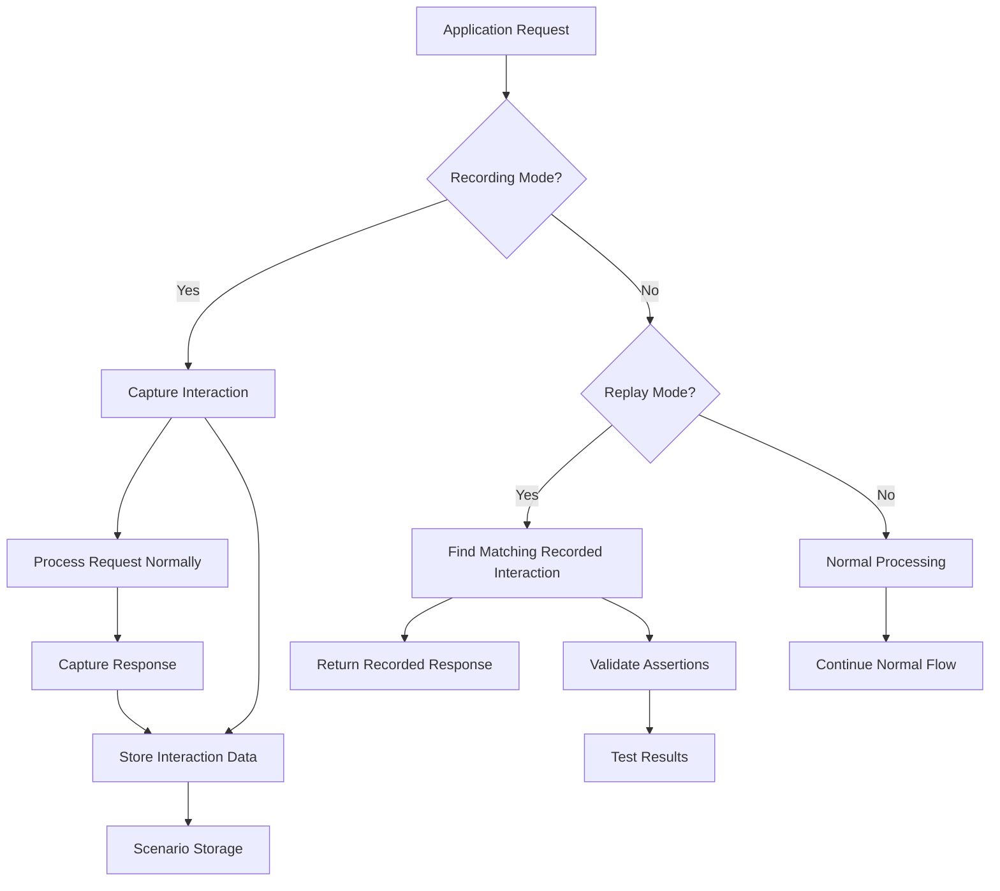

# Record/Replay Testing Framework Guide

## Table of Contents
1. [Overview](#overview)
2. [Testing Architecture](#testing-architecture)
3. [Recording Capabilities](#recording-capabilities)
4. [Replay Features](#replay-features)
5. [Scenario Management](#scenario-management)
6. [Regression Testing](#regression-testing)
7. [Integration Examples](#integration-examples)
8. [Configuration](#configuration)
9. [API Reference](#api-reference)
10. [Best Practices](#best-practices)

## Overview

The ACT Placemat platform implements a sophisticated Record/Replay Testing Framework that captures real system interactions for deterministic testing, regression prevention, and debugging. This framework enables reliable testing by recording actual system behavior and replaying it consistently across different environments.

### Key Benefits
- **Deterministic Testing**: Consistent test results across environments
- **Real-World Scenarios**: Tests based on actual system interactions
- **Regression Prevention**: Automatic detection of behavior changes
- **Debugging Support**: Detailed interaction history for troubleshooting
- **Performance Baselines**: Track performance changes over time

### Core Capabilities
- **API Interaction Recording**: Complete HTTP request/response cycles
- **Database Transaction Capture**: SQL queries, results, and execution plans
- **External Service Mocking**: Deterministic replay of third-party APIs
- **Scenario Organization**: Logical grouping of related interactions
- **Automated Regression Testing**: Continuous validation of system behavior

## Testing Architecture

### Service Architecture
**Location**: `/apps/backend/src/services/recordReplayService.js`

```javascript
class RecordReplayService {
  constructor() {
    this.isInitialized = false;
    this.isRecording = false;
    this.isReplaying = false;
    this.currentScenario = null;
    this.replayData = new Map();
    this.config = {
      scenariosPath: './test/scenarios',
      maxInteractions: 10000,
      compressionEnabled: true,
      encryptSensitiveData: true,
      retentionDays: 30
    };
  }
}
```

### Data Flow Architecture



### Storage Structure

```
test/scenarios/
├── scenario-{uuid}/
│   ├── metadata.json          # Scenario information
│   ├── interactions/          # Recorded interactions
│   │   ├── api-{timestamp}.json
│   │   ├── database-{timestamp}.json
│   │   └── external-{timestamp}.json
│   ├── assertions/            # Test assertions
│   │   └── expected-outcomes.json
│   ├── mocks/                 # Mock responses
│   │   └── external-services.json
│   └── reports/               # Test reports
│       └── regression-results.json
```

## Recording Capabilities

### API Interaction Recording

```javascript
// HTTP request/response recording
const apiInteractionCapture = {
  id: 'api-1642234567890',
  type: 'api',
  timestamp: '2024-01-15T10:30:00.000Z',
  scenario: 'user-registration-flow',
  request: {
    method: 'POST',
    url: '/api/users/register',
    headers: {
      'Content-Type': 'application/json',
      'User-Agent': 'ACT-Placemat-Client/1.0',
      'Authorization': 'Bearer [REDACTED]' // Automatically redacted
    },
    body: {
      email: 'test@example.com',
      name: 'Test User',
      preferences: {
        newsletter: true,
        notifications: false
      }
    },
    query: {},
    params: {}
  },
  response: {
    status: 201,
    statusText: 'Created',
    headers: {
      'Content-Type': 'application/json',
      'Location': '/api/users/user_abc123'
    },
    body: {
      id: 'user_abc123',
      email: 'test@example.com',
      name: 'Test User',
      created_at: '2024-01-15T10:30:00.000Z',
      updated_at: '2024-01-15T10:30:00.000Z'
    }
  },
  timing: {
    start: 1642234567890,
    end: 1642234568135,
    duration: 245
  },
  context: {
    user_id: 'user_abc123',
    session_id: 'session_xyz789',
    trace_id: '1234567890abcdef'
  }
};
```

### Database Transaction Recording

```javascript
// Database operation capture
const databaseInteractionCapture = {
  id: 'db-1642234567891',
  type: 'database',
  timestamp: '2024-01-15T10:30:00.100Z',
  scenario: 'user-registration-flow',
  operation: {
    type: 'INSERT',
    table: 'users',
    sql: 'INSERT INTO users (email, name, preferences) VALUES ($1, $2, $3) RETURNING *',
    parameters: [
      'test@example.com',
      'Test User',
      { newsletter: true, notifications: false }
    ],
    execution_plan: {
      node_type: 'Insert',
      relation_name: 'users',
      total_cost: 0.01,
      startup_cost: 0.00,
      plan_rows: 1,
      plan_width: 32
    }
  },
  result: {
    rows: [{
      id: 'user_abc123',
      email: 'test@example.com',
      name: 'Test User',
      preferences: { newsletter: true, notifications: false },
      created_at: '2024-01-15T10:30:00.000Z',
      updated_at: '2024-01-15T10:30:00.000Z'
    }],
    row_count: 1,
    affected_rows: 1,
    command: 'INSERT'
  },
  timing: {
    start: 1642234567891,
    end: 1642234567903,
    duration: 12,
    queue_time: 2,
    execution_time: 10
  },
  connection: {
    pool_id: 'pool_1',
    connection_id: 'conn_abc',
    active_connections: 3,
    idle_connections: 7
  }
};
```

### External Service Recording

```javascript
// External API call capture
const externalServiceCapture = {
  id: 'ext-1642234567892',
  type: 'external',
  timestamp: '2024-01-15T10:30:00.200Z',
  scenario: 'user-registration-flow',
  service: {
    name: 'notification-service',
    url: 'https://api.notifications.example.com/send',
    version: 'v1',
    provider: 'external'
  },
  request: {
    method: 'POST',
    url: 'https://api.notifications.example.com/send',
    headers: {
      'Authorization': 'Bearer [REDACTED]',
      'Content-Type': 'application/json'
    },
    body: {
      type: 'welcome_email',
      recipient: 'test@example.com',
      template_data: {
        name: 'Test User',
        verification_url: 'https://app.actplacemat.org/verify/abc123'
      }
    }
  },
  response: {
    status: 200,
    headers: {
      'Content-Type': 'application/json'
    },
    body: {
      message_id: 'msg_xyz789',
      status: 'queued',
      estimated_delivery: '2024-01-15T10:32:00.000Z'
    }
  },
  timing: {
    start: 1642234567892,
    end: 1642234568036,
    duration: 144,
    dns_lookup: 15,
    tcp_connect: 23,
    tls_handshake: 45,
    request_send: 5,
    response_receive: 56
  },
  metadata: {
    rate_limit_remaining: 980,
    rate_limit_reset: '2024-01-15T11:00:00Z',
    retry_count: 0,
    circuit_breaker_state: 'closed'
  }
};
```

### Recording Configuration

```javascript
// Recording configuration options
const recordingConfig = {
  // What to capture
  captureRequests: true,
  captureResponses: true,
  captureHeaders: true,
  captureTimings: true,
  captureDatabase: true,
  captureExternal: true,
  
  // Data handling
  redactSensitiveData: true,
  sensitiveFields: [
    'password', 'token', 'secret', 'key', 'authorization',
    'credit_card', 'ssn', 'phone', 'api_key'
  ],
  compressData: true,
  encryptStorage: true,
  
  // Filtering
  excludeEndpoints: [
    '/health',
    '/metrics',
    '/favicon.ico'
  ],
  includeOnlyMethods: ['GET', 'POST', 'PUT', 'DELETE'],
  maxPayloadSize: 1024 * 1024, // 1MB
  
  // Performance
  samplingRate: 1.0, // 100% for development
  batchSize: 100,
  flushInterval: 5000, // 5 seconds
  
  // Retention
  maxScenarios: 1000,
  retentionDays: 30,
  autoCleanup: true
};
```

## Replay Features

### Deterministic Replay

```javascript
// Replay configuration for deterministic testing
const replayConfig = {
  deterministicMode: true,
  strictMatching: true,
  allowPartialMatches: false,
  mockExternalServices: true,
  preserveTimestamps: false,
  
  // Time mocking
  mockTime: {
    enabled: true,
    baseTime: '2024-01-15T10:30:00.000Z',
    timeMultiplier: 1.0
  },
  
  // Random mocking
  mockRandom: {
    enabled: true,
    seed: 12345,
    sequences: ['uuid', 'timestamp', 'random']
  },
  
  // Network mocking
  mockNetwork: {
    latency: 100, // Fixed 100ms latency
    jitter: 0,    // No jitter for deterministic tests
    packetLoss: 0 // No packet loss
  }
};

// Start replay session
async function startReplaySession(scenarioId, options = {}) {
  return await tracingService.startActiveSpan('testing.start_replay', {
    attributes: {
      'test.scenario_id': scenarioId,
      'test.replay_mode': 'deterministic',
      'test.options': JSON.stringify(options)
    }
  }, async (span) => {
    
    try {
      // Load scenario data
      const scenario = await this.loadScenario(scenarioId);
      if (!scenario) {
        throw new Error(`Scenario not found: ${scenarioId}`);
      }
      
      // Validate scenario integrity
      const validation = await this.validateScenario(scenario);
      if (!validation.valid) {
        throw new Error(`Invalid scenario: ${validation.errors.join(', ')}`);
      }
      
      // Initialize replay state
      this.isReplaying = true;
      this.currentScenario = scenario;
      this.replayIndex = 0;
      this.replayData.clear();
      
      // Load interactions into memory
      for (const interaction of scenario.interactions) {
        this.replayData.set(interaction.id, interaction);
      }
      
      // Setup mocks based on configuration
      if (options.mockExternalServices) {
        await this.setupExternalServiceMocks(scenario);
      }
      
      if (options.mockTime) {
        this.setupTimeMocking(options.mockTime);
      }
      
      if (options.mockRandom) {
        this.setupRandomMocking(options.mockRandom);
      }
      
      span.setAttributes({
        'test.scenario_loaded': true,
        'test.interactions_count': scenario.interactions.length,
        'test.mocks_enabled': !!options.mockExternalServices
      });
      
      console.log(`🎬 Started replay session: ${scenarioId}`);
      console.log(`   - Interactions: ${scenario.interactions.length}`);
      console.log(`   - Mode: ${options.deterministicMode ? 'Deterministic' : 'Flexible'}`);
      
      return {
        success: true,
        scenario: scenario,
        sessionId: this.generateSessionId()
      };
      
    } catch (error) {
      span.recordException(error);
      this.isReplaying = false;
      this.currentScenario = null;
      throw error;
    }
  });
}
```

### Interaction Matching

```javascript
// Sophisticated interaction matching system
class InteractionMatcher {
  constructor(options = {}) {
    this.strictMode = options.strictMode || false;
    this.fuzzyMatching = options.fuzzyMatching || true;
    this.tolerances = options.tolerances || {
      timestamp: 1000,    // 1 second tolerance
      payload_size: 0.1,  // 10% size difference
      response_time: 0.5  // 50% time difference
    };
  }
  
  async findMatchingInteraction(request, recordedInteractions) {
    const candidates = [];
    
    for (const recorded of recordedInteractions) {
      const score = await this.calculateMatchScore(request, recorded);
      if (score > 0) {
        candidates.push({ interaction: recorded, score });
      }
    }
    
    // Sort by match score (highest first)
    candidates.sort((a, b) => b.score - a.score);
    
    if (candidates.length === 0) {
      throw new Error(`No matching interaction found for ${request.method} ${request.url}`);
    }
    
    const bestMatch = candidates[0];
    
    if (this.strictMode && bestMatch.score < 0.95) {
      throw new Error(`No exact match found (best score: ${bestMatch.score})`);
    }
    
    return bestMatch.interaction;
  }
  
  async calculateMatchScore(request, recorded) {
    let score = 0;
    let maxScore = 0;
    
    // Method matching (required)
    maxScore += 20;
    if (request.method === recorded.request.method) {
      score += 20;
    } else {
      return 0; // Method must match
    }
    
    // URL path matching (required)
    maxScore += 30;
    const requestPath = new URL(request.url, 'http://localhost').pathname;
    const recordedPath = new URL(recorded.request.url, 'http://localhost').pathname;
    
    if (requestPath === recordedPath) {
      score += 30;
    } else {
      // Try parameter substitution
      const pathScore = this.calculatePathSimilarity(requestPath, recordedPath);
      score += pathScore * 30;
      if (pathScore < 0.8) {
        return 0; // Path must be very similar
      }
    }
    
    // Headers matching (optional)
    maxScore += 15;
    const headerScore = this.calculateHeaderSimilarity(request.headers, recorded.request.headers);
    score += headerScore * 15;
    
    // Query parameters matching (optional)
    maxScore += 10;
    const queryScore = this.calculateQuerySimilarity(request.query, recorded.request.query);
    score += queryScore * 10;
    
    // Body matching (optional for GET requests)
    if (request.method !== 'GET') {
      maxScore += 25;
      const bodyScore = this.calculateBodySimilarity(request.body, recorded.request.body);
      score += bodyScore * 25;
    }
    
    return score / maxScore;
  }
  
  calculatePathSimilarity(path1, path2) {
    // Handle parameterized paths like /users/:id
    const segments1 = path1.split('/');
    const segments2 = path2.split('/');
    
    if (segments1.length !== segments2.length) {
      return 0;
    }
    
    let matches = 0;
    for (let i = 0; i < segments1.length; i++) {
      if (segments1[i] === segments2[i]) {
        matches++;
      } else if (this.isParameterSegment(segments1[i]) || this.isParameterSegment(segments2[i])) {
        matches += 0.8; // Parameter segments get partial credit
      }
    }
    
    return matches / segments1.length;
  }
  
  isParameterSegment(segment) {
    // Check if segment looks like a parameter (UUID, number, etc.)
    return /^[a-f0-9-]{36}$/.test(segment) || // UUID
           /^\d+$/.test(segment) ||           // Number
           /^[a-zA-Z0-9_-]+$/.test(segment) && segment.length > 10; // Long alphanumeric
  }
}
```

## Scenario Management

### Scenario Creation and Organization

```javascript
// Scenario metadata structure
const scenarioMetadata = {
  id: 'scenario-uuid-here',
  name: 'User Registration Flow',
  description: 'Complete user registration including email verification',
  type: 'integration', // 'unit', 'integration', 'e2e', 'regression'
  tags: ['authentication', 'user-management', 'email'],
  
  // Timing information
  created_at: '2024-01-15T10:30:00.000Z',
  updated_at: '2024-01-15T10:30:00.000Z',
  last_run: '2024-01-15T14:20:00.000Z',
  
  // Configuration
  configuration: {
    recording_options: recordingConfig,
    replay_options: replayConfig,
    assertions: [],
    timeout: 30000 // 30 seconds
  },
  
  // Statistics
  statistics: {
    interactions_count: 15,
    total_duration: 2450, // milliseconds
    api_calls: 8,
    database_operations: 5,
    external_services: 2,
    assertions: 12
  },
  
  // Test results history
  test_history: [
    {
      timestamp: '2024-01-15T14:20:00.000Z',
      result: 'passed',
      duration: 2380,
      assertions: { passed: 12, failed: 0 }
    }
  ],
  
  // Dependencies
  dependencies: {
    requires: ['database-setup', 'email-service'],
    provides: ['user-account'],
    conflicts: []
  }
};

// Scenario management API
class ScenarioManager {
  async createScenario(name, options = {}) {
    const scenario = {
      id: this.generateScenarioId(),
      name,
      description: options.description || '',
      type: options.type || 'integration',
      tags: options.tags || [],
      created_at: new Date().toISOString(),
      configuration: {
        ...this.defaultConfiguration,
        ...options.configuration
      },
      interactions: [],
      assertions: options.assertions || [],
      statistics: this.initializeStatistics()
    };
    
    await this.saveScenario(scenario);
    return scenario;
  }
  
  async addInteractionToScenario(scenarioId, interaction) {
    const scenario = await this.loadScenario(scenarioId);
    if (!scenario) {
      throw new Error(`Scenario not found: ${scenarioId}`);
    }
    
    scenario.interactions.push(interaction);
    scenario.updated_at = new Date().toISOString();
    
    // Update statistics
    this.updateScenarioStatistics(scenario);
    
    await this.saveScenario(scenario);
    return scenario;
  }
  
  async tagScenario(scenarioId, tags) {
    const scenario = await this.loadScenario(scenarioId);
    scenario.tags = [...new Set([...scenario.tags, ...tags])];
    scenario.updated_at = new Date().toISOString();
    
    await this.saveScenario(scenario);
    return scenario;
  }
  
  async searchScenarios(query) {
    const allScenarios = await this.listScenarios();
    
    return allScenarios.filter(scenario => 
      scenario.name.toLowerCase().includes(query.toLowerCase()) ||
      scenario.description.toLowerCase().includes(query.toLowerCase()) ||
      scenario.tags.some(tag => tag.toLowerCase().includes(query.toLowerCase()))
    );
  }
}
```

### Assertion Framework

```javascript
// Test assertion system
const assertionTypes = {
  response_status: {
    name: 'Response Status Code',
    validator: (expected, actual) => actual.status === expected,
    errorMessage: (expected, actual) => `Expected status ${expected}, got ${actual.status}`
  },
  
  response_body_contains: {
    name: 'Response Body Contains',
    validator: (expected, actual) => 
      JSON.stringify(actual.body).includes(expected),
    errorMessage: (expected, actual) => `Response body does not contain "${expected}"`
  },
  
  response_time: {
    name: 'Response Time',
    validator: (expected, actual) => actual.duration <= expected,
    errorMessage: (expected, actual) => 
      `Response time ${actual.duration}ms exceeded limit ${expected}ms`
  },
  
  database_row_count: {
    name: 'Database Row Count',
    validator: (expected, actual) => actual.result.row_count === expected,
    errorMessage: (expected, actual) => 
      `Expected ${expected} rows, got ${actual.result.row_count}`
  },
  
  external_service_called: {
    name: 'External Service Called',
    validator: (expected, actual, scenario) => {
      const externalCalls = scenario.interactions.filter(i => 
        i.type === 'external' && i.service.name === expected
      );
      return externalCalls.length > 0;
    },
    errorMessage: (expected) => `External service "${expected}" was not called`
  }
};

// Assertion execution
async function executeAssertions(scenario, replayResults) {
  const assertionResults = [];
  
  for (const assertion of scenario.assertions) {
    const assertionType = assertionTypes[assertion.type];
    if (!assertionType) {
      assertionResults.push({
        assertion,
        passed: false,
        error: `Unknown assertion type: ${assertion.type}`
      });
      continue;
    }
    
    try {
      const target = this.findAssertionTarget(assertion, replayResults);
      const passed = assertionType.validator(assertion.expected, target, scenario);
      
      assertionResults.push({
        assertion,
        passed,
        actual: target,
        error: passed ? null : assertionType.errorMessage(assertion.expected, target)
      });
      
    } catch (error) {
      assertionResults.push({
        assertion,
        passed: false,
        error: error.message
      });
    }
  }
  
  return {
    total: assertionResults.length,
    passed: assertionResults.filter(r => r.passed).length,
    failed: assertionResults.filter(r => !r.passed).length,
    results: assertionResults
  };
}
```

## Regression Testing

### Automated Regression Test Runner
**Location**: `/apps/backend/src/scripts/regressionTester.js`

```javascript
// Comprehensive regression testing
class RegressionTester {
  async runAllRegressionTests(options = {}) {
    return await tracingService.startActiveSpan('testing.regression_suite', {
      attributes: {
        'test.type': 'regression_full',
        'test.parallel': options.parallel || false
      }
    }, async (span) => {
      
      const startTime = Date.now();
      console.log('🚀 Starting regression test suite...');
      
      // Get all regression scenarios
      const scenarios = await recordReplayService.listScenarios('regression');
      
      if (scenarios.length === 0) {
        return {
          success: true,
          totalTests: 0,
          message: 'No regression tests found'
        };
      }
      
      console.log(`🧪 Found ${scenarios.length} regression scenarios`);
      
      // Run tests (parallel or sequential)
      const results = options.parallel 
        ? await this.runTestsParallel(scenarios, options)
        : await this.runTestsSequential(scenarios, options);
      
      const duration = Date.now() - startTime;
      
      // Generate comprehensive report
      const report = await this.generateTestReport(results, duration);
      
      span.setAttributes({
        'test.total_scenarios': scenarios.length,
        'test.passed_tests': results.filter(r => r.passed).length,
        'test.failed_tests': results.filter(r => !r.passed).length,
        'test.duration': duration
      });
      
      const summary = {
        success: results.every(r => r.passed),
        totalTests: results.length,
        passed: results.filter(r => r.passed).length,
        failed: results.filter(r => !r.passed).length,
        duration,
        passRate: (results.filter(r => r.passed).length / results.length) * 100,
        report
      };
      
      console.log('🏁 Regression test suite completed:');
      console.log(`   - Total: ${summary.totalTests}`);
      console.log(`   - Passed: ${summary.passed} (${summary.passRate.toFixed(1)}%)`);
      console.log(`   - Failed: ${summary.failed}`);
      console.log(`   - Duration: ${duration}ms`);
      
      return summary;
    });
  }
  
  async runSingleRegressionTest(scenario, options = {}) {
    return await tracingService.startActiveSpan('testing.single_regression', {
      attributes: {
        'test.scenario_id': scenario.id,
        'test.scenario_name': scenario.name
      }
    }, async (span) => {
      
      const startTime = Date.now();
      
      try {
        console.log(`🔍 Testing scenario: ${scenario.name}`);
        
        // Start replay mode
        await recordReplayService.startReplay(scenario.id, {
          deterministicMode: true,
          strictMatching: options.strictMatching !== false
        });
        
        // Execute the scenario
        const testResult = await this.executeScenarioTest(scenario, options);
        
        // Stop replay mode
        await recordReplayService.stopReplay();
        
        const duration = Date.now() - startTime;
        
        const result = {
          scenarioId: scenario.id,
          scenarioName: scenario.name,
          passed: testResult.success,
          error: testResult.error || null,
          duration,
          interactions: testResult.interactions || 0,
          assertions: testResult.assertions || []
        };
        
        span.setAttributes({
          'test.passed': result.passed,
          'test.duration': duration,
          'test.interactions': result.interactions
        });
        
        return result;
        
      } catch (error) {
        span.recordException(error);
        
        // Ensure replay is stopped
        try {
          await recordReplayService.stopReplay();
        } catch (stopError) {
          console.warn('Warning: Could not stop replay:', stopError.message);
        }
        
        return {
          scenarioId: scenario.id,
          scenarioName: scenario.name,
          passed: false,
          error: error.message,
          duration: Date.now() - startTime
        };
      }
    });
  }
}
```

### Continuous Integration Integration

```javascript
// CI/CD integration
async function runContinuousIntegration(options = {}) {
  console.log('🔄 Starting CI regression tests...');
  
  const ciOptions = {
    ...options,
    parallel: true,
    retryFailedTests: true,
    generateReport: true,
    failFast: false
  };
  
  const results = await regressionTester.runAllRegressionTests(ciOptions);
  
  // Export results for CI system
  const junitReport = generateJUnitReport(results);
  await fs.writeFile('./test-results.xml', junitReport);
  
  // Export coverage data
  const coverageReport = generateCoverageReport(results);
  await fs.writeFile('./coverage.json', JSON.stringify(coverageReport, null, 2));
  
  // Exit with appropriate code
  if (!results.success) {
    console.error(`❌ CI tests failed: ${results.failed}/${results.totalTests} tests failed`);
    process.exit(1);
  }
  
  console.log('✅ All CI tests passed');
  return results;
}

// JUnit XML report generation
function generateJUnitReport(results) {
  const testSuites = results.results.map(result => `
    <testcase 
      classname="${result.scenarioName}" 
      name="${result.scenarioName}" 
      time="${result.duration / 1000}">
      ${result.passed ? '' : `<failure message="${result.error}"></failure>`}
    </testcase>
  `).join('');
  
  return `<?xml version="1.0" encoding="UTF-8"?>
<testsuites 
  tests="${results.totalTests}" 
  failures="${results.failed}" 
  time="${results.duration / 1000}">
  <testsuite name="RegressionTests" tests="${results.totalTests}" failures="${results.failed}">
    ${testSuites}
  </testsuite>
</testsuites>`;
}
```

## Integration Examples

### Express.js Middleware Integration

```javascript
// Recording middleware
function recordingMiddleware(options = {}) {
  return async (req, res, next) => {
    if (!recordReplayService.isRecording) {
      return next();
    }
    
    const interactionId = recordReplayService.generateInteractionId();
    const startTime = Date.now();
    
    // Capture request
    const requestData = {
      id: interactionId,
      type: 'api',
      timestamp: new Date().toISOString(),
      request: {
        method: req.method,
        url: req.url,
        headers: sanitizeHeaders(req.headers),
        body: req.body,
        query: req.query,
        params: req.params
      }
    };
    
    // Intercept response
    const originalSend = res.send;
    res.send = function(data) {
      const endTime = Date.now();
      
      requestData.response = {
        status: res.statusCode,
        statusText: res.statusMessage,
        headers: sanitizeHeaders(res.getHeaders()),
        body: data
      };
      
      requestData.timing = {
        start: startTime,
        end: endTime,
        duration: endTime - startTime
      };
      
      // Store interaction
      recordReplayService.addInteraction(requestData);
      
      return originalSend.call(this, data);
    };
    
    next();
  };
}

// Replay middleware
function replayMiddleware(options = {}) {
  return async (req, res, next) => {
    if (!recordReplayService.isReplaying) {
      return next();
    }
    
    try {
      // Find matching recorded interaction
      const recordedInteraction = await recordReplayService.findMatchingInteraction({
        method: req.method,
        url: req.url,
        headers: req.headers,
        body: req.body,
        query: req.query,
        params: req.params
      });
      
      if (recordedInteraction) {
        // Return recorded response
        res.status(recordedInteraction.response.status);
        
        // Set headers
        Object.entries(recordedInteraction.response.headers).forEach(([key, value]) => {
          res.set(key, value);
        });
        
        // Simulate response time if configured
        if (options.simulateLatency) {
          await new Promise(resolve => 
            setTimeout(resolve, recordedInteraction.timing.duration)
          );
        }
        
        return res.send(recordedInteraction.response.body);
      }
      
    } catch (error) {
      console.warn('Replay failed, falling back to normal processing:', error.message);
    }
    
    next();
  };
}
```

### Database Integration

```javascript
// Database operation recording
class DatabaseRecorder {
  constructor(databaseClient) {
    this.client = databaseClient;
    this.originalQuery = databaseClient.query.bind(databaseClient);
    this.setupRecording();
  }
  
  setupRecording() {
    this.client.query = async (sql, params = []) => {
      const interactionId = recordReplayService.generateInteractionId();
      const startTime = Date.now();
      
      try {
        // Execute the query
        const result = await this.originalQuery(sql, params);
        const endTime = Date.now();
        
        // Record the interaction if recording is active
        if (recordReplayService.isRecording) {
          const interaction = {
            id: interactionId,
            type: 'database',
            timestamp: new Date().toISOString(),
            operation: {
              type: this.extractOperationType(sql),
              sql: sql,
              parameters: params
            },
            result: {
              rows: result.rows,
              row_count: result.rowCount,
              command: result.command
            },
            timing: {
              start: startTime,
              end: endTime,
              duration: endTime - startTime
            }
          };
          
          await recordReplayService.addInteraction(interaction);
        }
        
        return result;
        
      } catch (error) {
        const endTime = Date.now();
        
        // Record the error if recording is active
        if (recordReplayService.isRecording) {
          const interaction = {
            id: interactionId,
            type: 'database',
            timestamp: new Date().toISOString(),
            operation: {
              type: this.extractOperationType(sql),
              sql: sql,
              parameters: params
            },
            error: {
              message: error.message,
              code: error.code,
              detail: error.detail
            },
            timing: {
              start: startTime,
              end: endTime,
              duration: endTime - startTime
            }
          };
          
          await recordReplayService.addInteraction(interaction);
        }
        
        throw error;
      }
    };
  }
  
  extractOperationType(sql) {
    const firstWord = sql.trim().split(' ')[0].toUpperCase();
    return ['SELECT', 'INSERT', 'UPDATE', 'DELETE', 'CREATE', 'ALTER', 'DROP'].includes(firstWord) 
      ? firstWord 
      : 'UNKNOWN';
  }
}
```

## Configuration

### Service Configuration

```javascript
// Record/Replay service configuration
const recordReplayConfig = {
  // Storage settings
  scenariosPath: process.env.SCENARIOS_PATH || './test/scenarios',
  maxScenarios: parseInt(process.env.MAX_SCENARIOS) || 1000,
  maxInteractions: parseInt(process.env.MAX_INTERACTIONS) || 10000,
  
  // Recording settings
  recordingEnabled: process.env.RECORDING_ENABLED !== 'false',
  replayEnabled: process.env.REPLAY_ENABLED !== 'false',
  
  // Data handling
  compressionEnabled: process.env.COMPRESSION_ENABLED !== 'false',
  encryptSensitiveData: process.env.ENCRYPT_SENSITIVE_DATA !== 'false',
  redactSensitiveFields: process.env.REDACT_SENSITIVE_FIELDS !== 'false',
  
  // Performance
  batchSize: parseInt(process.env.BATCH_SIZE) || 100,
  flushInterval: parseInt(process.env.FLUSH_INTERVAL) || 5000,
  
  // Retention
  retentionDays: parseInt(process.env.RETENTION_DAYS) || 30,
  autoCleanup: process.env.AUTO_CLEANUP !== 'false',
  
  // Testing
  deterministicMode: process.env.DETERMINISTIC_MODE !== 'false',
  strictMatching: process.env.STRICT_MATCHING !== 'false',
  mockExternalServices: process.env.MOCK_EXTERNAL_SERVICES !== 'false'
};
```

## API Reference

### Record/Replay Testing APIs

```
GET /api/testing/status                     - Testing service status
GET /api/testing/scenarios                  - List all scenarios
POST /api/testing/scenarios                 - Create new scenario
GET /api/testing/scenarios/:id              - Get scenario details
PUT /api/testing/scenarios/:id              - Update scenario
DELETE /api/testing/scenarios/:id           - Delete scenario

POST /api/testing/record/start              - Start recording session
POST /api/testing/record/stop               - Stop recording session
GET /api/testing/record/status              - Get recording status

POST /api/testing/replay/start              - Start replay session
POST /api/testing/replay/stop               - Stop replay session
GET /api/testing/replay/status              - Get replay status

GET /api/testing/interactions               - List interactions
GET /api/testing/interactions/:id           - Get interaction details

POST /api/testing/regression/run            - Run regression tests
GET /api/testing/regression/results         - Get test results
GET /api/testing/regression/reports         - List test reports
```

## Best Practices

### Recording Best Practices

```javascript
// ✅ Good recording practices

// 1. Use descriptive scenario names
await recordReplayService.startRecording('user-registration-with-email-verification');

// 2. Tag scenarios appropriately
await recordReplayService.tagScenario(scenarioId, [
  'authentication', 'email', 'integration', 'critical'
]);

// 3. Add meaningful assertions
const assertions = [
  { type: 'response_status', expected: 201 },
  { type: 'response_body_contains', expected: 'user_id' },
  { type: 'external_service_called', expected: 'email-service' }
];

// 4. Clean up after recording
await recordReplayService.stopRecording();
await recordReplayService.generateScenarioReport();

// ❌ Avoid these patterns

// Don't record without context
await recordReplayService.startRecording('test1');

// Don't include sensitive data
// (Service automatically redacts, but be mindful)

// Don't create overly long scenarios
// (Break into smaller, focused scenarios)
```

### Testing Best Practices

```javascript
// ✅ Good testing practices

// 1. Use deterministic replay for CI
const ciOptions = {
  deterministicMode: true,
  strictMatching: true,
  mockTime: true,
  mockRandom: true
};

// 2. Implement proper test isolation
beforeEach(async () => {
  await recordReplayService.resetState();
  await database.clearTestData();
});

// 3. Handle test failures gracefully
try {
  const result = await regressionTester.runSingleTest(scenario);
  if (!result.passed) {
    await generateFailureReport(result);
  }
} finally {
  await recordReplayService.stopReplay();
}

// 4. Use appropriate assertions
const assertions = [
  { type: 'response_status', expected: 200 },
  { type: 'response_time', expected: 1000 }, // max 1 second
  { type: 'database_row_count', expected: 1 }
];
```

This comprehensive Record/Replay Testing Framework provides robust regression testing capabilities, enabling reliable detection of system behavior changes and maintaining high-quality deployments for the ACT Placemat platform.