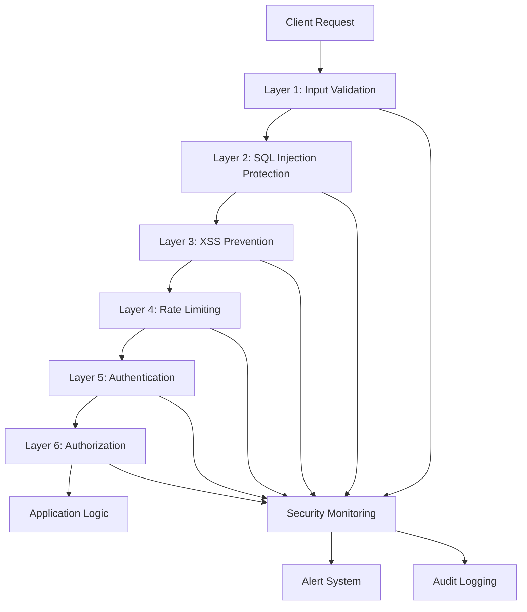

# Security Guardrails Implementation Guide

## Table of Contents
1. [Overview](#overview)
2. [Multi-Layer Security Architecture](#multi-layer-security-architecture)
3. [Input Validation System](#input-validation-system)
4. [SQL Injection Protection](#sql-injection-protection)
5. [XSS Prevention](#xss-prevention)
6. [Rate Limiting](#rate-limiting)
7. [Authentication & Authorization](#authentication--authorization)
8. [Security Monitoring](#security-monitoring)
9. [Configuration](#configuration)
10. [API Reference](#api-reference)
11. [Best Practices](#best-practices)

## Overview

The ACT Placemat platform implements a comprehensive multi-layer security framework designed to protect against common web vulnerabilities and ensure data integrity. The Security Guardrails Service provides real-time threat detection, automatic mitigation, and comprehensive security monitoring.

### Key Security Features
- **Multi-Layer Defense**: 6 distinct security layers with different protection mechanisms
- **Real-Time Threat Detection**: Automatic pattern matching and anomaly detection
- **Intelligent Response**: Configurable actions from sanitization to blocking
- **Comprehensive Monitoring**: Real-time security event tracking and alerting
- **Zero-Configuration Security**: Automatic protection with sensible defaults

### Threat Coverage
- **Injection Attacks**: SQL injection, NoSQL injection, command injection
- **Cross-Site Scripting (XSS)**: Reflected, stored, and DOM-based XSS
- **Authentication Attacks**: Brute force, credential stuffing, token manipulation
- **Authorization Bypass**: Privilege escalation, access control violations
- **Rate Limit Abuse**: DoS attacks, resource exhaustion
- **Data Exfiltration**: Unauthorized data access and bulk downloads

## Multi-Layer Security Architecture

### Security Layer Stack



### Service Architecture
**Location**: `/apps/backend/src/services/securityGuardrailsService.js`

```javascript
class SecurityGuardrailsService {
  constructor() {
    this.isInitialized = false;
    this.validators = new Map();
    this.rateLimiters = new Map();
    this.securityPatterns = new Map();
    this.alertThresholds = new Map();
    this.securityMetrics = new Map();
    this.config = {
      enableInputValidation: true,
      enableSQLInjectionProtection: true,
      enableXSSProtection: true,
      enableRateLimiting: true,
      enableSecurityHeaders: true,
      logSecurityEvents: true,
      alertOnThreats: true
    };
  }
}
```

## Input Validation System

### Schema-Based Validation

```javascript
// JSON Schema validation for all inputs
const userRegistrationSchema = {
  type: 'object',
  properties: {
    email: {
      type: 'string',
      format: 'email',
      maxLength: 100
    },
    name: {
      type: 'string',
      minLength: 1,
      maxLength: 50,
      pattern: '^[a-zA-Z\\s]+$'
    },
    age: {
      type: 'integer',
      minimum: 13,
      maximum: 120
    },
    preferences: {
      type: 'object',
      additionalProperties: false,
      properties: {
        newsletter: { type: 'boolean' },
        notifications: { type: 'boolean' }
      }
    }
  },
  required: ['email', 'name'],
  additionalProperties: false
};

// Usage in middleware
app.post('/api/users/register', 
  securityGuardrailsService.validateInput(userRegistrationSchema),
  async (req, res) => {
    // Input is guaranteed to be valid
    const user = await userService.register(req.body);
    res.json(user);
  }
);
```

### Advanced Input Sanitization

```javascript
// Comprehensive input sanitization
const sanitizationOptions = {
  // Basic sanitization
  trimWhitespace: true,
  removeNullBytes: true,
  normalizeUnicode: true,
  
  // HTML/XSS protection
  allowHTML: false,
  stripScripts: true,
  encodeEntities: true,
  allowedTags: [], // Empty = no HTML allowed
  
  // SQL injection protection
  escapeSQLChars: true,
  removeComments: true,
  blockUnionSelect: true,
  
  // Size limits
  maxLength: 1000,
  maxDepth: 5, // For nested objects
  
  // Pattern blocking
  blockPatterns: [
    /javascript:/i,
    /vbscript:/i,
    /data:text\/html/i,
    /on\w+\s*=/i
  ]
};

// Automatic sanitization middleware
app.use('/api', securityGuardrailsService.sanitizeInput(sanitizationOptions));

// Manual sanitization
const safeInput = await securityGuardrailsService.sanitizeInput(userInput, {
  allowHTML: false,
  stripScripts: true,
  maxLength: 500
});
```

### File Upload Security

```javascript
// Secure file upload validation
const fileUploadSecurity = {
  allowedTypes: ['image/jpeg', 'image/png', 'application/pdf'],
  maxFileSize: 5 * 1024 * 1024, // 5MB
  maxFiles: 10,
  scanForMalware: true,
  quarantineDirectory: './quarantine/',
  allowedExtensions: ['.jpg', '.jpeg', '.png', '.pdf']
};

app.post('/api/upload', 
  securityGuardrailsService.validateFileUpload(fileUploadSecurity),
  async (req, res) => {
    // Files are guaranteed to be safe
    const uploadedFiles = await fileService.processUpload(req.files);
    res.json(uploadedFiles);
  }
);
```

## SQL Injection Protection

### Pattern-Based Detection

```javascript
// SQL injection detection patterns
const sqlInjectionPatterns = [
  // Union-based injection
  /union\s+select/i,
  /union\s+all\s+select/i,
  
  // Boolean-based injection
  /1\s*=\s*1/i,
  /1\s*=\s*0/i,
  /'?\s*or\s+'?1'?\s*=\s*'?1/i,
  
  // Time-based injection
  /sleep\s*\(/i,
  /waitfor\s+delay/i,
  /pg_sleep\s*\(/i,
  
  // Error-based injection
  /convert\s*\(/i,
  /cast\s*\(/i,
  /extractvalue\s*\(/i,
  
  // Stacked queries
  /;\s*(drop|delete|insert|update|create)/i,
  
  // Comment injection
  /--\s*$/,
  /\/\*[\s\S]*?\*\//,
  /#.*$/,
  
  // Function calls
  /database\s*\(/i,
  /version\s*\(/i,
  /user\s*\(/i,
  /system_user\s*\(/i
];

// Real-time SQL injection detection
async function detectSQLInjection(input, context = {}) {
  const results = {
    detected: false,
    patterns: [],
    severity: 'low',
    action: 'allow'
  };
  
  for (const pattern of sqlInjectionPatterns) {
    if (pattern.test(input)) {
      results.detected = true;
      results.patterns.push(pattern.source);
      results.severity = 'critical';
      results.action = 'block';
      
      // Log security event
      await this.logSecurityEvent('sql_injection_attempt', {
        input: input.substring(0, 100),
        pattern: pattern.source,
        context,
        action: 'blocked'
      });
      
      break;
    }
  }
  
  return results;
}
```

### Safe Query Execution

```javascript
// Parameterized query wrapper
async function executeSafeQuery(sql, parameters = [], options = {}) {
  return await tracingService.startActiveSpan('security.safe_query', {
    attributes: {
      'security.operation': 'sql_execution',
      'security.parameterized': true,
      'db.statement_type': extractStatementType(sql)
    }
  }, async (span) => {
    
    // Validate SQL statement
    const sqlValidation = await this.validateSQLStatement(sql);
    if (!sqlValidation.safe) {
      const error = new Error(`Unsafe SQL statement: ${sqlValidation.reason}`);
      span.recordException(error);
      throw error;
    }
    
    // Validate parameters
    const paramValidation = await this.validateSQLParameters(parameters);
    if (!paramValidation.safe) {
      const error = new Error(`Unsafe SQL parameters: ${paramValidation.reason}`);
      span.recordException(error);
      throw error;
    }
    
    span.setAttributes({
      'security.sql_validated': true,
      'security.parameters_validated': true,
      'db.parameter_count': parameters.length
    });
    
    // Execute with monitoring
    const startTime = Date.now();
    const result = await database.query(sql, parameters);
    const duration = Date.now() - startTime;
    
    span.setAttributes({
      'db.duration': duration,
      'db.rows_affected': result.rowCount,
      'security.execution_safe': true
    });
    
    return result;
  });
}

// Usage examples
// ✅ Safe - parameterized query
const users = await securityGuardrailsService.executeSafeQuery(
  'SELECT * FROM users WHERE email = $1 AND status = $2',
  [email, 'active']
);

// ✅ Safe - with validation
const projects = await securityGuardrailsService.executeSafeQuery(
  'SELECT * FROM projects WHERE created_at > $1 LIMIT $2',
  [new Date('2024-01-01'), 10],
  { maxRows: 100 }
);

// ❌ Blocked - potential injection
try {
  const maliciousQuery = `SELECT * FROM users WHERE id = ${userId}`;
  await securityGuardrailsService.executeSafeQuery(maliciousQuery);
} catch (error) {
  // Error: Unsafe SQL statement: Direct parameter interpolation detected
}
```

## XSS Prevention

### Content Security Policy (CSP)

```javascript
// Comprehensive CSP configuration
const cspConfig = {
  directives: {
    'default-src': ["'self'"],
    'script-src': [
      "'self'",
      "'unsafe-inline'", // Only for development
      'https://unpkg.com',
      'https://cdn.jsdelivr.net'
    ],
    'style-src': [
      "'self'",
      "'unsafe-inline'",
      'https://fonts.googleapis.com'
    ],
    'img-src': [
      "'self'",
      'data:',
      'https:',
      'blob:'
    ],
    'font-src': [
      "'self'",
      'https://fonts.gstatic.com'
    ],
    'connect-src': [
      "'self'",
      'https://api.actplacemat.org',
      'https://api.notion.com'
    ],
    'frame-ancestors': ["'none'"],
    'form-action': ["'self'"],
    'base-uri': ["'self'"],
    'object-src': ["'none'"],
    'upgrade-insecure-requests': []
  },
  reportUri: '/api/security/csp-report'
};

// Apply CSP middleware
app.use(securityGuardrailsService.cspMiddleware(cspConfig));
```

### XSS Detection and Sanitization

```javascript
// XSS detection patterns
const xssPatterns = [
  // Script tags
  /<script[\s\S]*?>[\s\S]*?<\/script>/i,
  /<script[\s\S]*?>/i,
  
  // Event handlers
  /on\w+\s*=\s*["'][^"']*["']/i,
  /on\w+\s*=\s*[^>\s]+/i,
  
  // JavaScript protocols
  /javascript\s*:/i,
  /vbscript\s*:/i,
  /data\s*:\s*text\/html/i,
  
  // HTML injection
  /<iframe[\s\S]*?>/i,
  /<object[\s\S]*?>/i,
  /<embed[\s\S]*?>/i,
  /<form[\s\S]*?>/i,
  
  // CSS injection
  /expression\s*\(/i,
  /@import/i,
  /binding\s*:/i,
  
  // Data URIs
  /data\s*:\s*image\/svg\+xml/i
];

// XSS sanitization function
async function sanitizeXSS(input, options = {}) {
  const sanitized = {
    clean: input,
    threats: [],
    modified: false
  };
  
  for (const pattern of xssPatterns) {
    if (pattern.test(sanitized.clean)) {
      sanitized.threats.push({
        pattern: pattern.source,
        type: 'xss_attempt',
        severity: 'high'
      });
      
      // Remove or encode the threat
      if (options.stripTags) {
        sanitized.clean = sanitized.clean.replace(pattern, '');
      } else {
        sanitized.clean = this.htmlEncode(sanitized.clean);
      }
      
      sanitized.modified = true;
      
      // Log security event
      await this.logSecurityEvent('xss_attempt', {
        original: input.substring(0, 100),
        sanitized: sanitized.clean.substring(0, 100),
        pattern: pattern.source
      });
    }
  }
  
  return sanitized;
}

// HTML encoding utility
function htmlEncode(str) {
  return str
    .replace(/&/g, '&amp;')
    .replace(/</g, '&lt;')
    .replace(/>/g, '&gt;')
    .replace(/"/g, '&quot;')
    .replace(/'/g, '&#x27;')
    .replace(/\//g, '&#x2F;');
}
```

### Safe HTML Rendering

```javascript
// Whitelist-based HTML sanitization
const allowedTags = {
  'p': ['class'],
  'div': ['class'],
  'span': ['class'],
  'strong': [],
  'em': [],
  'h1': ['class'],
  'h2': ['class'],
  'h3': ['class'],
  'ul': ['class'],
  'ol': ['class'],
  'li': ['class'],
  'a': ['href', 'title', 'target'],
  'img': ['src', 'alt', 'width', 'height']
};

async function sanitizeHTML(html, options = {}) {
  const allowedTagsConfig = options.allowedTags || allowedTags;
  
  return await tracingService.startActiveSpan('security.html_sanitization', {
    attributes: {
      'security.operation': 'html_sanitization',
      'html.length': html.length,
      'allowed_tags_count': Object.keys(allowedTagsConfig).length
    }
  }, async (span) => {
    
    const sanitized = DOMPurify.sanitize(html, {
      ALLOWED_TAGS: Object.keys(allowedTagsConfig),
      ALLOWED_ATTR: Object.values(allowedTagsConfig).flat(),
      ALLOW_DATA_ATTR: false,
      ALLOW_UNKNOWN_PROTOCOLS: false,
      RETURN_DOM: false,
      RETURN_DOM_FRAGMENT: false,
      RETURN_TRUSTED_TYPE: false
    });
    
    span.setAttributes({
      'security.html_sanitized': true,
      'html.sanitized_length': sanitized.length,
      'html.modification_ratio': (html.length - sanitized.length) / html.length
    });
    
    return sanitized;
  });
}
```

## Rate Limiting

### Multi-Level Rate Limiting

```javascript
// Rate limiting configuration
const rateLimitConfig = {
  global: {
    windowMs: 15 * 60 * 1000, // 15 minutes
    max: 1000,                // 1000 requests per window
    message: 'Too many requests, please try again later'
  },
  perUser: {
    windowMs: 60 * 1000,      // 1 minute
    max: 60,                  // 60 requests per minute per user
    keyGenerator: (req) => req.user?.id || req.ip
  },
  perEndpoint: {
    '/api/upload': {
      windowMs: 60 * 1000,
      max: 5                  // 5 uploads per minute
    },
    '/api/auth/login': {
      windowMs: 15 * 60 * 1000,
      max: 5                  // 5 login attempts per 15 minutes
    },
    '/api/search': {
      windowMs: 60 * 1000,
      max: 100                // 100 searches per minute
    }
  },
  burst: {
    windowMs: 1000,           // 1 second
    max: 10                   // Max 10 requests per second
  }
};

// Rate limiting middleware factory
function createRateLimiter(config) {
  return async (req, res, next) => {
    const key = config.keyGenerator ? config.keyGenerator(req) : req.ip;
    const windowKey = `ratelimit:${key}:${Math.floor(Date.now() / config.windowMs)}`;
    
    const current = await redis.incr(windowKey);
    
    if (current === 1) {
      await redis.expire(windowKey, Math.ceil(config.windowMs / 1000));
    }
    
    if (current > config.max) {
      // Log rate limit violation
      await securityGuardrailsService.logSecurityEvent('rate_limit_exceeded', {
        key,
        current,
        max: config.max,
        endpoint: req.path,
        ip: req.ip,
        userAgent: req.get('User-Agent')
      });
      
      return res.status(429).json({
        error: config.message || 'Rate limit exceeded',
        retryAfter: Math.ceil(config.windowMs / 1000)
      });
    }
    
    // Add rate limit headers
    res.set({
      'X-RateLimit-Limit': config.max,
      'X-RateLimit-Remaining': Math.max(0, config.max - current),
      'X-RateLimit-Reset': new Date(Date.now() + config.windowMs)
    });
    
    next();
  };
}
```

### Adaptive Rate Limiting

```javascript
// Dynamic rate limiting based on user behavior
class AdaptiveRateLimiter {
  constructor() {
    this.userProfiles = new Map();
    this.suspiciousThreshold = 0.7;
  }
  
  async analyzeUserBehavior(userId, request) {
    const profile = this.userProfiles.get(userId) || {
      requests: [],
      riskScore: 0,
      lastActivity: Date.now()
    };
    
    // Add current request
    profile.requests.push({
      timestamp: Date.now(),
      endpoint: request.path,
      method: request.method,
      userAgent: request.get('User-Agent'),
      ip: request.ip
    });
    
    // Keep only recent requests (last hour)
    const oneHourAgo = Date.now() - 3600000;
    profile.requests = profile.requests.filter(r => r.timestamp > oneHourAgo);
    
    // Calculate risk score
    profile.riskScore = this.calculateRiskScore(profile.requests);
    profile.lastActivity = Date.now();
    
    this.userProfiles.set(userId, profile);
    
    return profile;
  }
  
  calculateRiskScore(requests) {
    let score = 0;
    
    // High frequency requests
    const requestsPerMinute = requests.length / 60;
    if (requestsPerMinute > 30) score += 0.3;
    
    // Diverse IP addresses
    const uniqueIPs = new Set(requests.map(r => r.ip)).size;
    if (uniqueIPs > 3) score += 0.2;
    
    // Diverse User-Agents
    const uniqueUAs = new Set(requests.map(r => r.userAgent)).size;
    if (uniqueUAs > 2) score += 0.2;
    
    // Unusual endpoint patterns
    const endpointDistribution = this.analyzeEndpointDistribution(requests);
    if (endpointDistribution.unusual) score += 0.3;
    
    return Math.min(score, 1.0);
  }
  
  async getAdaptiveLimit(userId, baseLimit) {
    const profile = this.userProfiles.get(userId);
    if (!profile) return baseLimit;
    
    if (profile.riskScore > this.suspiciousThreshold) {
      // Reduce limit for suspicious users
      return Math.floor(baseLimit * 0.3);
    } else if (profile.riskScore < 0.1) {
      // Increase limit for trusted users
      return Math.floor(baseLimit * 1.5);
    }
    
    return baseLimit;
  }
}
```

## Authentication & Authorization

### JWT Token Validation

```javascript
// Comprehensive JWT validation
async function validateJWTToken(token, options = {}) {
  return await tracingService.startActiveSpan('security.jwt_validation', {
    attributes: {
      'security.operation': 'jwt_validation',
      'jwt.algorithm': 'HS256'
    }
  }, async (span) => {
    
    try {
      // Basic token structure validation
      const tokenParts = token.split('.');
      if (tokenParts.length !== 3) {
        throw new Error('Invalid JWT structure');
      }
      
      // Verify signature
      const decoded = jwt.verify(token, process.env.JWT_SECRET, {
        algorithms: ['HS256'],
        issuer: 'act-placemat',
        audience: 'act-placemat-api'
      });
      
      // Check expiration
      if (decoded.exp && Date.now() >= decoded.exp * 1000) {
        throw new Error('Token expired');
      }
      
      // Check not before
      if (decoded.nbf && Date.now() < decoded.nbf * 1000) {
        throw new Error('Token not yet valid');
      }
      
      // Validate required claims
      const requiredClaims = ['sub', 'iat', 'exp'];
      for (const claim of requiredClaims) {
        if (!decoded[claim]) {
          throw new Error(`Missing required claim: ${claim}`);
        }
      }
      
      // Check token blacklist
      const isBlacklisted = await this.isTokenBlacklisted(decoded.jti);
      if (isBlacklisted) {
        throw new Error('Token has been revoked');
      }
      
      span.setAttributes({
        'jwt.valid': true,
        'jwt.subject': decoded.sub,
        'jwt.issued_at': decoded.iat,
        'jwt.expires_at': decoded.exp
      });
      
      return {
        valid: true,
        decoded,
        user: {
          id: decoded.sub,
          email: decoded.email,
          role: decoded.role,
          permissions: decoded.permissions || []
        }
      };
      
    } catch (error) {
      span.recordException(error);
      span.setAttributes({
        'jwt.valid': false,
        'jwt.error': error.message
      });
      
      // Log authentication failure
      await this.logSecurityEvent('authentication_failed', {
        error: error.message,
        token_preview: token.substring(0, 20) + '...'
      });
      
      return {
        valid: false,
        error: error.message
      };
    }
  });
}
```

### Role-Based Access Control (RBAC)

```javascript
// Permission system
const permissions = {
  'user.read': 'Read user information',
  'user.write': 'Modify user information',
  'project.read': 'Read project information',
  'project.write': 'Create and modify projects',
  'project.delete': 'Delete projects',
  'admin.users': 'Manage users',
  'admin.system': 'System administration'
};

const roles = {
  user: ['user.read', 'user.write', 'project.read'],
  moderator: ['user.read', 'project.read', 'project.write'],
  admin: Object.keys(permissions)
};

// Authorization middleware
function requirePermission(permission) {
  return async (req, res, next) => {
    try {
      const user = req.user;
      if (!user) {
        return res.status(401).json({ error: 'Authentication required' });
      }
      
      const userPermissions = roles[user.role] || [];
      const hasPermission = userPermissions.includes(permission) ||
                           user.permissions?.includes(permission);
      
      if (!hasPermission) {
        await securityGuardrailsService.logSecurityEvent('authorization_failed', {
          user_id: user.id,
          user_role: user.role,
          required_permission: permission,
          endpoint: req.path
        });
        
        return res.status(403).json({ error: 'Insufficient permissions' });
      }
      
      next();
    } catch (error) {
      res.status(500).json({ error: 'Authorization check failed' });
    }
  };
}

// Usage examples
app.get('/api/users', 
  authenticateToken,
  requirePermission('user.read'),
  getUsersHandler
);

app.delete('/api/projects/:id',
  authenticateToken,
  requirePermission('project.delete'),
  deleteProjectHandler
);
```

## Security Monitoring

### Real-Time Security Event Logging

```javascript
// Security event logging system
async function logSecurityEvent(eventType, eventData, severity = 'medium') {
  const event = {
    id: generateEventId(),
    timestamp: new Date().toISOString(),
    type: eventType,
    severity,
    data: eventData,
    source: {
      service: 'security-guardrails',
      version: '1.0.0'
    }
  };
  
  // Store event
  await this.storeSecurityEvent(event);
  
  // Check alert thresholds
  await this.checkAlertThresholds(eventType, event);
  
  // Real-time monitoring
  await this.updateSecurityMetrics(eventType, severity);
  
  // Trace integration
  const currentSpan = trace.getActiveSpan();
  if (currentSpan) {
    currentSpan.setAttributes({
      'security.event_logged': true,
      'security.event_type': eventType,
      'security.event_severity': severity
    });
  }
  
  console.log(`🚨 Security Event [${severity.toUpperCase()}]: ${eventType}`, eventData);
}

// Security metrics tracking
const securityMetrics = {
  events_by_type: {
    sql_injection_attempt: 0,
    xss_attempt: 0,
    rate_limit_exceeded: 0,
    authentication_failed: 0,
    authorization_failed: 0
  },
  events_by_severity: {
    critical: 0,
    high: 0,
    medium: 0,
    low: 0
  },
  blocked_requests: 0,
  sanitized_inputs: 0,
  active_sessions: 0
};
```

### Automated Threat Response

```javascript
// Threat response system
class ThreatResponseSystem {
  constructor() {
    this.responseActions = new Map();
    this.setupDefaultActions();
  }
  
  setupDefaultActions() {
    // SQL injection response
    this.responseActions.set('sql_injection_attempt', {
      immediate: ['block_request', 'log_event'],
      threshold: 1,
      escalation: ['block_ip', 'alert_admin']
    });
    
    // XSS attempt response
    this.responseActions.set('xss_attempt', {
      immediate: ['sanitize_input', 'log_event'],
      threshold: 3,
      escalation: ['block_user', 'alert_security_team']
    });
    
    // Rate limit response
    this.responseActions.set('rate_limit_exceeded', {
      immediate: ['throttle_request', 'log_event'],
      threshold: 10,
      escalation: ['block_ip_temporarily']
    });
    
    // Authentication failure response
    this.responseActions.set('authentication_failed', {
      immediate: ['log_event'],
      threshold: 5,
      escalation: ['block_ip', 'require_captcha']
    });
  }
  
  async executeResponse(threatType, context) {
    const config = this.responseActions.get(threatType);
    if (!config) return;
    
    // Execute immediate actions
    for (const action of config.immediate) {
      await this.executeAction(action, context);
    }
    
    // Check for escalation
    const recentEvents = await this.getRecentEvents(threatType, '1h');
    if (recentEvents.length >= config.threshold) {
      for (const action of config.escalation) {
        await this.executeAction(action, context);
      }
    }
  }
  
  async executeAction(action, context) {
    switch (action) {
      case 'block_request':
        throw new SecurityError('Request blocked due to security threat');
        
      case 'block_ip':
        await this.blockIP(context.ip, '24h');
        break;
        
      case 'block_user':
        await this.blockUser(context.user_id, '1h');
        break;
        
      case 'sanitize_input':
        context.sanitizedInput = await this.sanitizeInput(context.input);
        break;
        
      case 'alert_admin':
        await this.sendAdminAlert(context);
        break;
        
      case 'require_captcha':
        await this.enableCaptcha(context.ip);
        break;
    }
  }
}
```

## Configuration

### Environment Variables

```javascript
// Security configuration
const securityConfig = {
  // Feature toggles
  SECURITY_INPUT_VALIDATION: process.env.SECURITY_INPUT_VALIDATION !== 'false',
  SECURITY_SQL_PROTECTION: process.env.SECURITY_SQL_PROTECTION !== 'false',
  SECURITY_XSS_PROTECTION: process.env.SECURITY_XSS_PROTECTION !== 'false',
  SECURITY_RATE_LIMITING: process.env.SECURITY_RATE_LIMITING !== 'false',
  
  // JWT configuration
  JWT_SECRET: process.env.JWT_SECRET,
  JWT_EXPIRATION: process.env.JWT_EXPIRATION || '1h',
  JWT_REFRESH_EXPIRATION: process.env.JWT_REFRESH_EXPIRATION || '7d',
  
  // Rate limiting
  RATE_LIMIT_WINDOW: parseInt(process.env.RATE_LIMIT_WINDOW) || 900000, // 15 minutes
  RATE_LIMIT_MAX: parseInt(process.env.RATE_LIMIT_MAX) || 100,
  
  // Security headers
  SECURITY_HEADERS_ENABLED: process.env.SECURITY_HEADERS_ENABLED !== 'false',
  CSP_REPORT_URI: process.env.CSP_REPORT_URI || '/api/security/csp-report',
  
  // Monitoring
  SECURITY_MONITORING: process.env.SECURITY_MONITORING !== 'false',
  SECURITY_ALERTS: process.env.SECURITY_ALERTS !== 'false',
  
  // Threat response
  AUTO_BLOCK_THREATS: process.env.AUTO_BLOCK_THREATS !== 'false',
  THREAT_RESPONSE_LEVEL: process.env.THREAT_RESPONSE_LEVEL || 'medium'
};
```

### Service Initialization

```javascript
// Security service initialization
async function initialize() {
  try {
    console.log('🔧 Initializing Security Guardrails Service...');
    
    // Setup input validators
    this.setupInputValidators();
    
    // Configure SQL injection protection
    this.setupSQLProtection();
    
    // Initialize XSS protection
    this.setupXSSProtection();
    
    // Configure rate limiting
    this.setupRateLimiting();
    
    // Setup security monitoring
    this.setupSecurityMonitoring();
    
    // Initialize threat response
    this.setupThreatResponse();
    
    this.isInitialized = true;
    console.log('✅ Security Guardrails Service initialized');
    
    return true;
    
  } catch (error) {
    console.error('❌ Failed to initialize Security Guardrails Service:', error.message);
    return false;
  }
}
```

## API Reference

### Security Validation APIs

```
GET /api/security/status           - Security service status and configuration
GET /api/security/metrics          - Real-time security metrics
GET /api/security/alerts           - Recent security alerts and events
POST /api/security/validate        - Validate input data against security rules
POST /api/security/sanitize        - Sanitize user input
POST /api/security/report          - Report security incident
GET /api/security/blocked-ips      - List blocked IP addresses
DELETE /api/security/blocked-ips/:ip - Unblock IP address
```

### Example API Usage

```javascript
// Validate input
const validation = await fetch('/api/security/validate', {
  method: 'POST',
  headers: { 'Content-Type': 'application/json' },
  body: JSON.stringify({
    input: userInput,
    type: 'user_registration',
    rules: ['sql_injection', 'xss', 'length_limit']
  })
});

// Get security metrics
const metrics = await fetch('/api/security/metrics');
const data = await metrics.json();
console.log('Security Status:', data);

// Report security incident
await fetch('/api/security/report', {
  method: 'POST',
  headers: { 'Content-Type': 'application/json' },
  body: JSON.stringify({
    type: 'suspicious_activity',
    description: 'Multiple failed login attempts',
    context: { user_id: 'user_123', ip: '192.168.1.1' }
  })
});
```

## Best Practices

### Secure Coding Guidelines

```javascript
// ✅ Good practices
// Always validate inputs
app.post('/api/users', validateInput(userSchema), createUser);

// Use parameterized queries
const user = await db.query('SELECT * FROM users WHERE id = $1', [userId]);

// Sanitize outputs
const safeHtml = await securityGuardrailsService.sanitizeHTML(userContent);

// Check permissions
if (!user.hasPermission('user.write')) {
  return res.status(403).json({ error: 'Forbidden' });
}

// ❌ Avoid these patterns
// Direct string interpolation
const user = await db.query(`SELECT * FROM users WHERE id = ${userId}`);

// Trusting user input
res.send(`<h1>Hello ${userName}</h1>`);

// Missing authorization
app.delete('/api/users/:id', deleteUser); // Anyone can delete users!

// Storing sensitive data in logs
console.log('User login:', { password: userPassword });
```

### Security Testing

```javascript
// Security test examples
describe('Security Guardrails', () => {
  it('should block SQL injection attempts', async () => {
    const maliciousInput = "'; DROP TABLE users; --";
    
    const response = await request(app)
      .post('/api/search')
      .send({ query: maliciousInput })
      .expect(400);
    
    expect(response.body.error).toContain('Security violation detected');
  });
  
  it('should sanitize XSS attempts', async () => {
    const xssInput = '<script>alert("xss")</script>';
    
    const response = await request(app)
      .post('/api/comments')
      .send({ content: xssInput })
      .expect(200);
    
    expect(response.body.content).not.toContain('<script>');
  });
  
  it('should enforce rate limits', async () => {
    const requests = Array(101).fill().map(() => 
      request(app).get('/api/projects')
    );
    
    const responses = await Promise.all(requests);
    const rateLimited = responses.filter(r => r.status === 429);
    
    expect(rateLimited.length).toBeGreaterThan(0);
  });
});
```

This comprehensive security guardrails implementation provides robust protection against common web vulnerabilities while maintaining usability and performance for the ACT Placemat platform.