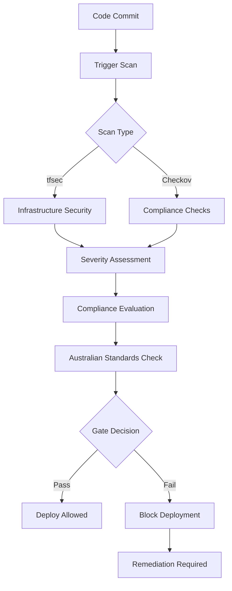

# Security Scanning Integration

## Overview

The ACT Placemat platform includes comprehensive security scanning capabilities that integrate tfsec and Checkov to ensure infrastructure code compliance with Australian government standards, privacy regulations, and security best practices.

## Architecture

### Components

1. **SecurityScanningService** - Core scanning orchestration service
2. **SecurityController** - REST API endpoints for scan management
3. **SecurityDashboard** - Real-time security monitoring interface
4. **CI/CD Integration** - Automated security scanning in GitHub Actions
5. **Local Tools** - Development environment security scanning

### Security Scanning Flow



## Australian Compliance Framework

### Privacy Act Compliance

- **Data Encryption**: All data at rest and in transit
- **Access Controls**: Least privilege principle enforcement
- **Data Residency**: Australian region requirements
- **Audit Logging**: Comprehensive access and change tracking

### Government Standards

- **Essential Eight**: Cyber security framework alignment
- **ISM Guidelines**: Information Security Manual compliance
- **ACSC Requirements**: Australian Cyber Security Centre standards
- **GDPR Integration**: European privacy regulation compliance

### Compliance Checks

1. **Data Protection**
   - Encryption configuration validation
   - Access control verification
   - Data classification enforcement

2. **Infrastructure Security**
   - Network security groups
   - Resource access policies
   - Backup and recovery procedures

3. **Operational Security**
   - Logging and monitoring
   - Incident response capabilities
   - Vulnerability management

## API Endpoints

### Security Scanning

```typescript
// Initiate security scan
POST /api/agents/security/scan
{
  "projectPath": "/path/to/terraform",
  "initiatedBy": "user-id",
  "config": {
    "enable_tfsec": true,
    "enable_checkov": true,
    "severity_threshold": "medium",
    "parallel_execution": true
  }
}

// Get scan results
GET /api/agents/security/scan/:scanId

// Get project scan history
GET /api/agents/security/project-history?projectPath=/path/to/project

// Security dashboard
GET /api/agents/security/dashboard
```

### Response Format

```typescript
interface SecurityScanResult {
  id: string;
  scan_type: 'tfsec' | 'checkov' | 'combined';
  project_path: string;
  status: 'running' | 'completed' | 'failed';
  results: SecurityFinding[];
  summary: SecuritySummary;
  compliance_status: ComplianceStatus;
}

interface SecurityFinding {
  severity: 'critical' | 'high' | 'medium' | 'low' | 'info';
  rule_id: string;
  description: string;
  file_path: string;
  remediation: string;
  scanner: 'tfsec' | 'checkov';
}
```

## Dashboard Features

### Real-time Monitoring

- **Active Scans**: Current scanning operations
- **Finding Trends**: Security posture over time
- **Compliance Scores**: Australian standards alignment
- **Critical Alerts**: Immediate attention requirements

### Compliance Overview

- **Australian Privacy Act**: Data protection compliance
- **GDPR**: European privacy regulation alignment
- **ISO27001**: Information security management
- **Data Residency**: Australian region compliance
- **Government Standards**: ACSC and ISM alignment

### Interactive Features

- **Scan Initiation**: On-demand security scanning
- **Result Filtering**: Severity and category filters
- **Finding Details**: Detailed remediation guidance
- **Compliance Tracking**: Historical compliance trends

## CI/CD Integration

### GitHub Actions Workflow

The security scanning workflow automatically:

1. **Triggers on**:
   - Infrastructure code changes
   - Pull requests
   - Scheduled daily scans
   - Manual workflow dispatch

2. **Scanning Process**:
   - Terraform format validation
   - tfsec security analysis
   - Checkov compliance checks
   - Australian compliance evaluation

3. **Security Gates**:
   - Critical issues block deployment
   - High severity issues generate warnings
   - Compliance violations reported
   - Security team notifications

### Configuration

```yaml
# .github/workflows/security-scan.yml
env:
  SCAN_COMPLIANCE_FRAMEWORKS: "australian-privacy-act,gdpr,iso27001"
  TERRAFORM_VERSION: "1.5.0"
  TFSEC_VERSION: "latest"
  CHECKOV_VERSION: "latest"
```

## Local Development

### Setup Script

Run the setup script to install security tools:

```bash
./scripts/setup-security-tools.sh
```

This installs:
- **Terraform**: Infrastructure as code tool
- **tfsec**: Terraform security scanner
- **Checkov**: Infrastructure compliance scanner

### Manual Scanning

```bash
# Run security scan
.security/scan.sh

# Scan specific directory
.security/scan.sh infrastructure/

# High severity threshold
SEVERITY_THRESHOLD=high .security/scan.sh
```

### Pre-commit Hooks

Automatic security checking before commits:

```bash
# Installed automatically by setup script
# Runs tfsec on terraform file changes
# Blocks commits with high/critical issues
```

## Configuration

### tfsec Configuration

```yaml
# .security/tfsec.yml
exclude:
  - aws-s3-enable-bucket-encryption  # If needed

minimum_severity: MEDIUM

custom_checks:
  - check_data_residency
  - check_encryption_at_rest
  - check_encryption_in_transit
  - check_access_logging
  - check_backup_encryption
```

### Checkov Configuration

```yaml
# .security/checkov.yml
framework:
  - terraform
  - kubernetes

compliance:
  - australian-privacy-act
  - gdpr
  - iso27001

skip-check:
  # Add checks to skip if needed
```

## Security Findings Management

### Severity Levels

1. **Critical**: Immediate action required
   - Data exposure risks
   - Access control failures
   - Encryption violations

2. **High**: Address within 24 hours
   - Security misconfigurations
   - Compliance violations
   - Access logging issues

3. **Medium**: Address within one week
   - Best practice deviations
   - Performance security impacts
   - Documentation requirements

4. **Low**: Address during regular maintenance
   - Code quality improvements
   - Minor compliance gaps
   - Optimisation opportunities

### Remediation Process

1. **Automated Fixes**: Apply suggested remediations
2. **Manual Review**: Assess complex security issues
3. **Compliance Update**: Verify Australian requirements
4. **Re-scan**: Validate fix effectiveness
5. **Documentation**: Update security procedures

## Monitoring and Alerting

### Metrics Tracked

- **Scan Frequency**: Daily, on-change, and manual scans
- **Finding Trends**: Security posture improvement
- **Compliance Scores**: Australian standards alignment
- **Remediation Time**: Issue resolution metrics
- **Scanner Performance**: Tool effectiveness analysis

### Alert Conditions

- **Critical Findings**: Immediate security team notification
- **Compliance Failures**: Australian standards violations
- **Scan Failures**: Tool or configuration issues
- **Threshold Breaches**: Configurable severity limits

## Best Practices

### Infrastructure Code

1. **Secure by Default**: Enable security features automatically
2. **Least Privilege**: Minimum required access permissions
3. **Encryption Everywhere**: Data at rest and in transit
4. **Audit Trails**: Comprehensive logging and monitoring
5. **Australian Regions**: Data residency compliance

### Development Workflow

1. **Local Scanning**: Pre-commit security validation
2. **Pull Request Gates**: Automated compliance checking
3. **Continuous Monitoring**: Regular security assessments
4. **Team Training**: Security awareness and best practices
5. **Incident Response**: Documented security procedures

### Compliance Management

1. **Regular Reviews**: Quarterly compliance assessments
2. **Policy Updates**: Keep pace with regulatory changes
3. **Documentation**: Maintain compliance evidence
4. **Training Programs**: Team security education
5. **External Audits**: Independent security validation

## Troubleshooting

### Common Issues

1. **Tool Installation Failures**
   - Check system requirements
   - Verify network connectivity
   - Use manual installation if needed

2. **Scan Configuration Errors**
   - Validate YAML syntax
   - Check file permissions
   - Review exclude patterns

3. **False Positives**
   - Add specific check exclusions
   - Document security exceptions
   - Regular pattern reviews

4. **Performance Issues**
   - Enable parallel execution
   - Exclude unnecessary paths
   - Optimise scan schedules

### Support Resources

- **Internal Documentation**: Team security guidelines
- **Tool Documentation**: tfsec and Checkov manuals
- **Australian Standards**: ACSC and ISM references
- **Community Support**: Security scanning communities
- **Vendor Support**: Commercial tool assistance

## Future Enhancements

### Planned Features

1. **ML-Powered Analysis**: Intelligent finding prioritisation
2. **Custom Rule Engine**: Organisation-specific checks
3. **Integration Expansion**: Additional security tools
4. **Automated Remediation**: Self-healing infrastructure
5. **Advanced Reporting**: Executive dashboards

### Roadmap

- **Q1**: Enhanced Australian compliance checks
- **Q2**: Machine learning integration
- **Q3**: Custom rule development
- **Q4**: Advanced automation features

## Conclusion

The security scanning integration provides comprehensive protection for the ACT Placemat platform, ensuring compliance with Australian government standards while maintaining operational efficiency. The combination of automated scanning, real-time monitoring, and detailed remediation guidance creates a robust security posture that scales with the platform's growth.

Regular security scanning, combined with Australian compliance requirements and best practices, ensures the platform maintains the highest security standards while delivering reliable community services across Australia.