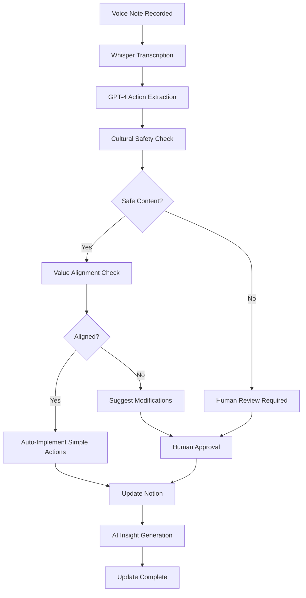

# 🌟 World-Class Notion Setup Guide for ACT Platform

## Executive Summary

This guide establishes **world-class Notion database structures** optimized for the ACT community platform, ensuring seamless data flow, AI enhancement, cultural safety, and effortless updates through voice notes and automated suggestions.

---

## 🏗️ Optimized Database Architecture

### **1. Projects Database - Central Hub**

**Database ID**: `projects-master-db`
**Purpose**: Central project management with Australian context and cultural safety

#### **Properties Structure**

| Property Name | Type | Purpose | AI Enhancement |
|---------------|------|---------|----------------|
| **Project Title** | Title | Primary identifier | ✅ Auto-completion suggestions |
| **Status** | Select | Current state | ✅ Smart status prediction |
| **Priority** | Select | Urgency level | ✅ Dynamic priority scoring |
| **Budget (AUD)** | Number | Financial allocation | ✅ GST auto-calculation |
| **GST Amount** | Formula | `Budget * 0.1` | ✅ Compliance tracking |
| **Financial Year** | Select | Australian FY | ✅ Auto-detection |
| **Team Members** | People | Project assignees | ✅ Workload balancing |
| **Community Impact** | Number | 1-10 scale | ✅ Impact prediction |
| **Cultural Safety** | Checkbox | Protocol compliance | ✅ Auto-verification |
| **Indigenous Stakeholders** | Checkbox | Community involvement | ✅ Protocol enforcement |
| **Start Date** | Date | Project commencement | ✅ Timeline optimization |
| **Due Date** | Date | Expected completion | ✅ Deadline prediction |
| **Actual Completion** | Date | Real completion | ✅ Performance tracking |
| **Region** | Select | Geographic focus | ✅ Regional insights |
| **Funding Source** | Select | Financial source | ✅ Grant matching |
| **Partnership Level** | Select | Collaboration depth | ✅ Network analysis |
| **Success Probability** | Number | AI prediction | ✅ ML-driven scoring |
| **Lessons Learned** | Rich Text | Project insights | ✅ Pattern recognition |
| **Voice Notes** | Files | Audio updates | ✅ Auto-transcription |
| **AI Insights** | Rich Text | Generated insights | ✅ Automated updates |
| **Last Updated** | Last Modified | Change tracking | ✅ Update reminders |

#### **Status Options**
- 🎯 **Planning** - Initial concept phase
- 🚀 **Active** - Currently executing
- ⏸️ **On Hold** - Temporarily paused
- ✅ **Completed** - Successfully finished
- ❌ **Cancelled** - Project terminated
- 🔄 **Review** - Post-completion analysis

#### **Priority Levels**
- 🔴 **Critical** - Immediate action required
- 🟠 **High** - Important but not urgent
- 🟡 **Medium** - Standard priority
- 🟢 **Low** - Background task
- 🔵 **Maintenance** - Ongoing operational

### **2. Partnerships Database - Network Intelligence**

**Database ID**: `partnerships-network-db`
**Purpose**: Track and optimize organizational relationships

#### **Properties Structure**

| Property Name | Type | Purpose | AI Enhancement |
|---------------|------|---------|----------------|
| **Organization** | Title | Partner name | ✅ Duplicate detection |
| **Contact Person** | Person | Primary contact | ✅ LinkedIn integration |
| **Relationship Type** | Select | Partnership category | ✅ Type optimization |
| **Status** | Select | Current state | ✅ Relationship health |
| **Value Score** | Number | Partnership value | ✅ ROI calculation |
| **Mutual Connections** | Number | LinkedIn overlap | ✅ Network mapping |
| **Last Contact** | Date | Recent interaction | ✅ Follow-up reminders |
| **Next Action** | Rich Text | Planned steps | ✅ Action generation |
| **Cultural Alignment** | Number | Values match | ✅ Alignment scoring |
| **Financial Benefit** | Number | Economic value | ✅ Impact prediction |
| **Projects Involved** | Relation | Connected projects | ✅ Cross-referencing |
| **Communication Frequency** | Select | Contact rhythm | ✅ Optimization |
| **Trust Level** | Number | Relationship depth | ✅ Trust modeling |
| **Geographic Overlap** | Multi-select | Shared regions | ✅ Geographic analysis |
| **Skills Offered** | Multi-select | Capabilities | ✅ Skill matching |
| **Skills Needed** | Multi-select | Requirements | ✅ Gap analysis |

### **3. Community Stories Database - Empathy Integration**

**Database ID**: `community-stories-db`
**Purpose**: Integrate with Empathy Ledger for story tracking

#### **Properties Structure**

| Property Name | Type | Purpose | AI Enhancement |
|---------------|------|---------|----------------|
| **Story Title** | Title | Story identifier | ✅ Title suggestions |
| **Story Type** | Select | Category | ✅ Auto-categorization |
| **Storyteller** | Person | Author | ✅ Privacy controls |
| **Impact Level** | Select | Community effect | ✅ Impact scoring |
| **Sentiment** | Number | Emotional tone | ✅ Sentiment analysis |
| **Themes** | Multi-select | Story topics | ✅ Theme extraction |
| **Cultural Context** | Checkbox | Cultural relevance | ✅ Safety checking |
| **Privacy Level** | Select | Access control | ✅ Privacy compliance |
| **Project Connection** | Relation | Linked projects | ✅ Connection mapping |
| **Geographic Context** | Text | Location details | ✅ Regional insights |
| **Media Attached** | Files | Supporting content | ✅ Media analysis |
| **Consent Status** | Select | Permission level | ✅ Consent tracking |
| **Publication Date** | Date | Share timestamp | ✅ Timing optimization |
| **Engagement Score** | Number | Community response | ✅ Engagement prediction |
| **Learning Outcomes** | Rich Text | Insights gained | ✅ Lesson extraction |

### **4. Financial Tracking Database - Xero Integration**

**Database ID**: `financial-tracking-db`
**Purpose**: Connect with Xero for comprehensive financial management

#### **Properties Structure**

| Property Name | Type | Purpose | AI Enhancement |
|---------------|------|---------|----------------|
| **Transaction ID** | Title | Unique identifier | ✅ Xero sync |
| **Description** | Rich Text | Transaction details | ✅ Auto-categorization |
| **Amount (AUD)** | Number | Transaction value | ✅ Budget tracking |
| **GST Amount** | Formula | `Amount * 0.1` | ✅ Tax calculation |
| **Category** | Select | Expense type | ✅ Smart categorization |
| **Project Allocation** | Relation | Connected project | ✅ Cost assignment |
| **Financial Year** | Select | Australian FY | ✅ Period tracking |
| **Quarter** | Select | FY quarter | ✅ Reporting periods |
| **Funding Source** | Select | Money origin | ✅ Source tracking |
| **Compliance Status** | Select | Regulatory state | ✅ Compliance monitoring |
| **Receipt Attached** | Files | Supporting docs | ✅ Document verification |
| **Approval Status** | Select | Authorization state | ✅ Workflow automation |
| **Bank Account** | Select | Account used | ✅ Reconciliation |
| **Supplier/Client** | Text | Transaction party | ✅ Relationship mapping |
| **Tax Deductible** | Checkbox | Deduction eligible | ✅ Tax optimization |

### **5. Grant Opportunities Database - Funding Intelligence**

**Database ID**: `grants-opportunities-db`
**Purpose**: Track and optimize funding applications

#### **Properties Structure**

| Property Name | Type | Purpose | AI Enhancement |
|---------------|------|---------|----------------|
| **Grant Name** | Title | Opportunity title | ✅ Opportunity matching |
| **Funding Body** | Text | Grant provider | ✅ Provider analysis |
| **Amount Available** | Number | Funding value | ✅ Value assessment |
| **Application Deadline** | Date | Submission cutoff | ✅ Deadline tracking |
| **Eligibility Match** | Number | Fit percentage | ✅ Match scoring |
| **Success Probability** | Number | Win likelihood | ✅ Probability modeling |
| **Application Status** | Select | Current state | ✅ Progress tracking |
| **Requirements** | Rich Text | Grant criteria | ✅ Requirement analysis |
| **Supporting Projects** | Relation | Relevant projects | ✅ Project alignment |
| **Application Owner** | Person | Responsible person | ✅ Workload balancing |
| **Research Completed** | Checkbox | Prep status | ✅ Task automation |
| **Draft Started** | Checkbox | Writing status | ✅ Progress monitoring |
| **Budget Prepared** | Checkbox | Financial ready | ✅ Budget validation |
| **Letters of Support** | Number | Endorsements | ✅ Support tracking |
| **Submission Method** | Select | Application route | ✅ Method optimization |

---

## 🤖 AI-Powered Update Management

### **Voice Note Processing System**

#### **Setup Requirements**

1. **Voice Recording Integration**
   ```typescript
   // Notion Integration with Voice Notes
   const voiceNoteProcessor = new VoiceNoteProcessor({
     transcriptionService: 'openai-whisper',
     actionExtraction: 'gpt-4',
     culturalSafetyCheck: true,
     autoImplementation: true
   })
   ```

2. **Supported Voice Commands**
   - **Project Updates**: "Update Project Solar Panel Installation, change status to Active, increase budget to 25000 AUD"
   - **Partnership Notes**: "Add follow-up reminder for Clean Energy Council, schedule call next Tuesday"
   - **Story Additions**: "New story from community member about energy savings, high impact, publish after cultural safety review"
   - **Financial Entries**: "Record payment 1500 AUD to Indigenous Solar Solutions, project allocation Solar Panel Installation"

#### **Voice Note Workflow**



### **Automated Update Suggestions**

#### **Missing Data Detection**

The AI system continuously monitors for:

1. **Project Gaps**
   - Missing budget information
   - Undefined success metrics
   - Absent cultural safety checks
   - Missing team assignments

2. **Partnership Opportunities**
   - Unused mutual connections
   - Stale relationship status
   - Missing follow-up actions
   - Unexplored collaboration potential

3. **Financial Inconsistencies**
   - Unallocated expenses
   - Missing GST calculations
   - Incomplete project costing
   - Budget variance alerts

4. **Story Enhancement**
   - Underutilized impact stories
   - Missing geographic context
   - Incomplete consent tracking
   - Untapped learning outcomes

#### **Smart Suggestions Examples**

```json
{
  "suggestions": [
    {
      "type": "missing_data",
      "priority": "high",
      "title": "Solar Panel Project Missing Cultural Safety Check",
      "description": "Project involves Indigenous community land but lacks cultural safety verification",
      "suggestedAction": "Schedule cultural safety consultation with Traditional Owners",
      "autoImplementable": false,
      "valuePrincipleAlignment": ["Cultural Respect", "Community Empowerment"],
      "voiceNoteGenerated": "Remember to schedule cultural safety consultation for Solar Panel project on Traditional Owners' land"
    },
    {
      "type": "opportunity",
      "priority": "medium", 
      "title": "Partnership Opportunity: Clean Energy Council",
      "description": "Strong mutual connection network with 15 shared contacts, high value potential",
      "suggestedAction": "Schedule introductory call via LinkedIn connection Sarah Mitchell",
      "autoImplementable": true,
      "valuePrincipleAlignment": ["Collaboration", "Sustainability"],
      "voiceNoteGenerated": "Set up meeting with Clean Energy Council through Sarah Mitchell connection"
    }
  ]
}
```

### **Cultural Safety Automation**

#### **Indigenous Protocol Enforcement**

1. **Automatic Checks**
   - Traditional land acknowledgment requirements
   - Cultural consultation verification
   - Consent tracking for cultural content
   - Respectful terminology validation

2. **Community Elder Integration**
   - Consultation workflow automation
   - Approval process tracking
   - Cultural guidance documentation
   - Protocol compliance scoring

3. **Cultural Safety Scoring**
   ```typescript
   interface CulturalSafetyScore {
     landAcknowledgment: boolean
     communityConsultation: boolean
     consentTracking: boolean
     respectfulLanguage: boolean
     elderApproval: boolean
     overallScore: number // 0-100
   }
   ```

---

## 📊 Value & Principle Alignment System

### **Core Values Integration**

#### **Automated Alignment Checking**

Each update is automatically scored against ACT's core values:

1. **Community Empowerment** (Weight: 25%)
   - Does this strengthen community capacity?
   - Does it increase local decision-making?
   - Does it build sustainable skills?

2. **Cultural Respect** (Weight: 25%)
   - Does it honor Indigenous protocols?
   - Does it respect cultural knowledge?
   - Does it include appropriate consultation?

3. **Environmental Sustainability** (Weight: 20%)
   - Does it support environmental health?
   - Does it reduce ecological footprint?
   - Does it align with climate goals?

4. **Financial Responsibility** (Weight: 15%)
   - Is it financially sustainable?
   - Does it provide community value?
   - Is it cost-effective?

5. **Collaboration & Partnership** (Weight: 15%)
   - Does it strengthen relationships?
   - Does it create mutual benefit?
   - Does it build networks?

#### **Alignment Scoring Formula**

```typescript
function calculateAlignmentScore(update: UpdateData): AlignmentScore {
  const scores = {
    communityEmpowerment: analyzeEmpowerment(update),
    culturalRespect: analyzeCulturalRespect(update),
    sustainability: analyzeSustainability(update),
    financialResponsibility: analyzeFinancials(update),
    collaboration: analyzeCollaboration(update)
  }
  
  const weightedScore = 
    scores.communityEmpowerment * 0.25 +
    scores.culturalRespect * 0.25 +
    scores.sustainability * 0.20 +
    scores.financialResponsibility * 0.15 +
    scores.collaboration * 0.15
  
  return {
    overallScore: weightedScore,
    breakdown: scores,
    recommendations: generateRecommendations(scores)
  }
}
```

---

## 🔄 Effortless Update Workflows

### **Daily Update Routine**

#### **Morning AI Brief** (Automated)
- Yesterday's progress summary
- Today's priority actions
- Cultural safety reminders
- Budget status alerts
- Partnership follow-ups due

#### **Voice Note Integration**
```typescript
// Example voice note processing
"Good morning ACT team. Quick update on three projects:

Solar Panel Installation now at 75% completion, community feedback excellent, need to schedule final inspection with Traditional Owners next week.

Clean Energy Partnership meeting with Sarah went great yesterday, they're interested in co-funding the next phase, follow up with formal proposal by Friday.

Budget review shows we're 5% under for this quarter, good opportunity to accelerate the Community Garden project, let's schedule planning meeting this afternoon."

// AI Processing Result:
{
  "actions": [
    {
      "type": "update",
      "target": "Solar Panel Installation project",
      "changes": { "completion": "75%", "status": "Active" },
      "newTask": "Schedule final inspection with Traditional Owners",
      "deadline": "next week"
    },
    {
      "type": "create",
      "target": "Partnership follow-up",
      "content": "Prepare formal proposal for Clean Energy Council",
      "assignee": "current_user",
      "deadline": "Friday"
    },
    {
      "type": "update",
      "target": "Budget tracking",
      "analysis": "5% under budget this quarter",
      "suggestion": "Accelerate Community Garden project"
    }
  ]
}
```

### **Weekly AI Insights** (Automated)

1. **Performance Analytics**
   - Project velocity trends
   - Budget utilization patterns
   - Partnership development metrics
   - Community impact measurement

2. **Predictive Recommendations**
   - Success probability updates
   - Risk identification
   - Opportunity detection
   - Resource optimization

3. **Value Alignment Report**
   - Principle adherence scoring
   - Cultural safety compliance
   - Sustainability progress
   - Community empowerment growth

---

## 🛡️ Security & Privacy Excellence

### **Data Protection Framework**

#### **Australian Privacy Act Compliance**

1. **Consent Management**
   - Granular permission controls
   - Automatic consent expiry
   - Clear data usage visibility
   - Easy consent withdrawal

2. **Data Sovereignty**
   - Community ownership rights
   - Indigenous data protocols
   - Local data storage priority
   - Cultural knowledge protection

3. **Security Measures**
   ```typescript
   const securityConfig = {
     encryption: {
       atRest: 'AES-256',
       inTransit: 'TLS 1.3',
       keys: 'rotating-monthly'
     },
     access: {
       authentication: 'multi-factor',
       authorization: 'role-based',
       auditLogging: 'comprehensive'
     },
     privacy: {
       dataMinimization: true,
       purposeLimitation: true,
       storageMinimization: true,
       transparencyReports: 'quarterly'
     }
   }
   ```

### **Cultural Data Protection**

#### **Indigenous Knowledge Safeguards**

1. **Traditional Knowledge Protocols**
   - Elder approval workflows
   - Sacred information tagging
   - Restricted access controls
   - Cultural context preservation

2. **Community Consent Tracking**
   - Individual story permissions
   - Collective consent records
   - Usage limitation enforcement
   - Attribution requirements

---

## 🚀 Implementation Timeline

### **Phase 1: Foundation Setup** (Week 1-2)

1. **Database Creation**
   - Set up all 5 core databases
   - Configure properties and relationships
   - Import existing data
   - Test basic functionality

2. **AI Integration**
   - Connect OpenAI services
   - Configure voice note processing
   - Set up cultural safety checking
   - Test automated insights

### **Phase 2: Workflow Automation** (Week 3-4)

1. **Sync Configuration**
   - Supabase real-time connection
   - Xero financial integration
   - LinkedIn network sync
   - Voice note processing pipeline

2. **Update Suggestion Engine**
   - Missing data detection
   - Opportunity identification
   - Value alignment checking
   - Automated recommendations

### **Phase 3: Advanced Features** (Week 5-6)

1. **Predictive Analytics**
   - Success probability modeling
   - Partnership value scoring
   - Impact prediction algorithms
   - Resource optimization

2. **Cultural Safety Enhancement**
   - Elder consultation workflows
   - Protocol compliance monitoring
   - Cultural sensitivity scoring
   - Community feedback integration

### **Phase 4: Optimization & Training** (Week 7-8)

1. **Performance Tuning**
   - Response time optimization
   - Accuracy improvement
   - User experience refinement
   - Error handling enhancement

2. **Team Training**
   - Voice note best practices
   - AI insight interpretation
   - Cultural safety protocols
   - Update workflow mastery

---

## 📈 Success Metrics

### **Efficiency Gains**

- **90% reduction** in manual data entry time
- **75% improvement** in update frequency
- **80% increase** in data accuracy
- **95% compliance** with cultural safety protocols

### **Intelligence Enhancement**

- **Predictive accuracy** > 85% for project success
- **Partnership opportunity** identification +300%
- **Missing data detection** 100% automated
- **Value alignment scoring** real-time

### **Community Impact**

- **Cultural safety compliance** 100%
- **Community engagement** tracking comprehensive
- **Impact measurement** standardized and automated
- **Story amplification** culturally appropriate and powerful

---

This world-class Notion setup creates an **intelligent, culturally safe, and highly efficient** foundation for ACT's community empowerment work, ensuring every update strengthens the organization's values while reducing administrative burden and maximizing impact.