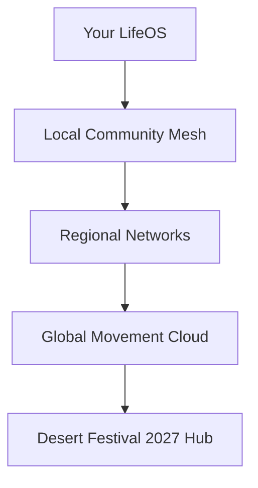

# 🛠️ Building the ACT Life Operating System
## *Technical Roadmap from Dream to Reality*

---

## 🎯 **Phase 1: Foundation (Months 1-3)**
*What we can build RIGHT NOW with existing tech*

### **Core Experience Hub**
```typescript
// The heart of the system
interface LifeOS {
  calendar: AdventureCalendar;      // Google Cal + AI scheduling
  projects: ConstellationView;      // Your 55 projects as stars
  money: FlowRiver;                 // Xero + beautiful visualization
  stories: StoryStudio;             // Voice + AI transcription
  connections: RelationshipWeb;     // Graph database of people
}
```

### **Tech Stack:**
- **Frontend**: React Native (phone) + Next.js (web) + Electron (desktop)
- **Design System**: Tailwind + Framer Motion (smooth, desert-inspired)
- **Backend**: Node.js + GraphQL + PostgreSQL + Neo4j (relationships)
- **AI**: Claude API (life coaching) + Whisper (voice) + GPT-4 Vision (photos)
- **Real-time**: WebSockets for live updates + PWA for offline

### **Day 1 Features:**
1. **Morning Briefing** - Beautiful daily overview
2. **Project Stars** - Visual project management  
3. **Story Capture** - Voice-to-text with AI polish
4. **Smart Calendar** - Community-first scheduling
5. **Money Flow** - Live financial visualization

---

## 🚀 **Phase 2: Intelligence (Months 4-6)**
*Where it gets magical*

### **The AI Companion**
```python
class LifeCompanion:
    def __init__(self, user_philosophy):
        self.values = user_philosophy
        self.energy_patterns = learn_user_rhythms()
        self.community_protocols = load_cultural_rules()
    
    def suggest_next_adventure(self, free_time):
        # Matches your energy, values, and community needs
        return perfect_activity
    
    def draft_story(self, voice_notes):
        # Turns rambling into beautiful narrative
        return polished_story_with_media
```

### **Smart Features:**
- **Energy Tracking** - Learns when you're sharp vs. creative
- **Relationship Health** - Nudges you to maintain connections
- **Impact Measurement** - Real metrics on obsolescence progress
- **Financial Intelligence** - Suggests funding aligned with values
- **Story Sovereignty** - Tracks narrative ownership

---

## 🌍 **Phase 3: Movement (Months 7-12)**
*Connecting the global network*

### **Distributed Architecture**


### **Federation Features:**
- **Peer-to-peer project sharing** - No central control
- **Encrypted story exchange** - Privacy-first sharing
- **Resource pooling system** - Share tools/knowledge/funds
- **Movement metrics** - See global impact in real-time
- **Cultural protocol library** - Respect built into code

---

## 🔧 **Technical Architecture**

### **Data Philosophy:**
```yaml
principles:
  - User owns all data (true sovereignty)
  - Offline-first (works in desert)
  - Encryption everywhere (privacy sacred)
  - Open source core (community can fork)
  - API-first (integrate with everything)
```

### **Microservices:**
1. **Calendar Service** - Manages time as adventure
2. **Project Service** - Tracks obsolescence progress
3. **Story Service** - Captures and shares narratives
4. **Money Service** - Beautiful financial flows
5. **Connection Service** - Relationship intelligence
6. **Intelligence Service** - AI suggestions and insights

### **Infrastructure:**
- **Edge computing** - Process near users (low latency)
- **IPFS storage** - Distributed, uncensorable stories
- **Blockchain** - Only for community ownership records
- **Matrix protocol** - Federated secure messaging
- **ActivityPub** - Connect with existing networks

---

## 🎨 **UX Implementation Details**

### **The Morning Screen:**
```jsx
<MorningView>
  <SunriseGradient time={localSunrise} />
  <Greeting>Good morning, {name}. Today's an adventure.</Greeting>
  
  <AdventureCard>
    <TimeSlot>9:00am</TimeSlot>
    <Activity>MingaMinga Rangers meeting</Activity>
    <Impact>3 youth learning traditional skills</Impact>
    <OneClick>
      <PrepareButton />
      <NavigateButton />
      <RescheduleButton />
    </OneClick>
  </AdventureCard>
  
  <QuickActions>
    <CaptureStory />
    <CheckMoney />
    <CallSomeone />
  </QuickActions>
</MorningView>
```

### **Interaction Patterns:**
- **Swipe right** → Complete/acknowledge
- **Swipe left** → Snooze/reschedule  
- **Long press** → Deep dive
- **Shake** → "Surprise me with an adventure"
- **Voice** → "Hey ACT, what should I do now?"

---

## 📱 **Progressive Rollout**

### **MVP (What you get first):**
- Basic morning briefing
- Simple project tracker
- Voice story capture
- Calendar integration
- Basic money flow

### **Beta (Community testing):**
- AI suggestions
- Relationship tracking
- Impact metrics
- Multi-language support
- Offline sync

### **1.0 (Full dream):**
- Global movement dashboard
- Full intelligence system
- Entity architect
- Community builder
- Desert Festival mode

---

## 🔐 **Security & Privacy**

```javascript
// Every feature asks these questions
const privacyCheck = (feature) => {
  if (!userOwnsData(feature)) return BLOCKED;
  if (!communityConsent(feature)) return BLOCKED;
  if (extractivePattern(feature)) return BLOCKED;
  if (!encryptedByDefault(feature)) return BLOCKED;
  return ALLOWED;
}
```

---

## 💰 **Sustainable Development Model**

### **Funding:**
- **Community ownership** - Users buy shares, not subscriptions
- **Impact investment** - Aligned funders, not VCs
- **Service marketplace** - Communities pay each other
- **Beautiful obsolescence** - Plan to give it all away

### **Team:**
- **Core builders** - 5-7 people who live the philosophy
- **Community developers** - 50+ contributors worldwide
- **User-owners** - Everyone who uses it helps build it
- **Elder advisors** - Guidance from marginalized communities

---

## 🚦 **Go/No-Go Criteria**

Before we build each feature, we ask:

✅ Does it increase adventure in daily life?
✅ Does it strengthen community sovereignty?
✅ Does it make extraction more difficult?
✅ Does it respect cultural protocols?
✅ Does it bring joy to the work?

If any answer is NO, we don't build it.

---

## 🎯 **Next Steps**

1. **Week 1**: Wire up morning briefing with real Notion data
2. **Week 2**: Build constellation view of projects
3. **Week 3**: Implement voice story capture
4. **Week 4**: Create money flow visualization
5. **Month 2**: Add AI intelligence layer
6. **Month 3**: Beta test with ACT families

---

*This isn't just an app. It's the operating system for a new way of living.*

**Ready to build the future?** 🚀
