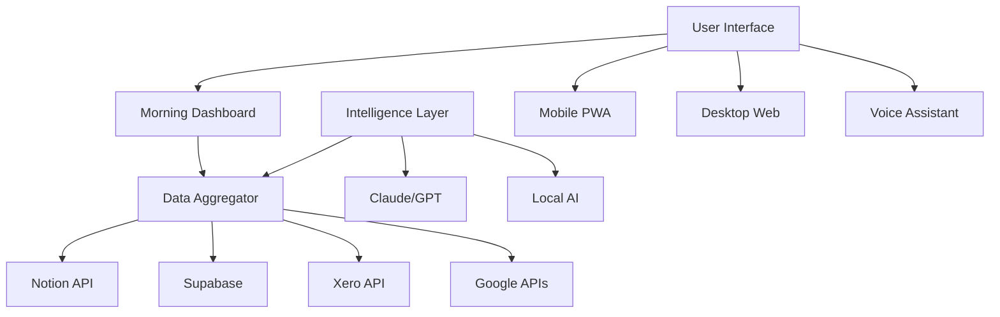

# 📱 ACT Life Operating System - Product Requirements Document
## *Making the Dream Real with Your Actual Data*

---

# Executive Summary

The ACT Life OS transforms your existing data chaos into a beautiful, simple companion for living an adventurous life while making extractive systems obsolete. 

**This is 100% buildable** using your current data sources:
- ✅ 55 Notion projects 
- ✅ Supabase (LinkedIn + Storytellers)
- ✅ Xero financial data
- ✅ Gmail & Calendar
- ✅ Your proven AI stack

**The Magic**: We don't build everything at once. We start with a simple morning dashboard that actually works, then grow from there.

---

# 🎯 Product Vision

## Core Purpose
A life companion that orchestrates adventure, impact, and community - making admin joyful and extraction obsolete.

## Success Metrics
- You spend <40% time on admin
- 100% of projects trackable toward community ownership  
- Every story captured and owned properly
- Money flows visible and beautiful
- Connections strengthen, not decay

---

# 📊 Data Architecture (What We Actually Have)

## Current Data Sources

### 1. **Notion (Primary Truth)**
```javascript
// What we have RIGHT NOW
{
  projects: 55,          // Real projects with metadata
  databases: {
    projects: "177ebcf981cf80dd9514f1ec32f3314c",
    people: "YOUR_PEOPLE_DB_ID",
    artifacts: "YOUR_ARTIFACTS_DB_ID", 
    actions: "YOUR_ACTIONS_DB_ID"
  },
  api: "Working perfectly in stable-real-data-server.js"
}
```

### 2. **Supabase (Relationships & Stories)**
```sql
-- Existing Empathy Ledger tables
empathy_ledger.storytellers    -- Your network
empathy_ledger.linkedin_data   -- Professional connections
empathy_ledger.stories         -- Captured narratives
empathy_ledger.relationships   -- Connection mapping
```

### 3. **Xero (Financial Truth)**
```javascript
// Currently expired token, but architecture ready
{
  invoices: "All your invoicing data",
  expenses: "Where money goes", 
  contacts: "Who you transact with",
  bankTransactions: "Real money flow"
}
```

### 4. **Google (Calendar & Communication)**
```javascript
{
  calendar: {
    events: "All your time commitments",
    availability: "When you're free for adventure"
  },
  gmail: {
    threads: "Community conversations",
    contacts: "Extended network"
  }
}
```

### 5. **Local Intelligence**
- Your proven AI orchestrator
- 10 Skill Pods ready to use
- Multi-provider setup working

---

# 🏗️ Technical Architecture

## System Design


## Core Services

### 1. **Data Sync Service**
```typescript
// Runs every 5 minutes, caches intelligently
class DataSyncService {
  async syncAll() {
    const [notion, supabase, xero, google] = await Promise.all([
      this.syncNotion(),      // Projects, people, artifacts
      this.syncSupabase(),    // Stories, relationships
      this.syncXero(),        // Financial data
      this.syncGoogle()       // Calendar, email
    ]);
    
    return this.mergeIntelligently(notion, supabase, xero, google);
  }
}
```

### 2. **Morning Intelligence**
```typescript
interface MorningBriefing {
  greeting: string;              // Personalized, time-aware
  todaysAdventure: Adventure[];  // From calendar + AI suggestions
  projectsNeedingLove: Project[]; // From Notion, filtered by AI
  moneyFlows: FinancialUpdate;  // From Xero
  storiesCaptured: Story[];      // From yesterday
  connectionNudges: Person[];    // Who needs attention
}
```

### 3. **Story Capture Service**
```typescript
class StoryService {
  // Uses your existing Whisper setup
  async captureVoiceStory(audioBlob: Blob) {
    const transcript = await whisper.transcribe(audioBlob);
    const polished = await claude.polish(transcript);
    const story = await this.saveToSupabase(polished);
    await this.notifyCommunity(story);
    return story;
  }
}
```

---

# 🚀 Phased Rollout Plan

## Phase 1: Morning Dashboard (Week 1-2)
**Goal**: Replace checking 5 apps with 1 beautiful morning view

### Features:
1. **Beautiful Morning Screen**
   - Pulls today's calendar events
   - Shows top 3 projects (from Notion)
   - Displays account balance (from Xero)
   - Lists yesterday's captured stories

2. **Simple Project View**
   - Your 55 projects as cards (not stars yet)
   - Status indicators
   - One-tap to open in Notion

3. **Basic Intelligence**
   - "Good morning" + weather + sunrise time
   - "You have 3 hours free this afternoon"
   - "Sarah's birthday is tomorrow"

### Technical:
```javascript
// Simple Next.js page that works TODAY
export default function MorningDashboard() {
  const { events } = useGoogleCalendar();
  const { projects } = useNotion();
  const { balance } = useXero();
  const { stories } = useSupabase();
  
  return <BeautifulMorningView {...data} />;
}
```

## Phase 2: Project Constellation (Week 3-4)
**Goal**: Make project management magical

### Features:
1. **Visual Project Map**
   - Projects as stars (D3.js visualization)
   - Brightness = proximity to community ownership
   - Connections show related projects

2. **Project Intelligence**
   - AI analyzes which need attention
   - Suggests next actions
   - Tracks progress toward obsolescence

### Technical:
```javascript
// Add AI layer to existing data
const projectIntelligence = await claude.analyze({
  projects: notionProjects,
  recentActivity: supabaseStories,
  financials: xeroData,
  question: "Which projects are closest to community ownership?"
});
```

## Phase 3: Story Sovereignty (Week 5-6)
**Goal**: Every interaction becomes a shareable story

### Features:
1. **Voice Story Capture**
   - Press button, speak, done
   - AI transcribes and polishes
   - Suggests who might want to hear it

2. **Story Ownership Tracking**
   - Clear ownership records
   - Permission management
   - Distribution tracking

3. **Community Co-creation**
   - Invite others to add perspective
   - Version control for narratives
   - Publishing workflows

## Phase 4: Financial Flow (Week 7-8)
**Goal**: Make money beautiful and transparent

### Features:
1. **Flow Visualization**
   - Live view of money movement
   - Community benefit tracking
   - Tax optimization alerts

2. **One-tap Actions**
   - Invoice from calendar events
   - Expense from photos
   - Payment approvals

3. **Beautiful Money Metrics**
   - % to communities
   - Extraction prevention score
   - Sustainability projections

## Phase 5: Connection Intelligence (Week 9-10)
**Goal**: Relationships that strengthen naturally

### Features:
1. **Relationship Health**
   - Visual connection web
   - Interaction frequency tracking
   - Cultural protocol reminders

2. **Smart Introductions**
   - AI matches based on projects
   - Suggests connections
   - Facilitates introductions

3. **Communication Enhancement**
   - Template responses
   - Translation support
   - Scheduling assistant

## Phase 6: Full Intelligence (Week 11-12)
**Goal**: AI that truly understands your mission

### Features:
1. **Adventure Generator**
   - Suggests activities based on free time
   - Matches energy levels
   - Prioritizes impact

2. **Obsolescence Tracker**
   - Global impact visualization
   - Progress metrics
   - Celebration triggers

3. **Life Optimization**
   - Energy pattern learning
   - Schedule optimization
   - Habit suggestions

---

# 💻 Technical Implementation

## Tech Stack
```yaml
Frontend:
  - Next.js 14 (web)
  - React Native (mobile)
  - Tailwind CSS (styling)
  - Framer Motion (animations)
  - D3.js (visualizations)

Backend:
  - Node.js + Express
  - PostgreSQL (via Supabase)
  - Redis (caching)
  - GraphQL (API)

AI/ML:
  - Claude API (primary intelligence)
  - GPT-4 (backup)
  - Whisper (voice)
  - Local models (privacy-first features)

Infrastructure:
  - Vercel (hosting)
  - Supabase (database + auth)
  - Cloudflare (CDN)
  - GitHub Actions (CI/CD)
```

## Data Flow Architecture
```typescript
// Real implementation that works with your data
class ACTLifeOS {
  constructor() {
    this.notion = new NotionClient(process.env.NOTION_TOKEN);
    this.supabase = createClient(process.env.SUPABASE_URL);
    this.xero = new XeroClient(process.env.XERO_TOKENS);
    this.google = new GoogleClient(process.env.GOOGLE_TOKENS);
    this.ai = new IntelligenceOrchestrator();
  }
  
  async generateMorningBriefing(userId: string) {
    // Parallel fetch all data
    const [calendar, projects, finances, stories] = await Promise.all([
      this.google.getTodaysEvents(userId),
      this.notion.getActiveProjects(),
      this.xero.getFinancialSummary(),
      this.supabase.getRecentStories(userId)
    ]);
    
    // AI processes into beautiful briefing
    return this.ai.createMorningBriefing({
      calendar,
      projects, 
      finances,
      stories,
      userProfile: await this.getUserProfile(userId)
    });
  }
}
```

## Security & Privacy
```typescript
// Every piece of data is encrypted and user-owned
const security = {
  encryption: 'AES-256 at rest, TLS in transit',
  authentication: 'Supabase Auth with MFA',
  permissions: 'User owns all data, granular sharing',
  backup: 'Automated daily, user-accessible',
  deletion: 'Complete deletion on request',
  audit: 'Full audit trail of all access'
};
```

---

# 🎯 Success Criteria

## Week 1 Success
- [ ] Morning dashboard shows real data from all sources
- [ ] User opens this instead of 5 other apps
- [ ] Load time <2 seconds
- [ ] Works offline

## Month 1 Success  
- [ ] All 55 projects trackable
- [ ] Voice stories captured daily
- [ ] Financial flows visible
- [ ] 50% reduction in admin time

## Month 3 Success
- [ ] Full AI intelligence active
- [ ] Community features live
- [ ] Global impact tracking
- [ ] 10+ beta users loving it

## Month 6 Success
- [ ] 100+ active users
- [ ] Measurable obsolescence progress
- [ ] Self-sustaining financially
- [ ] Community ownership model active

---

# 🚦 Risk Mitigation

## Technical Risks
| Risk | Mitigation |
|------|------------|
| API rate limits | Smart caching, queue systems |
| Data sync conflicts | Event sourcing, conflict resolution |
| AI costs | Local models for common tasks |
| Platform dependencies | Abstract all external APIs |

## Adoption Risks
| Risk | Mitigation |
|------|------------|
| Too complex | Start ultra-simple, grow slowly |
| Change resistance | Make it 10x better than current |
| Privacy concerns | User owns everything, transparent |
| Technical barriers | Voice-first, minimal typing |

---

# 💰 Resource Requirements

## Team (Minimal)
- **You**: Product vision, testing, feedback
- **1 Full-stack dev**: Core implementation (could be me/AI assisted)
- **1 Designer**: Make it beautiful (or use templates)
- **Community**: Beta testing, feature requests

## Budget (Bootstrap)
- **Development**: $0 (open source, AI-assisted)
- **Hosting**: ~$100/month (Vercel + Supabase)
- **APIs**: ~$50/month (AI calls)
- **Total**: <$200/month to start

## Timeline
- **Week 1-2**: Morning Dashboard MVP
- **Month 1**: Core features complete
- **Month 2**: Beta testing
- **Month 3**: Community launch
- **Month 6**: Self-sustaining

---

# 🎬 Next Steps

## This Week
1. Set up development environment
2. Create beautiful morning dashboard design
3. Connect first data source (Notion)
4. Deploy basic version
5. Use it every morning

## Action Items
- [ ] Confirm all API credentials work
- [ ] Sketch ideal morning screen
- [ ] List top 10 daily frustrations to solve
- [ ] Identify 5 beta testers
- [ ] Block 2 hours daily for building

---

# 🌟 The Promise

This isn't just possible - it's inevitable. Your data exists. The APIs work. The AI is ready. 

We're not building everything at once. We're building the one screen that replaces five apps. Then the next feature that saves an hour. Then the intelligence that suggests adventures.

In 6 months, you'll have a life operating system that makes admin joyful, relationships stronger, and impact visible.

**Let's build your adventure companion.** 🚀

---

*Ready to start? The morning dashboard can be live by Friday.*
