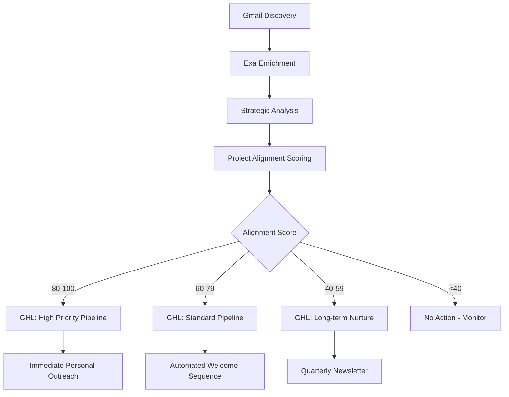
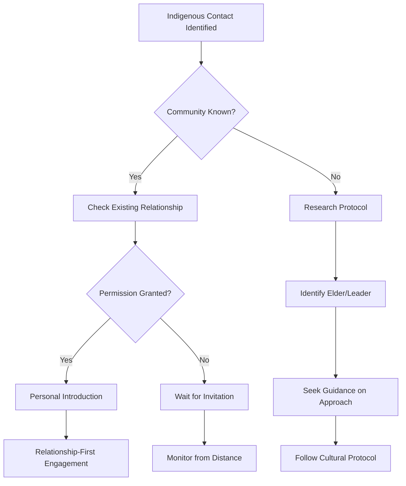
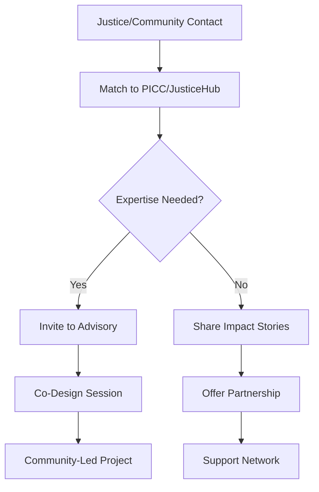

# ACT Mission-Aligned Engagement Architecture
## From Contact Enrichment → Project Matching → GoHighLevel Pipelines → Community Prosperity

**Date**: January 1, 2026
**Purpose**: Connect enriched contacts to ACT's mission of Beautiful Obsolescence, support grassroots/Indigenous ownership, and foster growth in strategic areas

---

## 🌱 Core Philosophy Integration

### **Beautiful Obsolescence** Applied to Contact Engagement

**Traditional CRM**: Extract value from relationships → Build dependency → Scale extraction
**ACT Model**: Give value through relationships → Build capacity → Scale independence

**How We're Different**:
- We don't "nurture leads" — we **identify capability matches**
- We don't "close deals" — we **catalyze community-led projects**
- We don't "retain clients" — we **celebrate obsolescence**
- We don't "maximize revenue" — we **maximize community ownership**

### **The Rocket Booster Model for Contacts**

```
Enriched Contact Discovery
         ↓
Match to ACT Mission & Projects
         ↓
Initial Connection (100% ACT energy)
         ↓
Capability Building (60% ACT / 40% community)
         ↓
Community Ownership (20% ACT / 80% community)
         ↓
Beautiful Obsolescence (0% ACT / 100% independent)
```

---

## 🎯 ACT Mission Alignment Framework

### **Core Values from ACT Philosophy**

1. **Radical Humility** - Listen, offer tools, step back
2. **Creative Disruption** - Art, storytelling, imagination vs. bureaucracy
3. **Uncomfortable Truth-Telling** - Name extraction, including in our own work
4. **Indigenous Sovereignty** - First Nations leadership in all aspects
5. **Beautiful Obsolescence** - Build movements that don't need us

### **Strategic Focus Areas** (from ACT Master Philosophy)

| Focus Area | Keywords | Why It Matters |
|------------|----------|----------------|
| **Indigenous Sovereignty** | indigenous, aboriginal, First Nations, cultural preservation | Core to ACT's mission |
| **Youth Justice** | justice, youth, community support, rehabilitation | Major project area (PICC, JusticeHub) |
| **Health & Wellness** | health, mental health, community wellness | Active projects (SMART Connect, Goods) |
| **Storytelling** | storytelling, narrative, empathy ledger | Core methodology |
| **Circular Economy** | sustainability, regenerative, circular economy | Future vision |
| **Community-Led Innovation** | community, grassroots, local ownership | Operational philosophy |

---

## 📊 Current ACT Ecosystem (From Active Projects)

### **Active Projects** (33 total)

#### **Justice & Social Impact** (9 projects)
- **PICC** (Palm Island Community Company) - 7 projects
  - Annual Report, Elders' trip, Photo Kiosk, Storm Stories, Townsville Precinct
- **JusticeHub** - Collaboration, Storytelling
- **MMEIC** - Justice Projects
- **Oonchiumpa** - Justice focus
- **BG Fit** - Empathy Ledger, Health, Justice

**Contact Matching Opportunity**:
- Justice reform advocates
- Indigenous community workers
- Health/wellness practitioners
- Government/policy contacts
- Youth workers

#### **Storytelling & Creative** (6 projects)
- **Empathy Ledger** (CORE PLATFORM)
- **Diagrama** - Storytelling, Collaboration
- **NFP leaders interview project**
- **Project Her Self design**
- **The Confessional**
- **Designing for Obsolescence**

**Contact Matching Opportunity**:
- Filmmakers, photographers
- Writers, journalists
- Creative directors
- Impact storytellers
- Media producers

#### **Health & Wellness** (4 projects)
- **SMART Connect** (Very active - Oct 2024)
- **SMART HCP GP Uplift Project**
- **Custodian Economy**
- **Goods** - Health product

**Contact Matching Opportunity**:
- Healthcare providers
- Community health workers
- Wellness entrepreneurs
- Indigenous health advocates

#### **Indigenous/Cultural** (4 projects)
- **Travelling women's car** - Cultural preservation
- **Uncle Allan Palm Island Art**
- **MingaMinga Rangers**
- Partnership with Murrup (Sept 2024 - new!)

**Contact Matching Opportunity**:
- Indigenous elders/leaders
- Cultural practitioners
- Land management
- Traditional knowledge holders

#### **Strategic/Funding** (3 projects)
- **Go big // Funding ACT**
- **Regional Arts Fellowship**
- **Dad.Lab.25** (most recent - Sept 2024)

**Contact Matching Opportunity**:
- Grant writers
- Philanthropists
- Social impact investors
- Government funding contacts

---

## 🔄 Contact → Project Matching Engine

### **Automatic Alignment Scoring**

Based on enriched contact data, calculate **Project Alignment Score**:

```javascript
// Pseudocode for alignment engine
const calculateProjectAlignment = (contact, project) => {
  let score = 0;

  // Bio keyword matching
  if (contact.bio && project.tags) {
    const bioLower = contact.bio.toLowerCase();
    const matches = project.tags.filter(tag =>
      bioLower.includes(tag.toLowerCase())
    );
    score += matches.length * 20; // 20 points per keyword match
  }

  // Strategic value boost
  if (contact.strategic_value === 'high') score += 30;
  if (contact.strategic_value === 'medium') score += 15;

  // Location matching (if project has location)
  if (contact.location && project.location) {
    if (contact.location.includes(project.location)) score += 25;
  }

  // Role/expertise matching
  if (contact.current_position && project.needs_expertise) {
    // Match position keywords to project expertise needs
    score += matchExpertise(contact.current_position, project.needs_expertise);
  }

  // Exa confidence boost (quality signal)
  score += contact.exa_confidence_score * 10;

  return Math.min(score, 100); // Cap at 100
};
```

### **Project-Contact Linking**

**Database Structure**:
```sql
CREATE TABLE project_contact_matches (
  id UUID PRIMARY KEY,
  contact_id UUID REFERENCES linkedin_contacts(id),
  project_notion_id TEXT,  -- Link to Notion Projects DB
  project_name TEXT,
  alignment_score INTEGER,  -- 0-100
  matched_keywords TEXT[],  -- ['indigenous', 'health', 'storytelling']
  match_reason TEXT,  -- Human-readable explanation
  engagement_status TEXT,  -- 'potential', 'contacted', 'active', 'obsolete'
  created_at TIMESTAMP,
  updated_at TIMESTAMP
);
```

---

## 🚀 GoHighLevel Integration Architecture

### **Why GoHighLevel**

GoHighLevel provides:
- **CRM pipelines** for engagement stages
- **Automation** for follow-ups and nurturing
- **Communication** (email, SMS, calls)
- **Forms/landing pages** for community signups
- **Analytics** for engagement tracking

### **ACT-Specific Pipeline Design**

#### **Pipeline 1: Community Capability Building**

**Stages aligned with Rocket Booster Model**:

1. **Discovery** (Week 0)
   - Contact enriched via Exa
   - Project alignment identified
   - Initial research complete

2. **Ignition** (Weeks 1-4)
   - 100% ACT energy
   - Outreach: "We noticed your work in [area] aligns with our [project]"
   - Offer: Free tools, connections, first success story
   - Goal: Identify mutual interest

3. **Thrust** (Months 2-3)
   - 60% ACT / 40% community
   - Provide: Training, resources, peer connections
   - Co-create: Project plan, success metrics
   - Goal: Community takes ownership

4. **Trajectory** (Months 4-6)
   - 20% ACT / 80% community
   - Support: Light check-ins, amplify stories
   - Celebrate: Share wins, connect to network
   - Goal: Self-sustaining momentum

5. **Orbit** (Month 6+)
   - 0% ACT / 100% community
   - Document: Beautiful Obsolescence achieved
   - Share: Case study for others
   - Goal: Complete independence

#### **Pipeline 2: Strategic Partnerships**

**For organizations/funders (not community projects)**:

1. **Research** - Deep alignment analysis
2. **Introduction** - Warm outreach via shared connection
3. **Discovery** - Understand mutual goals
4. **Co-Design** - Develop partnership model
5. **Implementation** - Execute with transparency
6. **Benefit Sharing** - 40% value to community

#### **Pipeline 3: Indigenous Sovereignty**

**Special handling for Indigenous contacts** (highest priority):

1. **Cultural Protocol** - Research proper approach
2. **Community Permission** - Never direct contact without invitation
3. **Relationship First** - No transactional engagement
4. **Elder Guidance** - Seek wisdom, not extraction
5. **Community Ownership** - 100% IP/value to community
6. **Long-term Relationship** - Measured in years, not quarters

---

## 📈 Engagement Automation (GoHighLevel Workflows)

### **Workflow 1: Auto-Enrich → Project Match → GHL**



### **Workflow 2: Indigenous Contact Protocol**



### **Workflow 3: Justice/Community Contact**



---

## 🌍 Community Benefit & Prosperity Framework

### **40% Value-Back Model**

**Every engagement must answer**:
1. How does this build community capacity?
2. What IP/ownership stays with community?
3. How do we measure obsolescence progress?
4. When can we step back?

**Revenue Allocation** (when applicable):
```
100% Project Revenue
├─ 40% → Community Ownership Fund
├─ 30% → ACT Operations (sustainability)
├─ 20% → Reinvestment (tools, training)
└─ 10% → Network Building (peer connections)
```

### **Indigenous Prosperity Principles**

**Non-negotiable**:
- ✅ **Indigenous-led** - Community decides, ACT supports
- ✅ **Cultural safety** - Protocols respected
- ✅ **IP ownership** - 100% to community
- ✅ **Long-term thinking** - Generations, not quarters
- ✅ **No extraction** - Give without expectation

**Success Metrics**:
- Community capacity built (skills, confidence, networks)
- Indigenous ownership secured (IP, assets, decision-making)
- Cultural knowledge preserved (stories, practices, wisdom)
- Economic sovereignty advanced (revenue, jobs, equity)

---

## 🔧 Implementation Plan

### **Phase 1: Data Integration** (Week 1-2)

**Goal**: Connect enriched contacts to ACT project data

**Tasks**:
1. Create `project_contact_matches` table in Supabase
2. Build project alignment scoring engine
3. Sync Notion Projects to Supabase (cache for speed)
4. Auto-match enriched contacts to projects
5. Generate match reports

**Deliverable**: Contact → Project alignment scores for all 278 enriched contacts

### **Phase 2: GoHighLevel Setup** (Week 3-4)

**Goal**: Configure pipelines and automation

**Tasks**:
1. Set up GHL account and workspace
2. Create 3 pipelines (Capability Building, Partnerships, Indigenous)
3. Build automation workflows
4. Design email/SMS templates (ACT voice)
5. Configure webhooks (Supabase ↔ GHL)

**Deliverable**: Live pipelines ready for contacts

### **Phase 3: Automated Flow** (Week 5-6)

**Goal**: End-to-end automation

**Tasks**:
1. Build contact sync (Supabase → GHL)
2. Auto-assign contacts to pipelines based on alignment
3. Trigger welcome sequences
4. Set up engagement tracking
5. Create reporting dashboard

**Deliverable**: Contacts automatically flow from enrichment → GHL pipelines

### **Phase 4: Community Protocols** (Week 7-8)

**Goal**: Ensure cultural safety and benefit sharing

**Tasks**:
1. Document Indigenous engagement protocol
2. Create community consent forms
3. Build benefit-sharing calculator
4. Establish Elder advisory process
5. Train team on cultural safety

**Deliverable**: Community-safe engagement framework operational

---

## 📊 Success Metrics

### **Obsolescence Metrics** (Primary)

| Metric | Target | Measurement |
|--------|--------|-------------|
| Communities that no longer need us | 5+ per year | Exit interviews |
| Innovations we never imagined | 10+ per project | Story documentation |
| Projects 100% community-owned | 80% by Year 2 | Ownership audits |
| Indigenous-led initiatives | 100% of Indigenous projects | Leadership mapping |

### **Engagement Metrics** (Secondary)

| Metric | Target | Measurement |
|--------|--------|-------------|
| Contact → Project matches | 50+ | Alignment scores ≥60 |
| Active collaborations | 15-20 | GHL pipeline stages |
| Community capacity built | 30+ people | Skills/networks gained |
| Indigenous ownership secured | 100% | IP/asset transfers |

### **Anti-Metrics** (What We DON'T Measure)

- ❌ "Customer lifetime value" - We celebrate exits!
- ❌ "Lead conversion rate" - We seek capability matches, not sales
- ❌ "Revenue per contact" - We optimize for community benefit
- ❌ "Retention rate" - Obsolescence is success!

---

## 🎯 Next Steps

### **Immediate Actions** (This Week)

1. **Review ACT active projects** - Ensure alignment data is current
2. **Build project matching engine** - Calculate alignment scores
3. **Set up GHL account** - Configure pipelines
4. **Document Indigenous protocol** - Cultural safety first

### **Strategic Questions to Answer**

1. Which ACT projects are actively seeking collaborators?
2. What expertise/capabilities are needed for each project?
3. Who are the key Indigenous leaders we should never contact without invitation?
4. How do we measure "beautiful obsolescence" in GHL?
5. What does "40% value-back" look like for different project types?

---

## 💡 Example: Putting It All Together

### **Scenario: Erin White (QUT - Justice/Education)**

**Enriched Data**:
- Confidence: 100%
- Strategic: Medium (justice, education keywords)
- LinkedIn: ✅
- Bio: QUT researcher, justice reform focus

**Auto-Matching**:
```
Project Alignment Scores:
- JusticeHub: 85 (justice + storytelling)
- PICC projects: 75 (justice + community)
- NFP leaders interview: 70 (research + collaboration)
- MMEIC Justice Projects: 80 (justice + collaboration)
```

**GHL Pipeline Assignment**: High Priority → Capability Building

**Engagement Strategy**:
1. **Research** (Week 0): Review Erin's publications, understand focus
2. **Outreach** (Week 1): "We noticed your youth justice research aligns with our JusticeHub project..."
3. **Offer** (Week 2): Share PICC impact stories, invite to advisory
4. **Co-create** (Month 2-3): Collaborate on research/documentation
5. **Celebrate** (Month 6+): Amplify Erin's work, step back gracefully

**Obsolescence Goal**: Erin becomes independent advocate for justice reform, no longer needs ACT support

---

## 🌟 The Vision

**When this works, we will have**:

✅ **Contact enrichment** that serves ACT's mission of Beautiful Obsolescence
✅ **Project matching** that builds community capacity, not dependency
✅ **Engagement pipelines** that celebrate independence, not retention
✅ **Indigenous sovereignty** protected through cultural protocols
✅ **Grassroots prosperity** amplified through 40% value-back
✅ **World-class CRM** that proves business can serve liberation, not extraction

**This is not a CRM system.**

**This is a Community Liberation Platform.**

---

**Next**: Build the project matching engine and integrate with GoHighLevel.
