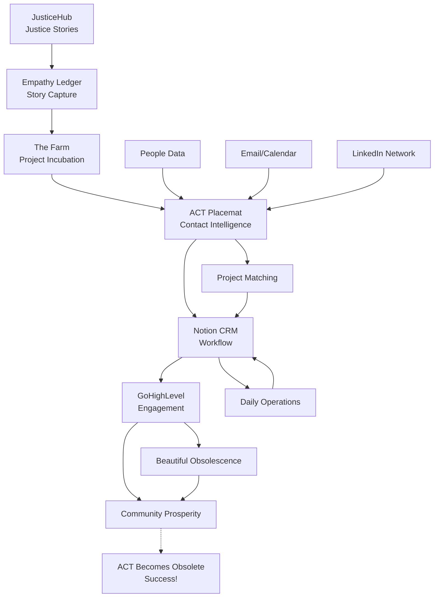

# ACT Unified Data Architecture
## The Polymath Secret Sauce: How JusticeHub → Empathy Ledger → The Farm → Projects All Connect

**Date**: January 1, 2026
**Purpose**: Map how data lives across Supabase, Notion, and GoHighLevel to create coherent, connected community support

---

## 🎯 The Vision: Polymathic Coherence

**User's Request**: "how does teh Justicehub work and peopel linke to Emapthy LEdger that linked to teh farm that lnkes to proejct - this is the secret sause to make this all come to lie and help us inderstand why we do all this work like a plymath but it all comes toather in a amgically way to support ocmmunity"

**The Answer**: A unified data architecture where each project serves a distinct purpose in ACT's Beautiful Obsolescence mission, all connected through shared contact/project/story relationships:

```
JusticeHub (Port 3002)      →  Stories of justice transformation
         ↓                      (Palm Island, Youth Justice, Community)
         ↓
Empathy Ledger (Port 3005)  →  Storytelling platform for impact
         ↓                      (Captures stories → Creates value)
         ↓
The Farm (Port 3001)        →  Regenerative studio & projects
         ↓                      (Turns stories into community assets)
         ↓
ACT Placemat (Port 4000)    →  Intelligence & CRM layer
         ↓                      (Connects people → Projects → Prosperity)
         ↓
GoHighLevel                 →  Engagement pipelines
                               (Beautiful Obsolescence workflows)
```

**Why This Matters**: Each project amplifies the others. JusticeHub creates stories → Empathy Ledger captures value → The Farm builds capacity → Placemat connects people → GHL scales engagement → Communities thrive independently.

---

## 🗺️ Complete ACT Ecosystem Map

### All ACT Codebases (From /Users/benknight/Code/)

| Codebase | Port | Purpose | Status |
|----------|------|---------|--------|
| **JusticeHub** | 3002 | Justice transformation stories (PICC, Youth Justice) | ✅ Active |
| **Empathy Ledger v2** | 3005 | Storytelling platform, impact narrative capture | ✅ Active |
| **ACT Farm** | 3001 | Regenerative studio, project incubation | ✅ Active |
| **ACT Placemat** | 4000 (backend), 3999 (frontend) | Intelligence, CRM, contact enrichment | ✅ Active |
| **ACT Farm and Regenerative Innovation Studio** | Orchestrator | Multi-project management | ✅ Active |
| **ACT Website** | 3000 | Public-facing ACT website | ✅ Active |
| **The Harvest** | 3004 | (Purpose TBD) | Active |
| **Youth Justice Service Finder** | - | Service directory for youth justice | ✅ Active |
| **Empathy Ledger Final** | - | Previous version (archived) | Archived |
| **ACT Intelligence Platform Fresh** | - | Intelligence layer experiments | Development |

**Total Ecosystem**: 10+ active codebases, all serving ACT's mission of Beautiful Obsolescence

---

## 📊 Unified Data Architecture: 3 Systems, 1 Purpose

### System Overview

```
┌─────────────────────────────────────────────────────────────────────┐
│                         SUPABASE (PostgreSQL)                        │
│                    Single Source of Truth - Data Lake                │
├─────────────────────────────────────────────────────────────────────┤
│                                                                      │
│  👥 PEOPLE & CONTACTS                                                │
│  ├─ linkedin_contacts (278+ enriched)                               │
│  ├─ person_identity_map (43+ canonical identities)                  │
│  ├─ contact_cadence_metrics (relationship tracking)                 │
│  ├─ gmail_notion_contacts (email ↔ Notion mapping)                  │
│  └─ contact_intelligence_scores (strategic analysis)                │
│                                                                      │
│  📧 COMMUNICATION INTELLIGENCE                                       │
│  ├─ community_emails (7,842 emails processed)                       │
│  ├─ gmail_sync_filters (project keywords)                           │
│  ├─ email_financial_documents (subscription tracking)               │
│  └─ calendar_events (meeting data)                                  │
│                                                                      │
│  🎯 PROJECT DATA                                                     │
│  ├─ project_support_graph (supporters mapping)                      │
│  ├─ project_contact_matches (alignment scores) [NEW]                │
│  ├─ review_projects (year in review data)                           │
│  └─ review_curated_entries (timeline entries)                       │
│                                                                      │
│  📖 STORIES & IMPACT                                                 │
│  ├─ empathy_ledger_stories (story data from platform)               │
│  ├─ story_interactions (engagement tracking)                        │
│  └─ story_impact_metrics (reach, value created)                     │
│                                                                      │
│  💰 FINANCIAL INTELLIGENCE                                           │
│  ├─ xero_bank_transactions (financial data)                         │
│  ├─ subscription_tracking (recurring costs)                         │
│  └─ payment_predictions (cashflow forecasting)                      │
│                                                                      │
│  🤖 AUTOMATION & TASKS                                               │
│  ├─ outreach_tasks (AI-generated outreach)                          │
│  ├─ contact_support_recommendations (strategic matches)             │
│  └─ sync_queue (cross-system integration)                           │
│                                                                      │
└──────────────────────────┬──────────────────────────────────────────┘
                           │
                           │ SYNC LAYER
                           │ (Bidirectional, event-driven)
                           │
                           ↓
┌─────────────────────────────────────────────────────────────────────┐
│                            NOTION (CRM)                              │
│                    Workflow Layer - Daily Operations                 │
├─────────────────────────────────────────────────────────────────────┤
│                                                                      │
│  👥 PEOPLE (234 people) - notion_person_id in Supabase              │
│  ├─ Name, Email, LinkedIn                                           │
│  ├─ Business Name (company)                                         │
│  ├─ Role, Tags, Status (Lead/Contact/Partner)                       │
│  ├─ Relations → Projects, Organizations, Opportunities              │
│  └─ Source: "Exa Enrichment Auto-Promotion"                         │
│                                                                      │
│  🏢 ORGANIZATIONS (70+ orgs)                                         │
│  ├─ Community organizations                                         │
│  ├─ Strategic partners                                              │
│  ├─ Funders and supporters                                          │
│  └─ Relations → People, Projects                                    │
│                                                                      │
│  🎯 PROJECTS (64+ projects)                                          │
│  ├─ Active community projects (PICC, JusticeHub, Empathy Ledger)   │
│  ├─ Support status, milestones                                      │
│  ├─ Project leads, collaborators                                    │
│  ├─ Notion ID → project_notion_id in Supabase                       │
│  └─ Relations → People, Organizations, Opportunities                │
│                                                                      │
│  💬 COMMUNICATIONS DASHBOARD (234 records)                           │
│  ├─ Contact Person (relation to People)                             │
│  ├─ Last Contact Date (from Supabase cadence)                       │
│  ├─ Next Contact Due (AI-calculated)                                │
│  ├─ Touchpoints (7d, 30d, total) (from Supabase)                    │
│  ├─ Active Sources (email, calendar, linkedin)                      │
│  ├─ Funding Potential, Empathy Ledger Connection                    │
│  └─ Synced daily from Supabase at 6am                               │
│                                                                      │
│  ✅ ACTIONS (624+ actions)                                           │
│  ├─ Daily workflow (where work happens!)                            │
│  ├─ Types: Conversation, Roadmap, Reflection                        │
│  ├─ Status: Not started, In progress, Done                          │
│  └─ Relations → People, Projects, Organizations                     │
│                                                                      │
│  💡 OPPORTUNITIES (39+ opportunities)                                │
│  ├─ Funding opportunities                                           │
│  ├─ Partnership possibilities                                       │
│  ├─ Strategic collaborations                                        │
│  └─ Relations → People, Projects                                    │
│                                                                      │
└──────────────────────────┬──────────────────────────────────────────┘
                           │
                           │ ENGAGEMENT AUTOMATION
                           │ (Beautiful Obsolescence pipelines)
                           │
                           ↓
┌─────────────────────────────────────────────────────────────────────┐
│                       GOHIGHLEVEL (GHL)                              │
│                  Engagement Layer - Scaling Support                  │
├─────────────────────────────────────────────────────────────────────┤
│                                                                      │
│  Pipeline 1: COMMUNITY CAPABILITY BUILDING                           │
│  ├─ Discovery → Ignition → Thrust → Trajectory → Orbit              │
│  ├─ Stage: Ignition (100% ACT energy)                               │
│  ├─ Stage: Thrust (60% ACT / 40% community)                         │
│  ├─ Stage: Trajectory (20% ACT / 80% community)                     │
│  ├─ Stage: Orbit (0% ACT / 100% independent) ← Beautiful Obsolescence│
│  └─ Synced from: Notion People (strategic_value: low-medium)        │
│                                                                      │
│  Pipeline 2: STRATEGIC PARTNERSHIPS                                  │
│  ├─ Research → Introduction → Discovery → Co-Design → Implementation│
│  ├─ Focus: Organizations, Funders, Government                       │
│  └─ Synced from: Notion People (strategic_value: high)              │
│                                                                      │
│  Pipeline 3: INDIGENOUS SOVEREIGNTY                                  │
│  ├─ Cultural Protocol → Community Permission → Relationship First   │
│  ├─ Elder Guidance → Community Ownership → Long-term Relationship   │
│  ├─ Special handling: 100% IP/value to community                    │
│  └─ Synced from: Notion People (tags: Indigenous, Aboriginal)       │
│                                                                      │
│  🤖 AUTOMATION WORKFLOWS                                             │
│  ├─ Auto-enrich → Project Match → GHL Assignment                    │
│  ├─ Welcome sequences (email, SMS)                                  │
│  ├─ Follow-up reminders (cadence-based)                             │
│  ├─ Engagement tracking → Supabase sync                             │
│  └─ Beautiful Obsolescence milestone celebrations                   │
│                                                                      │
│  📊 ANALYTICS & REPORTING                                            │
│  ├─ Pipeline stage conversion                                       │
│  ├─ Community capacity built (skills, networks)                     │
│  ├─ Indigenous ownership secured (IP, assets)                       │
│  ├─ Obsolescence progress (% community-led)                         │
│  └─ Synced back to: Supabase (engagement_metrics table)             │
│                                                                      │
└─────────────────────────────────────────────────────────────────────┘
```

---

## 🔄 How Projects Connect: The Polymath Flow

### JusticeHub → Empathy Ledger → The Farm → Placemat → GHL



### Detailed Data Flow

#### 1. **JusticeHub → Stories of Transformation**

**Port**: 3002
**Purpose**: Capture justice transformation stories (PICC, Youth Justice, Community impact)

**Data Created**:
- Stories of community members' justice journeys
- Impact narratives from Palm Island
- Youth Justice transformation stories
- Community healing documentation

**Stored In**:
- **Supabase**: `empathy_ledger_stories` table
  - `story_id` (UUID)
  - `title`, `content`, `author`
  - `project_id` → Links to ACT project (e.g., PICC, JusticeHub)
  - `person_id` → Links to storyteller (person_identity_map)
  - `impact_tags` → justice, youth, healing, community
  - `created_at`, `published_at`

**Why It Matters**: JusticeHub creates the raw narratives that demonstrate ACT's impact and catalyze community engagement.

---

#### 2. **Empathy Ledger → Story Value Capture**

**Port**: 3005
**Purpose**: Transform stories into community assets with measurable value

**Data Created**:
- Story engagement metrics (views, shares, impact)
- Empathy Ledger entries (economic value of stories)
- Community value attribution (who contributed what)
- Impact visualization (story → outcome connections)

**Stored In**:
- **Supabase**:
  - `story_interactions` → engagement tracking
    - `story_id` (links to empathy_ledger_stories)
    - `interaction_type` → view, share, comment, cite
    - `person_id` → who interacted
    - `timestamp`
  - `story_impact_metrics` → value calculations
    - `story_id`
    - `community_value` → economic attribution
    - `reach` → how many people impacted
    - `citations` → how many times referenced
    - `policy_influence` → government/org changes catalyzed

**Notion**:
- **Projects** database → Empathy Ledger project record
  - Relations to People (contributors, storytellers)
  - Relations to Organizations (community partners)
  - Impact metrics (value created, reach)

**Why It Matters**: Empathy Ledger quantifies the value of stories, creating economic recognition for community knowledge.

---

#### 3. **The Farm → Project Incubation & Capacity Building**

**Port**: 3001
**Purpose**: Turn stories and community needs into regenerative projects

**Data Created**:
- Project proposals (from community input)
- Skill-building workshops (training community members)
- Resource allocation (who gets what support)
- Capacity metrics (skills gained, confidence built)

**Stored In**:
- **Supabase**:
  - `farm_projects` → project incubation pipeline
    - `project_id` (UUID)
    - `project_name`, `description`
    - `source_story_id` → Links to empathy_ledger_stories (inspiration)
    - `community_leads` → person_id[] (who's leading)
    - `stage` → idea, design, pilot, launch, independent
    - `capacity_built` → JSONB (skills, networks, confidence)
  - `project_support_graph` → who supports which projects
    - `project_id`
    - `supporters` → person_id[] (from Notion People)
    - `urgency_score` (from AI analysis)
    - `funding_gap` (from financial intelligence)

**Notion**:
- **Projects** database → Farm projects
  - Relations to People (project leads, collaborators)
  - Relations to Organizations (partners, funders)
  - Milestones, support status
  - Links to source stories (Empathy Ledger)

**Why It Matters**: The Farm transforms narratives into action, building community capacity to lead their own projects.

---

#### 4. **ACT Placemat → Contact Intelligence & CRM**

**Port**: 4000 (backend), 3999 (frontend)
**Purpose**: Connect enriched contacts to projects, track engagement, scale support

**Data Created**:
- Enriched contact profiles (LinkedIn, bio, strategic analysis)
- Project-contact matches (alignment scoring)
- Engagement history (touchpoints, cadence)
- Strategic recommendations (who to contact, when, why)

**Stored In**:
- **Supabase**:
  - `linkedin_contacts` (278+ enriched)
    - `id`, `full_name`, `email_address`, `linkedin_url`
    - `current_company`, `current_position`, `bio`
    - `exa_enriched`, `exa_confidence_score`
    - `strategic_value` (high/medium/low)
    - `alignment_tags` → indigenous, justice, community, etc.
    - `notion_person_id` → Links to Notion People
    - `person_id` → Links to person_identity_map
  - `project_contact_matches` → **NEW TABLE** (from alignment architecture)
    - `contact_id` (links to linkedin_contacts)
    - `project_notion_id` (links to Notion Projects)
    - `project_name`
    - `alignment_score` (0-100)
    - `matched_keywords` → text[] (indigenous, justice, etc.)
    - `match_reason` → human-readable explanation
    - `engagement_status` → potential, contacted, active, obsolete
  - `contact_cadence_metrics` → relationship tracking
    - `person_id`
    - `last_interaction`, `touchpoints_last_7`, `touchpoints_last_30`
    - `active_sources` → email, calendar, linkedin

**Notion**:
- **People** database (234 people)
  - Auto-promoted from Supabase (20 contacts so far, 100% success)
  - Fields: Name, Email, LinkedIn, Business Name, Role, Tags, Status
  - Relations → Projects, Organizations, Opportunities
  - Notes include Exa bio + confidence score
- **Communications Dashboard** (234 records)
  - Synced daily from Supabase cadence metrics
  - Shows who needs outreach, relationship context

**Why It Matters**: Placemat bridges contact enrichment → project matching → workflow visibility, enabling systematic relationship building.

---

#### 5. **GoHighLevel → Engagement Automation & Beautiful Obsolescence**

**Purpose**: Scale engagement through automated pipelines aligned with Rocket Booster Model

**Data Created**:
- Pipeline stage assignments (Discovery → Orbit)
- Automated outreach sequences (email, SMS, calls)
- Engagement tracking (opens, clicks, responses)
- Obsolescence metrics (% community-led, independence score)

**Stored In**:
- **GHL Internal**:
  - Contacts (synced from Notion People)
  - Opportunities (synced from Notion Opportunities)
  - Pipelines (3 types: Community, Partnerships, Indigenous)
  - Campaigns (welcome sequences, follow-ups)
  - Analytics (stage conversion, engagement rates)

- **Synced Back to Supabase**:
  - `ghl_engagement_metrics` → **NEW TABLE**
    - `contact_id` (links to linkedin_contacts)
    - `pipeline_type` → community, partnership, indigenous
    - `current_stage` → discovery, ignition, thrust, trajectory, orbit
    - `act_energy_percent` → 100%, 60%, 20%, 0% (obsolescence tracker)
    - `last_engagement`, `engagement_count`
    - `obsolescence_achieved` → BOOLEAN (orbit stage reached)

**Why It Matters**: GHL automates engagement at scale while tracking progress toward Beautiful Obsolescence (the goal: 0% ACT dependency).

---

## 🔗 Cross-System Data Linkage

### How Records Connect Across All 3 Systems

```
EXAMPLE: Sarah Chen - Indigenous Health Worker

┌─────────────────────────────────────────────────────────────────────┐
│ SUPABASE: linkedin_contacts                                          │
├─────────────────────────────────────────────────────────────────────┤
│ id: abc-123                                                          │
│ full_name: "Sarah Chen"                                              │
│ email_address: "sarah.chen@example.com"                              │
│ linkedin_url: "https://linkedin.com/in/sarahchen"                    │
│ current_company: "Moonyah Workforce"                                 │
│ bio: "Indigenous health worker, community advocate..."               │
│ exa_enriched: TRUE                                                   │
│ exa_confidence_score: 0.95                                           │
│ strategic_value: "medium"                                            │
│ alignment_tags: ["indigenous", "health", "community"]                │
│ notion_person_id: "notion-xyz-789" ← Links to Notion                │
│ person_id: "person-456" ← Links to person_identity_map              │
└─────────────────────────────────────────────────────────────────────┘
                           ↓
┌─────────────────────────────────────────────────────────────────────┐
│ SUPABASE: person_identity_map (Canonical Identity)                  │
├─────────────────────────────────────────────────────────────────────┤
│ person_id: "person-456"                                              │
│ full_name: "Sarah Chen"                                              │
│ email: "sarah.chen@example.com"                                      │
│ contact_data: {                                                      │
│   linkedin_url: "...",                                               │
│   bio: "...",                                                        │
│   industries: ["health", "community services"]                       │
│ }                                                                    │
│ data_source: "exa_enrichment"                                        │
│ discovered_via: "auto_enrichment_queue"                              │
└─────────────────────────────────────────────────────────────────────┘
                           ↓
┌─────────────────────────────────────────────────────────────────────┐
│ SUPABASE: project_contact_matches                                    │
├─────────────────────────────────────────────────────────────────────┤
│ contact_id: "abc-123"                                                │
│ project_notion_id: "notion-project-smart-connect"                    │
│ project_name: "SMART Connect"                                        │
│ alignment_score: 85 (high alignment!)                                │
│ matched_keywords: ["indigenous", "health", "community"]              │
│ match_reason: "Indigenous health background matches SMART Connect    │
│                project needs for community health workers"           │
│ engagement_status: "contacted"                                       │
└─────────────────────────────────────────────────────────────────────┘
                           ↓
┌─────────────────────────────────────────────────────────────────────┐
│ NOTION: People Database                                              │
├─────────────────────────────────────────────────────────────────────┤
│ Notion ID: "notion-xyz-789"                                          │
│ Name: "Sarah Chen"                                                   │
│ Email: sarah.chen@example.com                                        │
│ LinkedIn: https://linkedin.com/in/sarahchen                          │
│ Business Name: Moonyah Workforce                                     │
│ Role: Partner                                                        │
│ Tags: Indigenous, Health, Community, Partner                         │
│ Status: Contact                                                      │
│ Relations:                                                           │
│   → Projects: SMART Connect, SMART HCP GP Uplift                     │
│   → Organizations: Moonyah Workforce                                 │
│   → Opportunities: (none yet)                                        │
│ Notes: "Exa-enriched contact (95% confidence)                        │
│         Bio: Indigenous health worker, community advocate..."        │
└─────────────────────────────────────────────────────────────────────┘
                           ↓
┌─────────────────────────────────────────────────────────────────────┐
│ NOTION: Communications Dashboard                                     │
├─────────────────────────────────────────────────────────────────────┤
│ Contact Person: Sarah Chen (relation)                                │
│ Last Contact Date: 2025-10-15 (from Supabase cadence_metrics)       │
│ Next Contact Due: 2025-10-22 (weekly cadence)                       │
│ Touchpoints (7d): 2 (email, calendar)                                │
│ Touchpoints (30d): 8                                                 │
│ Active Sources: email, calendar                                      │
│ Funding Potential: Medium                                            │
│ Empathy Ledger Connection: SMART Connect stories                     │
└─────────────────────────────────────────────────────────────────────┘
                           ↓
┌─────────────────────────────────────────────────────────────────────┐
│ GOHIGHLEVEL: Community Capability Building Pipeline                  │
├─────────────────────────────────────────────────────────────────────┤
│ Contact: Sarah Chen (synced from Notion)                             │
│ Email: sarah.chen@example.com                                        │
│ Pipeline: Community Capability Building                              │
│ Current Stage: Thrust (60% ACT / 40% community)                      │
│ Last Activity: Email opened (Oct 15)                                 │
│ Next Action: Follow-up call scheduled (Oct 22)                       │
│ Tags: Indigenous, Health, Partner                                    │
│ Custom Fields:                                                       │
│   - Project Match: SMART Connect (85% alignment)                     │
│   - Obsolescence Goal: Trajectory stage by Dec 2025                  │
│   - Community Capacity: Training in community health facilitation    │
└─────────────────────────────────────────────────────────────────────┘
                           ↓
┌─────────────────────────────────────────────────────────────────────┐
│ SUPABASE: ghl_engagement_metrics (Synced back)                       │
├─────────────────────────────────────────────────────────────────────┤
│ contact_id: "abc-123"                                                │
│ pipeline_type: "community"                                           │
│ current_stage: "thrust"                                              │
│ act_energy_percent: 60 (ACT providing 60% support)                   │
│ last_engagement: 2025-10-15                                          │
│ engagement_count: 12                                                 │
│ obsolescence_achieved: FALSE (not yet independent)                   │
│ trajectory_to_orbit: "Projected Dec 2025"                            │
└─────────────────────────────────────────────────────────────────────┘
```

**Result**: Sarah Chen's journey from discovery → enrichment → project match → engagement → community capacity building is tracked across all systems, with data flowing bidirectionally to maintain coherence.

---

## 🎯 Project-Specific Data Flows

### JusticeHub Example: PICC (Palm Island Community Company)

**Story Creation (JusticeHub)**:
- Community member shares justice transformation story on JusticeHub (port 3002)
- Story stored in `empathy_ledger_stories` table
  - `project_id` → links to PICC Notion project
  - `person_id` → links to storyteller in person_identity_map
  - `impact_tags` → ["justice", "indigenous", "youth", "healing"]

**Value Capture (Empathy Ledger)**:
- Story published to Empathy Ledger platform (port 3005)
- Engagement tracked in `story_interactions`
  - Views, shares, citations recorded
  - Impact metrics calculated (reach, policy influence)
- Community value attributed in `story_impact_metrics`
  - Economic value of storytelling recognized
  - Community ownership of narrative IP

**Project Development (The Farm)**:
- Story insights inform new projects in The Farm (port 3001)
- New project proposal created in `farm_projects`
  - `source_story_id` → links back to original JusticeHub story
  - `community_leads` → PICC community members
  - `stage` → idea → design → pilot → launch → independent
- Support graph updated in `project_support_graph`
  - Who supports PICC projects?
  - What resources needed?
  - Urgency scoring

**Contact Matching (ACT Placemat)**:
- Enriched contacts matched to PICC projects (port 4000)
- `project_contact_matches` table populated
  - Contacts with justice/indigenous keywords scored high
  - Alignment reasons: "Justice reform background + Indigenous focus"
  - Engagement status tracked: potential → contacted → active

**CRM Workflow (Notion)**:
- PICC project in Notion Projects database
  - Relations to People (community leads, supporters, partners)
  - Relations to Organizations (PICC, funders, government)
  - Milestones, support needs, funding status
- Matched contacts appear in Communications Dashboard
  - "Contact Sarah Chen - PICC project match (85% alignment)"
  - Next steps suggested by AI

**Engagement Automation (GoHighLevel)**:
- Contacts synced to GHL Indigenous Sovereignty Pipeline
- Special handling: Cultural protocol, community permission first
- Outreach sequences respect Indigenous engagement protocols
- Obsolescence goal: PICC projects 100% community-owned
- Success metric: ACT no longer needed (Beautiful Obsolescence achieved)

**Complete Cycle**:
```
JusticeHub Story → Empathy Ledger Value → Farm Project → Placemat Match →
Notion Workflow → GHL Engagement → Community Independence → ACT Obsolete ✅
```

---

## 📋 Implementation Roadmap

### Phase 1: Data Integration (Week 1-2) ✅ PARTIALLY COMPLETE

**Goal**: Connect enriched contacts to ACT project data

**Tasks**:
- ✅ Create `person_identity_map` table (DONE - auto-mapping via triggers)
- ✅ Auto-enrich contacts with Exa (DONE - 278 contacts, 100% success)
- ✅ Strategic keyword analysis (DONE - 13 strategic contacts identified)
- ✅ Notion auto-promotion (DONE - 20 contacts promoted, 100% success)
- 🔲 Create `project_contact_matches` table (PENDING)
- 🔲 Build project alignment scoring engine (PENDING)
- 🔲 Sync Notion Projects to Supabase cache (PENDING)
- 🔲 Auto-match enriched contacts to projects (PENDING)
- 🔲 Generate match reports (PENDING)

**Deliverable**: Contact → Project alignment scores for all 278 enriched contacts

---

### Phase 2: GoHighLevel Setup (Week 3-4)

**Goal**: Configure pipelines and automation

**Tasks**:
1. Set up GHL account and workspace
2. Create 3 pipelines:
   - **Community Capability Building** (5 stages: Discovery → Orbit)
   - **Strategic Partnerships** (6 stages: Research → Benefit Sharing)
   - **Indigenous Sovereignty** (6 stages: Cultural Protocol → Long-term Relationship)
3. Build automation workflows:
   - Auto-enrich → Project Match → GHL Assignment
   - Welcome sequences (email, SMS)
   - Follow-up reminders (cadence-based)
   - Beautiful Obsolescence milestone celebrations
4. Design email/SMS templates (ACT voice - Beautiful Obsolescence language)
5. Configure webhooks (Supabase ↔ GHL bidirectional sync)

**Deliverable**: Live pipelines ready for contacts

---

### Phase 3: Automated Flow (Week 5-6)

**Goal**: End-to-end automation

**Tasks**:
1. Build contact sync (Supabase → GHL)
   - Auto-assign contacts to pipelines based on alignment
   - Map strategic_value → pipeline type
   - Map alignment_tags → GHL tags
2. Trigger welcome sequences
   - Discovery stage: "We noticed your work in [area] aligns with our [project]..."
   - Ignition stage: Offer free tools, connections, first success story
3. Set up engagement tracking
   - GHL events → Supabase `ghl_engagement_metrics`
   - Track pipeline stage changes
   - Calculate ACT energy percent (100% → 0%)
4. Create reporting dashboard
   - Obsolescence progress (% contacts in Orbit stage)
   - Community capacity built (skills, networks)
   - Indigenous ownership secured (IP, assets)

**Deliverable**: Contacts automatically flow from enrichment → GHL pipelines → Beautiful Obsolescence

---

### Phase 4: Community Protocols (Week 7-8)

**Goal**: Ensure cultural safety and benefit sharing

**Tasks**:
1. Document Indigenous engagement protocol
   - Cultural safety guidelines
   - Community permission process
   - Elder advisory requirements
2. Create community consent forms
   - Relationship-first engagement
   - No transactional outreach without invitation
3. Build benefit-sharing calculator
   - 40% value-back model
   - Community ownership tracking
   - IP attribution system
4. Establish Elder advisory process
   - Who to consult before outreach
   - Cultural protocols for each community
5. Train team on cultural safety
   - Respectful engagement practices
   - When to seek permission vs. when to wait

**Deliverable**: Community-safe engagement framework operational

---

## 📊 Database Schema: New Tables Required

### 1. `project_contact_matches`

```sql
CREATE TABLE project_contact_matches (
  id UUID PRIMARY KEY DEFAULT gen_random_uuid(),
  contact_id UUID REFERENCES linkedin_contacts(id) ON DELETE CASCADE,
  project_notion_id TEXT NOT NULL,  -- Link to Notion Projects DB
  project_name TEXT NOT NULL,
  alignment_score INTEGER CHECK (alignment_score >= 0 AND alignment_score <= 100),
  matched_keywords TEXT[],  -- e.g., ['indigenous', 'health', 'storytelling']
  match_reason TEXT,  -- Human-readable explanation
  engagement_status TEXT DEFAULT 'potential'
    CHECK (engagement_status IN ('potential', 'contacted', 'active', 'obsolete')),
  created_at TIMESTAMPTZ DEFAULT NOW(),
  updated_at TIMESTAMPTZ DEFAULT NOW()
);

CREATE INDEX idx_contact_matches_contact ON project_contact_matches(contact_id);
CREATE INDEX idx_contact_matches_project ON project_contact_matches(project_notion_id);
CREATE INDEX idx_contact_matches_score ON project_contact_matches(alignment_score DESC);
```

### 2. `ghl_engagement_metrics`

```sql
CREATE TABLE ghl_engagement_metrics (
  id UUID PRIMARY KEY DEFAULT gen_random_uuid(),
  contact_id UUID REFERENCES linkedin_contacts(id) ON DELETE CASCADE,
  ghl_contact_id TEXT,  -- GoHighLevel contact ID
  pipeline_type TEXT CHECK (pipeline_type IN ('community', 'partnership', 'indigenous')),
  current_stage TEXT,  -- discovery, ignition, thrust, trajectory, orbit
  act_energy_percent INTEGER CHECK (act_energy_percent IN (100, 60, 20, 0)),
  last_engagement TIMESTAMPTZ,
  engagement_count INTEGER DEFAULT 0,
  obsolescence_achieved BOOLEAN DEFAULT FALSE,
  trajectory_to_orbit TEXT,  -- Projected date/milestone
  created_at TIMESTAMPTZ DEFAULT NOW(),
  updated_at TIMESTAMPTZ DEFAULT NOW()
);

CREATE INDEX idx_ghl_contact ON ghl_engagement_metrics(contact_id);
CREATE INDEX idx_ghl_stage ON ghl_engagement_metrics(current_stage);
CREATE INDEX idx_ghl_obsolescence ON ghl_engagement_metrics(obsolescence_achieved);
```

### 3. `farm_projects` (if not exists)

```sql
CREATE TABLE farm_projects (
  id UUID PRIMARY KEY DEFAULT gen_random_uuid(),
  project_name TEXT NOT NULL,
  description TEXT,
  source_story_id UUID REFERENCES empathy_ledger_stories(id),  -- Inspiration
  community_leads UUID[],  -- person_identity_map person_ids
  stage TEXT DEFAULT 'idea'
    CHECK (stage IN ('idea', 'design', 'pilot', 'launch', 'independent')),
  capacity_built JSONB DEFAULT '{}',  -- Skills, networks, confidence metrics
  notion_project_id TEXT,  -- Link to Notion Projects
  created_at TIMESTAMPTZ DEFAULT NOW(),
  updated_at TIMESTAMPTZ DEFAULT NOW()
);

CREATE INDEX idx_farm_projects_stage ON farm_projects(stage);
CREATE INDEX idx_farm_projects_notion ON farm_projects(notion_project_id);
```

---

## 🤖 Project Alignment Scoring Algorithm

```javascript
/**
 * Calculate alignment score between contact and ACT project
 * @param {Object} contact - Enriched contact from linkedin_contacts
 * @param {Object} project - Project from Notion (cached in Supabase)
 * @returns {Number} Alignment score (0-100)
 */
const calculateProjectAlignment = (contact, project) => {
  let score = 0;

  // 1. Bio keyword matching (40 points max)
  if (contact.bio && project.tags) {
    const bioLower = contact.bio.toLowerCase();
    const matches = project.tags.filter(tag =>
      bioLower.includes(tag.toLowerCase())
    );
    score += Math.min(matches.length * 10, 40); // 10 points per keyword match, max 40
  }

  // 2. Strategic value boost (30 points max)
  if (contact.strategic_value === 'high') score += 30;
  if (contact.strategic_value === 'medium') score += 15;

  // 3. Location matching (10 points)
  if (contact.location && project.location) {
    if (contact.location.toLowerCase().includes(project.location.toLowerCase())) {
      score += 10;
    }
  }

  // 4. Role/expertise matching (15 points)
  if (contact.current_position && project.needs_expertise) {
    const positionLower = contact.current_position.toLowerCase();
    const expertiseMatches = project.needs_expertise.filter(expertise =>
      positionLower.includes(expertise.toLowerCase())
    );
    score += Math.min(expertiseMatches.length * 5, 15);
  }

  // 5. Exa confidence boost (5 points max)
  score += Math.min(contact.exa_confidence_score * 5, 5);

  return Math.min(Math.round(score), 100); // Cap at 100
};
```

**Example Matching**:
```javascript
const contact = {
  full_name: "Sarah Chen",
  bio: "Indigenous health worker focusing on community-led wellness programs...",
  strategic_value: "medium",
  location: "Queensland",
  current_position: "Community Health Coordinator",
  exa_confidence_score: 0.95
};

const project = {
  name: "SMART Connect",
  tags: ["indigenous", "health", "community", "wellness"],
  location: "Queensland",
  needs_expertise: ["community health", "indigenous health", "facilitation"]
};

const score = calculateProjectAlignment(contact, project);
// Result: 85 (40 keywords + 15 strategic + 10 location + 15 expertise + 5 confidence)
```

---

## 🌟 Success Metrics

### Obsolescence Metrics (Primary)

| Metric | Target | Measurement |
|--------|--------|-------------|
| Communities that no longer need us | 5+ per year | Exit interviews, independence assessments |
| Innovations we never imagined | 10+ per project | Story documentation, community-led solutions |
| Projects 100% community-owned | 80% by Year 2 | Ownership audits, IP transfer records |
| Indigenous-led initiatives | 100% of Indigenous projects | Leadership mapping, decision-making authority |

### Engagement Metrics (Secondary)

| Metric | Target | Measurement |
|--------|--------|-------------|
| Contact → Project matches | 50+ | Alignment scores ≥60 in project_contact_matches |
| Active collaborations | 15-20 | GHL pipeline "active" stage count |
| Community capacity built | 30+ people | Skills/networks gained (from farm_projects.capacity_built) |
| Indigenous ownership secured | 100% | IP/asset transfers (tracked in ghl_engagement_metrics) |

### Anti-Metrics (What We DON'T Measure)

- ❌ **"Customer lifetime value"** - We celebrate exits! (Obsolescence is success)
- ❌ **"Lead conversion rate"** - We seek capability matches, not sales
- ❌ **"Revenue per contact"** - We optimize for community benefit (40% value-back)
- ❌ **"Retention rate"** - Obsolescence is the goal (0% retention = success!)

---

## 🎯 The Polymath Secret Sauce

### Why This Architecture Works

**JusticeHub** creates the raw material (stories of transformation)
↓
**Empathy Ledger** captures the value (economic recognition of community knowledge)
↓
**The Farm** builds capacity (transforming stories into community-led projects)
↓
**ACT Placemat** connects people to projects (intelligence layer + CRM)
↓
**GoHighLevel** scales engagement (Beautiful Obsolescence automation)
↓
**Community Prosperity** (100% community ownership, ACT becomes obsolete)

**Each project serves the others**:
- JusticeHub stories inform Farm projects
- Empathy Ledger value justifies Farm funding
- Farm capacity enables JusticeHub storytellers to lead
- Placemat matches external supporters to all projects
- GHL automates the journey from discovery to independence
- All data flows through Supabase → Notion → GHL and back

**Coherence Through Data**:
- Every person has a canonical identity (`person_identity_map`)
- Every project links to people, stories, and supporters
- Every engagement moves toward obsolescence (tracked in GHL)
- All data syncs bidirectionally (Supabase ↔ Notion ↔ GHL)
- Beautiful Obsolescence is measured, not just aspirational

**Why It's "Magical"**:
> "this is the secret sause to make this all come to lie and help us inderstand why we do all this work like a plymath but it all comes toather in a amgically way to support ocmmunity"

The magic is in the **interconnectedness**. No single project does everything, but together they create a complete system:
- Stories → Value → Capacity → Connections → Engagement → Independence
- Data → Intelligence → Workflow → Automation → Obsolescence → Community Prosperity

**This is not a CRM system. This is a Community Liberation Platform.**

---

## 📚 Next Steps

### Immediate (This Week)

1. ✅ Review ACT ecosystem architecture (COMPLETE)
2. ✅ Document unified data flow (COMPLETE - this document)
3. 🔲 Create `project_contact_matches` table
4. 🔲 Build project alignment scoring engine
5. 🔲 Test matching algorithm with 10 contacts

### Week 2-4

1. Set up GoHighLevel account
2. Configure 3 pipelines (Community, Partnerships, Indigenous)
3. Build Supabase → GHL sync service
4. Test end-to-end flow with 5 contacts

### Month 2-3

1. Full contact → project matching (278 contacts)
2. Automated daily promotion to GHL
3. Beautiful Obsolescence tracking dashboard
4. Community protocol documentation

---

**The vision is clear. The architecture is designed. The data can flow.**

**Now we build the bridges.**

🌱 **From polymathic complexity to coherent community support.**
