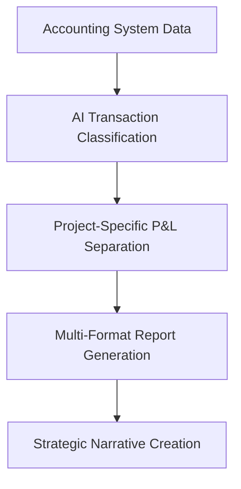

# Universal Financial Strategy Framework
**For AI-Powered Grant Applications & Strategic Documentation**

## 🎯 Overview

This framework, developed through the successful Snow Foundation application process, enables any project to generate world-class financial narratives that position communities as leaders while creating compelling cases for investment and systemic change.

## 📋 Core Framework Components

### **1. Real Data Foundation Pipeline**



**Implementation Steps:**
1. **Data Extraction**: Connect to accounting system (Xero, QuickBooks, etc.)
2. **AI Classification**: Use LLM to categorise transactions by project
3. **Financial Analysis**: Generate accurate project-specific financials
4. **Narrative Development**: Create contextual explanations for financial position

### **2. Multi-Stakeholder Documentation Strategy**

| Stakeholder | Format | Focus | Key Messages |
|-------------|---------|--------|--------------|
| **Grant Funders** | Professional PDF + HTML | Impact & Sustainability | Catalyst investment, proven model |
| **Community Partners** | Visual presentations | Ownership & Control | Traditional Custodian leadership |
| **Government/Policy** | Formal reports | Systemic Change | Replication potential, policy implications |
| **Private Sector** | Business cases | Innovation & ROI | Manufacturing excellence, market opportunity |

### **3. Financial Positioning Framework**

#### **Development Phase Narrative (Investment > Revenue)**
- "Normal startup investment pattern"
- "Building capabilities and community ownership structures" 
- "Transitioning from development to scaled operations"
- Show broader organisational sustainability

#### **Scaling Phase Narrative (Revenue approaching expenses)**
- "Proven demand with initial sales validation"
- "Ready to scale production to meet community needs"
- "Grant funding catalyzes transition to sustainability"

#### **Sustainability Phase Narrative (Revenue > Expenses)**
- "Financially sustainable with reinvestment capacity"
- "Seeking impact investment for replication"
- "Demonstrating model viability for systemic change"

## 🔧 Implementation Tools & Templates

### **Financial Analysis Scripts**
```javascript
// Template structure for any accounting system
const financialAnalysisPipeline = {
  dataExtraction: 'connect to accounting API',
  aiClassification: 'categorise transactions by project',
  reportGeneration: 'create multi-format outputs',
  narrativeCreation: 'contextual explanations'
}
```

### **Document Templates**

#### **1. Executive Summary Template**
```markdown
**Current Status:** [Project phase] having invested $[amount] in [activities] over [timeframe]. [Achievement summary]. Ready to [next phase].

**[Funder] Partnership:** Your $[amount] investment over [timeframe] will catalyze [transformation] while [broader impact].
```

#### **2. Financial Position Template** 
```markdown
**[Timeframe] Financial Position:**
- Revenue Generated: $[amount] ([sources])
- Development Investment: $[amount] ([categories])
- Net Position: $[amount] ([explanation of phase])
- Overall Organisation: $[amount] (demonstrates sustainability)
```

#### **3. Community Leadership Template**
```markdown
**[Community] Leadership Structure:**
- [Community leaders] control all [key decisions]
- [Cultural protocols] integrated into [processes]
- [Community enterprise] structure established and operational
```

## 🎨 Visual Design System

### **Color Palette for Financial Documents**
- **Primary Blue** (#1e3a8a): Trust, stability, professionalism
- **Action Red** (#dc2626): Urgency, impact, call-to-action  
- **Success Green** (#10b981): Growth, sustainability, achievement
- **Neutral Grays** (#f8f9fa to #374151): Professional backgrounds

### **Typography Hierarchy**
- **Headers**: Sans-serif, bold, larger sizing
- **Body**: Readable serif or clean sans-serif
- **Data**: Monospace for financial figures
- **Emphasis**: Strategic use of bold and color

### **Layout Templates**
- **Pitch Deck**: 8-slide maximum, visual-heavy
- **Strategic Plan**: Professional report format
- **Financial Reports**: Data tables with narrative explanation
- **Theory of Change**: Visual flow diagrams

## 📊 AI Integration Opportunities

### **Automated Foundation Research**
```python
def foundation_alignment_analysis(project_data, foundation_info):
    """
    Analyze project alignment with foundation values
    Generate customized application responses
    """
    return {
        'alignment_score': calculate_values_match(),
        'key_messaging': generate_aligned_language(),
        'application_responses': customize_responses()
    }
```

### **Dynamic Financial Narrative Generation**
```python
def generate_financial_narrative(financial_data, project_phase):
    """
    Create contextual explanations for financial position
    Adapt messaging based on development phase
    """
    return {
        'executive_summary': explain_current_status(),
        'investment_rationale': justify_funding_need(),
        'sustainability_plan': outline_revenue_path()
    }
```

### **Multi-Format Report Automation**
```python
def create_stakeholder_reports(base_data, stakeholder_types):
    """
    Generate customized reports for different audiences
    Maintain consistent data while adapting presentation
    """
    return {
        stakeholder: customize_report(base_data, stakeholder_preferences)
        for stakeholder in stakeholder_types
    }
```

## 🌟 Community Sovereignty Integration

### **Language Framework**
❌ **Avoid:** "We help communities..."  
✅ **Use:** "Traditional Custodians lead..."

❌ **Avoid:** "Community-focused"  
✅ **Use:** "Community-controlled"

❌ **Avoid:** "Service delivery"  
✅ **Use:** "Community ownership"

### **Decision-Making Authority**
- **All major decisions** made through community consultation
- **Traditional Custodians** control all aspects of implementation
- **Cultural protocols** guide all processes and partnerships
- **Community enterprise** owns equipment, processes, and profits

### **Impact Measurement**
- **Community-determined indicators** define success
- **Traditional Custodians** control all data collection and sharing
- **Cultural values** embedded in measurement frameworks
- **External metrics** support rather than replace community definitions

## 🚀 Implementation Checklist

### **Phase 1: Data Foundation**
- [ ] Connect to accounting system API
- [ ] Implement AI transaction classification
- [ ] Generate accurate project-specific P&L
- [ ] Create baseline financial narrative

### **Phase 2: Strategic Documentation**
- [ ] Research target funders/stakeholders thoroughly
- [ ] Develop community sovereignty language
- [ ] Create multi-format templates
- [ ] Generate visual design system

### **Phase 3: Application Development**
- [ ] Customize messaging for specific opportunities
- [ ] Create comprehensive document packages
- [ ] Develop presentation materials
- [ ] Prepare community review and approval process

### **Phase 4: System Optimization**
- [ ] Automate report generation pipelines
- [ ] Create foundation database with values/priorities
- [ ] Implement real-time financial dashboard
- [ ] Develop portfolio-level strategic planning

## 💡 Success Patterns from Snow Foundation Application

### **What Made It Successful**
1. **Real Data Integration** - Used actual 2,541 Xero transactions
2. **Community Agency** - Traditional Custodian leadership throughout  
3. **Values Alignment** - Deep research into foundation priorities
4. **Current Status Clarity** - Honest about development phase
5. **Multi-Format Strategy** - Different documents for different purposes

### **Replicable Elements**
- AI-powered transaction classification methodology
- Community sovereignty language framework
- Multi-stakeholder documentation approach
- Development phase narrative strategy
- Visual design system for professional presentation

## 🔮 Future Evolution: Universal AI Bookkeeping System

### **Vision**
Any organisation + AI Bookkeeping System = Real Data → Classification → Multi-Stakeholder Reports → Strategic Applications

### **Capabilities**
- **Real-time financial analysis** for any project
- **Automated grant opportunity matching** based on project data
- **Community language integration** based on location/culture
- **Foundation research database** with automated alignment scoring
- **Portfolio management** across multiple projects and funding sources

### **Impact**
- **Democratise access** to world-class financial strategy development
- **Strengthen community agency** through professional documentation
- **Accelerate systemic change** through improved funding success rates
- **Create replicable models** for community-controlled development

---

*This framework transforms financial data into strategic narratives that position communities as leaders and create compelling cases for investment in systemic change.*