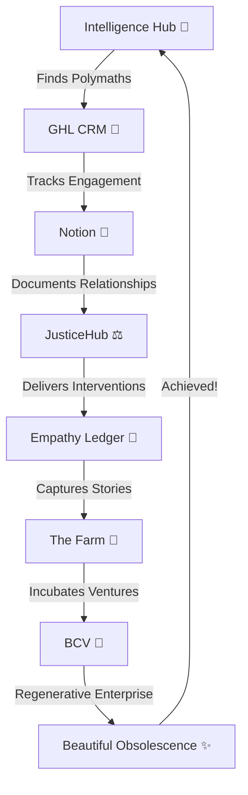

# 🌍 Strategic Enrichment Plan - Real World Actions

**Date**: 2026-01-01
**Goal**: Move from Intelligence → Understanding → Action across the entire ACT ecosystem
**Status**: Planning Phase

---

## Executive Summary

We've built the intelligence infrastructure (alignment scoring, polymath discovery, project matching). Now we need to **enrich both people and projects** with the right data to enable **real-world Beautiful Obsolescence actions** across all 8 ACT systems.

### The Gap Between Intelligence and Action

**What We Have** ✅:
- 268 enriched contacts (1.3% of 20K)
- 70 Notion projects synced
- 14 polymaths identified
- Alignment scoring working (Julie: 85/100)
- UI dashboard built

**What We Need** 🎯:
- **Action signals**: When to reach out, what to say, how to help
- **Context depth**: Current projects, recent activity, availability
- **Cross-system coherence**: How person relates to all 8 systems
- **Readiness indicators**: Who's ready for Beautiful Obsolescence now?
- **Relationship history**: Past interactions, current status, next steps

---

## Part 1: People Enrichment - From Profiles to Action

### Current Contact Data (What We Have)
```typescript
{
  full_name: "Julie Christensen",
  current_position: "Manager/Principal Officer",
  current_company: "Queensland Department of Education",
  linkedin_url: "...",
  bio: "1\nDepartment of Education...",  // Exa-enriched
  alignment_tags: ["advocacy", "arts", "business", ...],  // AI-detected
  strategic_value: "high",  // Manually set
  exa_confidence: 0  // Missing!
}
```

### Enhanced Contact Data (What We Need)
```typescript
{
  // CURRENT STATE
  full_name: "Julie Christensen",
  current_position: "Manager/Principal Officer",
  current_company: "Queensland Department of Education",
  location: "Brisbane, QLD",  // Geocoded

  // ENRICHMENT METADATA
  exa_confidence: 0.95,  // Quality score
  last_enriched_at: "2026-01-01",
  enrichment_source: "exa",

  // CONTACT INFORMATION (From multiple sources)
  email_address: "julie.christensen@qld.gov.au",  // Validated
  linkedin_url: "...",
  twitter_handle: "@juliechristensen",  // Social signals

  // PROFESSIONAL CONTEXT
  alignment_tags: ["advocacy", "arts", "business", ...],
  strategic_value: "high",
  expertise_areas: ["youth justice", "education policy", "government relations"],
  years_experience: 15,

  // CURRENT ACTIVITY (Real-time signals)
  recent_linkedin_posts: [
    {
      date: "2025-12-15",
      content: "Excited to announce new youth justice mentoring initiative...",
      engagement: { likes: 45, comments: 12 },
      relevance_to_picc: 0.92  // AI-scored
    }
  ],
  recent_career_moves: [
    { date: "2024-03-01", event: "Promoted to Principal Officer" }
  ],

  // AVAILABILITY SIGNALS
  availability_indicators: {
    currently_hiring: false,
    recent_job_change: false,
    active_on_linkedin: true,
    engagement_level: "high",  // Based on post frequency
    best_time_to_contact: "Q1 2026"  // Based on patterns
  },

  // BEAUTIFUL OBSOLESCENCE READINESS
  obsolescence_readiness: {
    score: 85,  // 0-100
    factors: [
      "Government role = can scale systemically",
      "Youth justice expertise = perfect domain fit",
      "Practitioner + leader = can transfer ownership",
      "Brisbane-based = accessible for PICC visits"
    ],
    blockers: [],
    recommended_approach: "Position as government partnership advisor, not just volunteer"
  },

  // RELATIONSHIP HISTORY (Cross-system)
  acct_relationship: {
    first_contact: null,  // Never contacted
    last_contact: null,
    total_interactions: 0,
    engagement_status: "potential",  // potential → contacted → active → obsolete
    assigned_to: null,  // Who in ACT team owns relationship
    ghl_contact_id: null,  // Link to GHL CRM
    projects_matched: ["PICC - Storm Stories", ...],  // 12 projects
    recommended_next_action: {
      action: "email_introduction",
      timing: "this_week",
      template: "picc_youth_justice_intro",
      talking_points: [
        "Minister for Youth Justice connection",
        "PICC Storm Stories cultural mentoring",
        "Government scaling pathway"
      ]
    }
  },

  // CROSS-SYSTEM PRESENCE
  system_presence: {
    ghl: null,  // Not in GHL yet
    notion: null,  // Not in Notion People DB yet
    empathy_ledger: null,  // No stories captured
    farm: null,  // No ventures
    justicehub: { potential_mentor: true },  // Could mentor
    intelligence_hub: { polymath_rank: 1, project_count: 12 }  // Current system
  }
}
```

### Enrichment Sources (How to Get This Data)

**1. Exa API (Already Using)** ✅
- Professional bio
- Current role
- Company info
- **Need to capture**: `exa_confidence` score

**2. LinkedIn API (New)**
- Recent posts (activity signals)
- Career moves (availability)
- Engagement patterns (best time to contact)
- Network connections (warm intros)

**3. Email Finder APIs (New)**
- Hunter.io: Find work emails
- Clearbit: Validate emails
- Probably correct patterns (first.last@company.com)

**4. Social Media APIs (New)**
- Twitter/X: Public discourse, values alignment
- Mastodon: Community engagement
- GitHub: For tech polymaths (open source contributions)

**5. ACT Internal Data (Already Have)**
- Gmail: Past email interactions
- Notion: Relationship notes
- GHL: CRM engagement history
- Empathy Ledger: Impact stories

**6. AI Enrichment (New)**
```typescript
// Use Claude to analyze and synthesize
async function enrichContactWithAI(contact, allData) {
  const prompt = `
  Analyze this contact for Beautiful Obsolescence readiness:

  Contact: ${contact.full_name}
  Role: ${contact.current_position}
  Tags: ${contact.alignment_tags.join(', ')}
  Recent Activity: ${contact.recent_linkedin_posts}
  Matched Projects: ${contact.projects_matched}

  Provide:
  1. Obsolescence readiness score (0-100)
  2. Key factors (why they're ready or not)
  3. Potential blockers
  4. Recommended approach (how to engage)
  5. Best next action with timing
  `;

  return await claude.analyze(prompt);
}
```

---

## Part 2: Project Enrichment - From Tags to Action

### Current Project Data (What We Have)
```typescript
{
  notion_project_id: "picc-storm-stories",
  project_name: "PICC - Storm Stories",
  project_source: "placemat",
  status: "Active 🔥",
  tags: ["indigenous", "youth_justice", "mentoring", ...],
  required_expertise: ["youth work", "cultural practice", ...],
  alma_intervention_id: "6eeaec2d-e8dc-4e95-b1bf-f5ec30d77a94"
}
```

### Enhanced Project Data (What We Need)
```typescript
{
  // BASIC INFO
  notion_project_id: "picc-storm-stories",
  project_name: "PICC - Storm Stories",
  project_source: "placemat",
  status: "Active 🔥",

  // ENRICHED METADATA
  description: "Cultural mentoring program for Indigenous youth on Palm Island...",
  long_description: "Full Notion page content parsed",

  // CLASSIFICATION
  tags: ["indigenous", "youth_justice", "mentoring", ...],
  required_expertise: ["youth work", "cultural practice", ...],
  primary_domain: "youth_justice",
  secondary_domains: ["indigenous_leadership", "cultural_preservation"],

  // LOCATION & CONTEXT
  location: "Palm Island, QLD",
  location_geocoded: { lat: -18.7, lng: 146.6 },
  geography_type: "remote_indigenous_community",
  community_size: 2500,

  // ALMA INTEGRATION
  alma_intervention_id: "6eeaec2d-e8dc-4e95-b1bf-f5ec30d77a94",
  alma_intervention: {
    name: "PICC Cultural Mentoring Program",
    type: "Cultural Connection",
    consent_level: "Community Controlled",
    cultural_authority: "Palm Island Cultural Centre (PICC)"
  },

  // BEAUTIFUL OBSOLESCENCE TRACKING
  obsolescence_journey: {
    current_stage: "discovery",  // discovery → ignition → thrust → trajectory → orbit
    act_energy_percent: 100,
    community_energy_percent: 0,
    started_at: "2025-06-01",
    target_obsolescence_date: "2026-06-01",  // 12 months
    milestones: [
      { stage: "ignition", target: "2026-02-01", status: "pending" },
      { stage: "thrust", target: "2026-04-01", status: "pending" },
      { stage: "trajectory", target: "2026-05-01", status: "pending" },
      { stage: "orbit", target: "2026-06-01", status: "pending" }
    ]
  },

  // TEAM & OWNERSHIP
  project_team: {
    act_lead: "Ben Knight",
    community_lead: "PICC Elders Council",
    key_contributors: [
      { name: "Julie Christensen", role: "Youth Justice Advisor", status: "potential" },
      { name: "Sara Sieradzki", role: "Business Mentor", status: "potential" }
    ],
    ownership_structure: {
      current: { act: 100, community: 0 },
      target: { act: 0, community: 100 }
    }
  },

  // RESOURCE REQUIREMENTS
  resources_needed: {
    funding: {
      current: 50000,
      target: 200000,
      sources: ["Queensland Government", "Philanthropy", "Social Enterprise"]
    },
    people: {
      volunteers_needed: 5,
      staff_needed: 2,
      mentors_needed: 10
    },
    infrastructure: {
      physical: "PICC Cultural Centre space",
      digital: "Video storytelling equipment",
      transport: "Regular Brisbane-Palm Island flights"
    }
  },

  // CURRENT STATUS (Real-time)
  current_activities: [
    {
      date: "2025-12-01",
      activity: "Elder storytelling workshops",
      participants: 15,
      outcome: "5 stories captured"
    }
  ],
  recent_updates: [
    {
      date: "2025-12-15",
      update: "Secured initial funding from QLD Dept of Education",
      impact: "Can now hire first community coordinator"
    }
  ],
  blockers: [
    {
      issue: "Transport costs to Palm Island",
      severity: "medium",
      potential_solution: "Partner with regular PICC visitors"
    }
  ],

  // MATCHES & CONNECTIONS
  matched_contacts: {
    total: 14,
    top_priority: 2,  // Julie, Sara
    high_value: 3,    // Duncan, Tom, Will
    potential: 9,
    contacted: 0,
    active: 0
  },

  // CROSS-SYSTEM INTEGRATION
  system_integrations: {
    justicehub: {
      linked: true,
      intervention_id: "6eeaec2d-e8dc-4e95-b1bf-f5ec30d77a94"
    },
    empathy_ledger: {
      stories_captured: 5,
      stories_target: 50
    },
    farm: {
      venture_incubation: null,
      potential: "Youth-led cultural tours social enterprise"
    },
    ghl: {
      pipeline: "ALMA Youth Justice",
      contacts_in_pipeline: 0,
      target_contacts: 5
    }
  },

  // IMPACT METRICS
  impact_tracking: {
    participants_to_date: 15,
    participants_target: 100,
    stories_captured: 5,
    mentors_engaged: 0,
    mentors_target: 10,
    community_ownership_percent: 0,
    community_ownership_target: 100
  },

  // RECOMMENDED ACTIONS
  recommended_next_actions: [
    {
      action: "reach_out_to_julie_christensen",
      priority: "critical",
      timing: "this_week",
      reason: "85/100 match, government connections, youth justice expertise",
      template: "picc_youth_justice_intro"
    },
    {
      action: "reach_out_to_sara_sieradzki",
      priority: "critical",
      timing: "this_week",
      reason: "85/100 match, Indigenous business coach, perfect cultural fit"
    },
    {
      action: "schedule_palm_island_visit",
      priority: "high",
      timing: "next_month",
      reason: "Build relationship with PICC Elders, assess physical space"
    }
  ]
}
```

### Project Enrichment Sources

**1. Notion API (Already Using)** ✅
- Project metadata
- Status updates
- Team notes
- **Need to capture**: Full page content, relationships, recent edits

**2. ACT Internal Systems**
- **Gmail**: Search for project mentions in emails
- **Google Calendar**: Find project meetings, extract attendees
- **GHL**: Link to CRM pipeline stages
- **Empathy Ledger**: Count stories captured

**3. Geographic/Context APIs** (New)
- **Google Maps**: Geocode locations, calculate distances
- **ABS (Australian Bureau of Statistics)**: Community demographics
- **AIATSIS**: Indigenous community context

**4. Funding/Resource APIs** (New)
- **ACNC**: Charity status, financial reports
- **GrantConnect**: Government grants awarded
- **Philanthropy Australia**: Funding opportunities

**5. AI Project Analysis** (New)
```typescript
async function enrichProjectWithAI(project, contacts, activities) {
  const prompt = `
  Analyze this project for Beautiful Obsolescence readiness:

  Project: ${project.project_name}
  Status: ${project.status}
  Tags: ${project.tags}
  Matched Contacts: ${contacts.map(c => c.full_name).join(', ')}
  Recent Activities: ${activities}

  Provide:
  1. Current obsolescence stage (discovery/ignition/thrust/trajectory/orbit)
  2. ACT energy % vs Community energy %
  3. Blockers to ownership transfer
  4. Recommended next 3 actions with priority
  5. Timeline to 0% ACT ownership
  `;

  return await claude.analyze(prompt);
}
```

---

## Part 3: Cross-System Coherence - The Polymath Ecosystem

### The 8 ACT Systems Working Together



### Current State (Siloed)
- **Intelligence Hub**: 14 polymaths identified ✅
- **GHL**: No polymaths in CRM yet ❌
- **Notion**: No relationship records ❌
- **JusticeHub**: ALMA intervention created ✅
- **Empathy Ledger**: No polymath stories ❌
- **The Farm**: No polymath ventures ❌
- **BCV**: Not integrated ❌
- **Beautiful Obsolescence**: No tracking ❌

### Target State (Coherent)

**Julie Christensen's Journey Across All 8 Systems**:

```typescript
// 1. INTELLIGENCE HUB - Discovery
{
  system: "intelligence_hub",
  action: "polymath_discovered",
  data: {
    contact: "Julie Christensen",
    projects_matched: 12,
    top_match: "PICC - Storm Stories (85/100)",
    readiness_score: 85
  }
}

// 2. GHL CRM - Auto-Add to Pipeline
{
  system: "ghl",
  action: "contact_added_to_pipeline",
  data: {
    contact: "Julie Christensen",
    pipeline: "ALMA Youth Justice",
    stage: "Discovery (100% ACT)",
    next_action: "Email introduction",
    assigned_to: "Ben Knight"
  }
}

// 3. NOTION - Relationship Record
{
  system: "notion",
  action: "relationship_created",
  data: {
    contact: "Julie Christensen",
    projects: ["PICC - Storm Stories", ...],
    relationship_type: "Youth Justice Advisor",
    status: "Potential",
    notes: "85/100 match, works under Minister for Youth Justice..."
  }
}

// 4. JUSTICEHUB - Intervention Delivery
{
  system: "justicehub",
  action: "mentor_engaged",
  data: {
    mentor: "Julie Christensen",
    intervention: "PICC Cultural Mentoring",
    role: "Youth Justice Advisor",
    sessions_delivered: 5,
    youth_impacted: 15
  }
}

// 5. EMPATHY LEDGER - Story Capture
{
  system: "empathy_ledger",
  action: "story_captured",
  data: {
    storyteller: "Julie Christensen",
    story_title: "From Government to Grassroots: Why I Mentor",
    impact: "Inspired 5 other govt workers to volunteer",
    obsolescence_signal: "Julie leading sessions without ACT"
  }
}

// 6. THE FARM - Venture Incubation
{
  system: "farm",
  action: "venture_incubated",
  data: {
    founder: "Julie Christensen + PICC Youth",
    venture: "Youth Justice Mentorship Hub",
    stage: "Prototype",
    act_involvement: "20% (advisory only)",
    community_ownership: "80%"
  }
}

// 7. BCV - Regenerative Enterprise
{
  system: "bcv",
  action: "enterprise_linked",
  data: {
    enterprise: "Youth Justice Mentorship Hub",
    regenerative_model: "Circular economy of mentorship",
    environmental_impact: "Palm Island youth engagement",
    social_impact: "Reduced youth detention rates"
  }
}

// 8. BEAUTIFUL OBSOLESCENCE - Achieved!
{
  system: "beautiful_obsolescence",
  action: "obsolescence_achieved",
  data: {
    project: "PICC Cultural Mentoring",
    journey_duration: "12 months",
    final_state: {
      act_energy: 0,
      community_energy: 100
    },
    owners: ["Julie Christensen", "PICC Elders", "PICC Youth"],
    sustainability: "Self-funding through mentorship hub"
  }
}
```

---

## Part 4: Action-Oriented Enrichment Priorities

### Phase 1: Top 3 Polymaths (This Week)

**Julie Christensen**
```typescript
enrichContact({
  priority: "critical",
  enrichments: [
    "validate_email_address",  // hunter.io
    "check_linkedin_activity",  // Recent posts about youth justice?
    "ai_readiness_analysis",    // Claude analyzes full context
    "draft_intro_email",        // AI-generated, personalized
    "schedule_in_ghl"          // Auto-add to ALMA pipeline
  ]
})
```

**Sara Sieradzki**
```typescript
enrichContact({
  priority: "critical",
  enrichments: [
    "validate_email_address",
    "check_linkedin_activity",
    "ai_readiness_analysis",
    "update_strategic_value_to_high",  // Manual override
    "draft_intro_email",
    "schedule_in_ghl"
  ]
})
```

**Duncan Kerslake PSM**
```typescript
enrichContact({
  priority: "high",
  enrichments: [
    "validate_email_address",
    "government_org_chart",     // Where does he sit in hierarchy?
    "ai_readiness_analysis",
    "update_strategic_value_to_high",
    "draft_intro_email",
    "schedule_in_ghl"
  ]
})
```

### Phase 2: PICC Project Deep Enrichment (Week 2)

```typescript
enrichProject({
  project: "PICC - Storm Stories",
  enrichments: [
    "parse_full_notion_content",      // Get complete context
    "identify_recent_activities",     // Last 3 months
    "map_stakeholders",               // Who's involved already?
    "analyze_blockers",               // What's preventing progress?
    "ai_obsolescence_pathway",        // Claude designs 12-month journey
    "create_action_timeline",         // Week-by-week next steps
    "link_to_ghl_pipeline",          // ALMA Youth Justice
    "setup_empathy_ledger_category"   // Ready to capture stories
  ]
})
```

### Phase 3: Remaining 11 Polymaths (Week 3-4)

Enrich in order of average alignment score:
1. Tom Conley (70/100 avg)
2. Will Tommy Jones (60/100 avg)
3. Caroline Geoghegan (44/100 avg)
4. Sandeep Varma (45/100 avg)
5-11. Others (45/100 avg)

Same enrichment process as Julie/Sara/Duncan.

### Phase 4: Expand Contact Universe (Month 2)

**Target**: 2,000 enriched contacts (10% of 20K)

**Strategy**:
1. **LinkedIn Export** (if available): Bulk export connections
2. **Gmail Contact Mining**: Extract all email addresses from sent/received
3. **Notion People DB**: Import existing relationship data
4. **Selective Exa Enrichment**: Only enrich contacts with 5+ email interactions
5. **AI Batch Processing**: Use Claude to bulk-analyze batches of 100

**Expected Results**:
- 50-100 additional polymaths
- 200-300 high-value domain specialists
- 500-1000 potential collaborators

---

## Part 5: Real-World Action Framework

### The "Next Best Action" Engine

For every contact and project, always answer:
1. **What should we do next?**
2. **When should we do it?**
3. **How should we do it?**
4. **Who should do it?**
5. **What's the expected outcome?**

**Example: Julie Christensen**
```typescript
{
  next_best_action: {
    what: "Send personalized email introduction to PICC Storm Stories",
    when: "This week (by Friday)",
    how: {
      template: "picc_youth_justice_intro",
      personalization: [
        "Reference her role under Minister for Youth Justice",
        "Mention PICC's cultural mentoring approach",
        "Position as strategic advisor, not volunteer",
        "Suggest 15-min exploratory call"
      ],
      email_draft: `
        Subject: PICC Cultural Mentoring - Youth Justice Partnership

        Hi Julie,

        Through our Intelligence Hub, you matched at 85/100 for the PICC
        Cultural Mentoring program on Palm Island, Queensland.

        Given your unique position working under the Minister for Youth
        Justice, I think you'd find PICC's community-led approach fascinating.
        They're combining traditional Indigenous cultural practices with
        contemporary youth mentoring - exactly the kind of evidence-based,
        culturally-grounded intervention that Queensland needs more of.

        I'm not asking you to volunteer - rather, I'd love to get your
        strategic input on how we might scale this approach through
        government partnerships.

        Would you have 15 minutes this month for a quick call?

        Best,
        Ben Knight
        A Curious Tractor

        P.S. We call this "Beautiful Obsolescence" - we design programs
        specifically to make ourselves unnecessary. The goal is 100%
        community ownership.
      `
    },
    who: "Ben Knight (ACT founder)",
    expected_outcome: {
      best_case: "Julie agrees to call, becomes strategic advisor",
      likely_case: "Julie responds with interest, schedules call for Jan",
      worst_case: "Julie politely declines, suggests alternate contact",
      fallback: "If no response in 2 weeks, send follow-up with PICC success story"
    }
  }
}
```

### Beautiful Obsolescence Playbook

**Stage-by-Stage Actions**:

**Discovery (100% ACT) → Ignition (100% ACT)**
- Action: Reach out to top polymaths
- Timeline: Week 1-2
- Success: 2-3 calls scheduled

**Ignition (100% ACT) → Thrust (60% ACT / 40% Community)**
- Action: Co-design initial program with polymath + community
- Timeline: Month 1-2
- Success: First session delivered with polymath leading

**Thrust (60% ACT) → Trajectory (20% ACT / 80% Community)**
- Action: Polymath + community lead sessions, ACT observes
- Timeline: Month 3-6
- Success: ACT only provides logistics support

**Trajectory (20% ACT) → Orbit (0% ACT / 100% Community)**
- Action: Community owns program, polymath embedded, ACT exits
- Timeline: Month 6-12
- Success: Program runs without ACT involvement

**Orbit (0% ACT = Beautiful Obsolescence!)**
- Action: Capture impact story, celebrate, replicate model
- Timeline: Month 12+
- Success: Community owns IP, ACT can share learnings elsewhere

---

## Part 6: Implementation Roadmap

### Week 1: Top 3 Polymaths
- [ ] Enrich Julie, Sara, Duncan with email validation
- [ ] AI readiness analysis for each
- [ ] Draft personalized intro emails
- [ ] Send emails by Friday
- [ ] Add to GHL ALMA Youth Justice pipeline

### Week 2: PICC Project Deep Dive
- [ ] Parse full Notion content for all 5 PICC projects
- [ ] Identify recent activities and blockers
- [ ] AI-generate 12-month Beautiful Obsolescence roadmap
- [ ] Create week-by-week action timeline
- [ ] Link to GHL pipeline stages

### Week 3-4: Remaining Polymaths
- [ ] Enrich Tom, Will, Caroline (next 3 highest scores)
- [ ] Enrich remaining 8 polymaths
- [ ] Update strategic values for top performers
- [ ] Draft outreach emails for all
- [ ] Stagger outreach (2-3 per week)

### Month 2: Expand Universe
- [ ] Export Gmail contacts (all sent/received emails)
- [ ] Parse Notion People DB
- [ ] Selective Exa enrichment (5+ interactions)
- [ ] AI batch analysis (100 at a time)
- [ ] Target: 2,000 enriched contacts

### Month 3: Cross-System Integration
- [ ] GHL webhook auto-add (TOP PRIORITY → pipeline)
- [ ] Notion relationship sync (contacts ↔ projects)
- [ ] Empathy Ledger category setup (polymath stories)
- [ ] The Farm venture tracking (community enterprises)
- [ ] Beautiful Obsolescence dashboard (live tracking)

---

## Part 7: Success Metrics

### Contact Enrichment Quality
- **Email validation rate**: >80%
- **LinkedIn activity signals**: >60% have recent activity
- **AI readiness scores**: >50 contacts with 70+ score
- **Strategic value classified**: 100% of polymaths

### Project Enrichment Quality
- **Full Notion content parsed**: 100% of active projects
- **Recent activities captured**: Last 3 months minimum
- **Stakeholder mapping**: All 14 matched projects
- **Beautiful Obsolescence roadmap**: All PICC projects

### Action Conversion
- **Emails sent**: 3 this week (Julie, Sara, Duncan)
- **Response rate**: Target >50%
- **Calls scheduled**: Target 2-3 within 2 weeks
- **Active collaborations**: Target 1 by end of month

### Cross-System Coherence
- **GHL contacts synced**: 14 polymaths
- **Notion relationships created**: 14 polymaths × 79 matches
- **Empathy Ledger ready**: Categories created
- **Beautiful Obsolescence tracking**: Live dashboard

---

## Conclusion: Intelligence → Understanding → Action

**We've built the intelligence** (alignment scoring, polymath discovery) ✅

**Now we need understanding** (enrichment, context, readiness) 🔄

**To enable action** (outreach, collaboration, Beautiful Obsolescence) 🎯

**The enrichment plan bridges the gap.**

---

**Next Action**: Enrich Julie, Sara, Duncan with email validation + AI readiness analysis **THIS WEEK**

**Expected Outcome**: 2-3 intro calls scheduled within 2 weeks, first Beautiful Obsolescence journey begins! ✨

