# ACT Platform - Visual Integration Map

*Generated on: 2025-08-28 as part of Task 16.3: Map Backend Code to Data Flows and Integrations*

## 🌐 System Architecture Diagram

```mermaid
graph TB
    %% External APIs
    subgraph "External APIs"
        GMAIL[Gmail API<br/>OAuth 2.0<br/>5 req/sec]
        LINKEDIN[LinkedIn API<br/>OAuth 2.0<br/>2 req/sec]
        NOTION[Notion API<br/>API Key<br/>3 req/sec]
        XERO[Xero API<br/>OAuth 2.0<br/>1 req/sec]
    end

    %% Core Data Layer
    subgraph "Core Data Sources"
        POSTGRES[(PostgreSQL<br/>Supabase<br/>Field-Level Encryption)]
        REDIS[(Redis<br/>Cache & Sessions)]
        NEO4J[(Neo4j<br/>Knowledge Graph)]
    end

    %% Integration Registry
    subgraph "Integration Layer"
        REGISTRY[Integration Registry<br/>Health Monitoring<br/>Rate Limiting]
    end

    %% API Endpoints by Domain
    subgraph "Financial APIs (10+ endpoints)"
        BOOKKEEPING[bookkeeping.js<br/>20 endpoints]
        FINANCE_DASH[financeDashboard.js<br/>17 endpoints]
        RECEIPTS[financeReceipts.js]
        BILLING[stripeBilling.js]
    end

    subgraph "Intelligence APIs (15+ endpoints)"
        GMAIL_INT[gmailIntelligence.js]
        LINKEDIN_INT[linkedinRelationshipIntelligence.js<br/>12 endpoints]
        AI_DECISION[aiDecisionSupport.js]
        ML_PIPELINE[mlPipeline.js]
        UNIVERSAL_INT[universalIntelligence.js]
    end

    subgraph "Integration APIs (20+ endpoints)"
        NOTION_PROXY[notion-proxy.js]
        GMAIL_SYNC[gmailSync.js]
        ECOSYSTEM[ecosystem.js<br/>13 endpoints]
        ENHANCED_INT[enhancedIntegration.js]
    end

    subgraph "Dashboard APIs (8+ endpoints)"
        DASHBOARD[dashboard.js<br/>14 endpoints]
        ADAPTIVE_DASH[adaptiveDashboard.js]
        PERFORMANCE[performanceDashboard.js]
        METABASE[metabaseConfig.js<br/>15 endpoints]
    end

    subgraph "Security APIs (6+ endpoints)"
        PRIVACY[privacy.js]
        COMPLIANCE[complianceOfficer.js]
        SECURITY[security.js]
        DATA_SOVEREIGNTY[dataSovereignty.js]
    end

    %% Service Layer
    subgraph "Internal Services"
        OBSERVABILITY[Observability<br/>Service]
        COMPLIANCE_SVC[Compliance<br/>Service]
        ML_SVC[ML Pipeline<br/>Service]
    end

    %% Data Flow Connections
    %% External APIs to Registry
    GMAIL --> REGISTRY
    LINKEDIN --> REGISTRY
    NOTION --> REGISTRY
    XERO --> REGISTRY

    %% Registry to Data Sources
    REGISTRY --> POSTGRES
    REGISTRY --> REDIS
    REGISTRY --> NEO4J

    %% API to Data Source Connections
    %% Financial APIs
    BOOKKEEPING --> POSTGRES
    BOOKKEEPING --> REDIS
    BOOKKEEPING -.-> XERO
    FINANCE_DASH --> POSTGRES
    FINANCE_DASH -.-> XERO
    RECEIPTS --> POSTGRES
    BILLING --> POSTGRES

    %% Intelligence APIs
    GMAIL_INT --> NEO4J
    GMAIL_INT --> REDIS
    GMAIL_INT -.-> GMAIL
    LINKEDIN_INT --> NEO4J
    LINKEDIN_INT --> POSTGRES
    LINKEDIN_INT -.-> LINKEDIN
    AI_DECISION --> POSTGRES
    AI_DECISION --> NEO4J
    ML_PIPELINE --> POSTGRES
    ML_PIPELINE --> NEO4J
    UNIVERSAL_INT --> POSTGRES
    UNIVERSAL_INT --> NEO4J
    UNIVERSAL_INT --> REDIS

    %% Integration APIs
    NOTION_PROXY -.-> NOTION
    NOTION_PROXY --> REDIS
    GMAIL_SYNC -.-> GMAIL
    GMAIL_SYNC --> POSTGRES
    ECOSYSTEM --> POSTGRES
    ECOSYSTEM --> NEO4J
    ECOSYSTEM -.-> NOTION
    ENHANCED_INT --> POSTGRES
    ENHANCED_INT --> REDIS

    %% Dashboard APIs
    DASHBOARD --> POSTGRES
    DASHBOARD --> REDIS
    ADAPTIVE_DASH --> POSTGRES
    PERFORMANCE --> POSTGRES
    METABASE --> POSTGRES

    %% Security APIs
    PRIVACY --> POSTGRES
    COMPLIANCE --> POSTGRES
    SECURITY --> POSTGRES
    DATA_SOVEREIGNTY --> POSTGRES
    DATA_SOVEREIGNTY --> REDIS
    DATA_SOVEREIGNTY --> NEO4J

    %% Services
    OBSERVABILITY --> POSTGRES
    COMPLIANCE_SVC --> POSTGRES
    ML_SVC --> NEO4J
    ML_SVC --> POSTGRES

    %% Styling
    classDef external fill:#e1f5fe
    classDef database fill:#f3e5f5
    classDef api fill:#e8f5e8
    classDef service fill:#fff3e0
    classDef registry fill:#fce4ec

    class GMAIL,LINKEDIN,NOTION,XERO external
    class POSTGRES,REDIS,NEO4J database
    class BOOKKEEPING,FINANCE_DASH,GMAIL_INT,LINKEDIN_INT,DASHBOARD,PRIVACY api
    class OBSERVABILITY,COMPLIANCE_SVC,ML_SVC service
    class REGISTRY registry
```

## 🔄 Data Flow Patterns Visualization

### **Pattern 1: Direct Database Access**
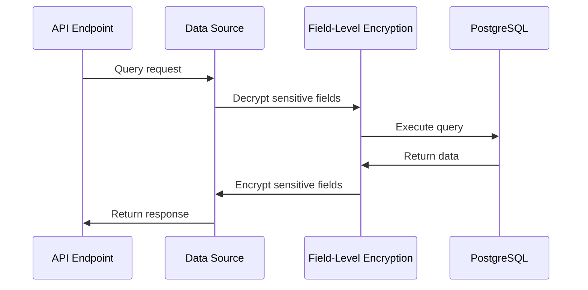

### **Pattern 2: External API Integration with Caching**
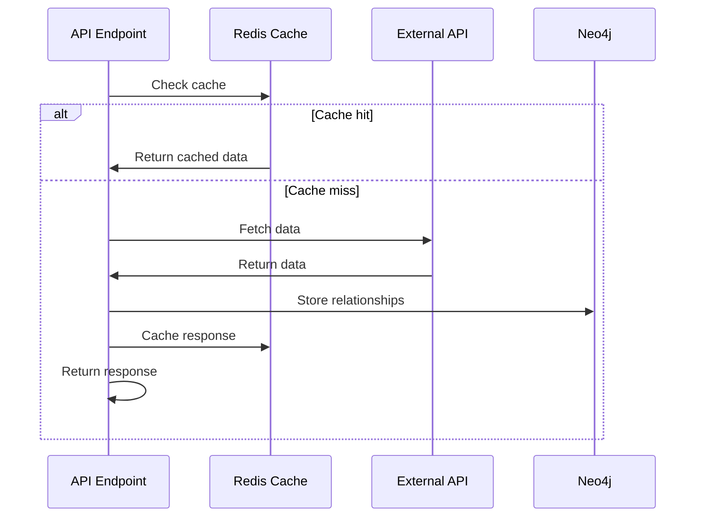

### **Pattern 3: Multi-Source Data Aggregation**
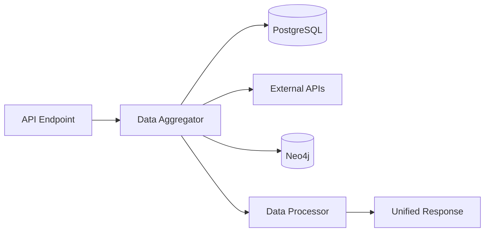

## 📊 Integration Complexity Matrix

| API Endpoint | Data Sources | External APIs | Complexity | Classification |
|--------------|--------------|---------------|------------|----------------|
| **universalIntelligence.js** | 3 | 3 | Very High | Confidential |
| **ecosystem.js** | 2 | 1 | High | Internal |
| **bookkeeping.js** | 2 | 1 | High | Restricted |
| **linkedinRelationshipIntelligence.js** | 2 | 1 | High | Confidential |
| **dashboard.js** | 2 | 0 | Medium | Internal |
| **gmailIntelligence.js** | 2 | 1 | Medium | Confidential |
| **privacy.js** | 1 | 0 | Low | Restricted |
| **security.js** | 1 | 0 | Low | Restricted |

## 🏷️ Data Classification & Security Boundaries

```mermaid
graph TB
    subgraph "RESTRICTED (Financial & Personal Data)"
        direction TB
        PG_R[PostgreSQL<br/>Encrypted Tables]
        BOOK[bookkeeping.js]
        XERO_API[Xero API]
        FINANCE[Financial APIs]
    end

    subgraph "CONFIDENTIAL (AI & Relationships)" 
        direction TB
        NEO4J_C[Neo4j<br/>Knowledge Graph]
        GMAIL_API[Gmail API]
        LINKEDIN_API[LinkedIn API]
        AI_APIS[Intelligence APIs]
    end

    subgraph "INTERNAL (Business Data)"
        direction TB
        PG_I[PostgreSQL<br/>General Tables]
        NOTION_API[Notion API]
        DASH_APIS[Dashboard APIs]
    end

    subgraph "PUBLIC (Health & Status)"
        direction TB
        REDIS_P[Redis<br/>Public Cache]
        HEALTH[Health APIs]
        STATUS[Status APIs]
    end

    %% Connections
    BOOK --> PG_R
    BOOK -.-> XERO_API
    FINANCE --> PG_R
    
    AI_APIS --> NEO4J_C
    AI_APIS -.-> GMAIL_API
    AI_APIS -.-> LINKEDIN_API
    
    DASH_APIS --> PG_I
    DASH_APIS -.-> NOTION_API
    
    HEALTH --> REDIS_P
    STATUS --> REDIS_P

    %% Styling by classification
    classDef restricted fill:#ffebee,stroke:#d32f2f
    classDef confidential fill:#f3e5f5,stroke:#7b1fa2
    classDef internal fill:#e8f5e8,stroke:#388e3c
    classDef public fill:#e3f2fd,stroke:#1976d2

    class PG_R,BOOK,XERO_API,FINANCE restricted
    class NEO4J_C,GMAIL_API,LINKEDIN_API,AI_APIS confidential
    class PG_I,NOTION_API,DASH_APIS internal
    class REDIS_P,HEALTH,STATUS public
```

## 🚀 Integration Performance & Scaling

### **API Response Time Analysis**
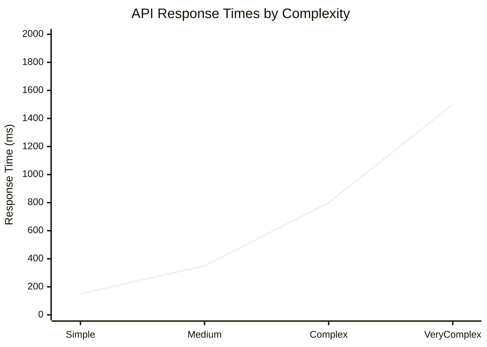

### **External API Rate Limits**
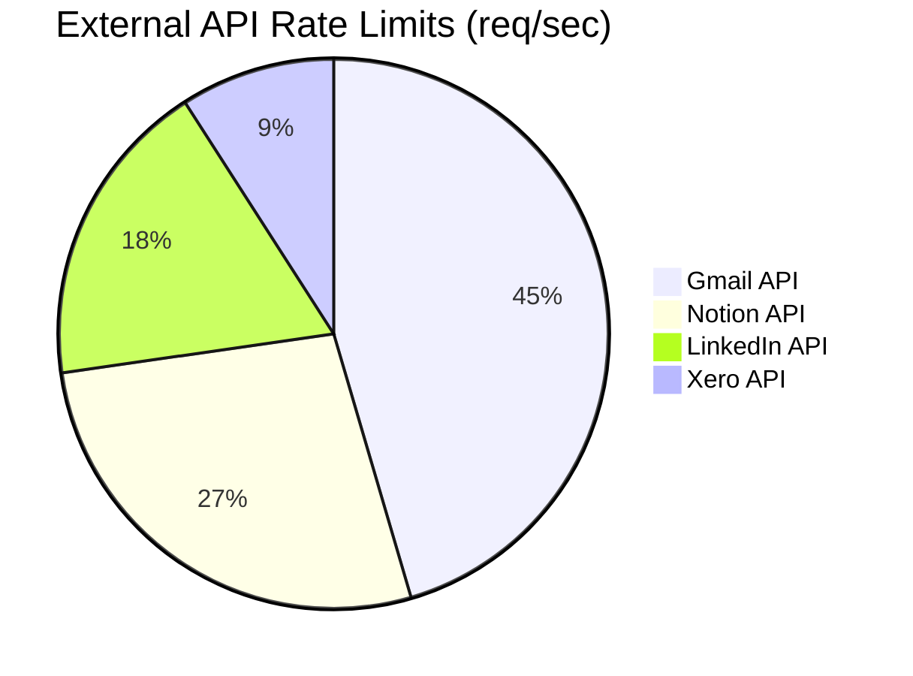

## 🔧 Integration Health Dashboard

### **System Health Overview**
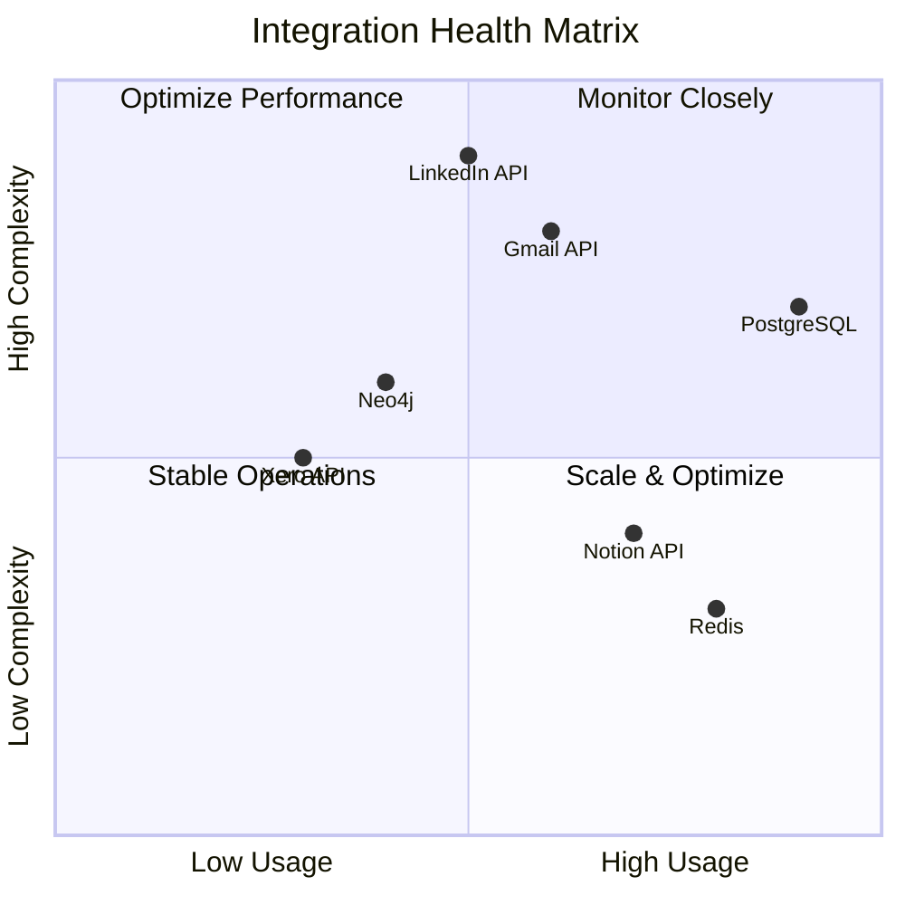

## 📈 Data Volume & Growth Patterns

### **Monthly Data Growth by Source**
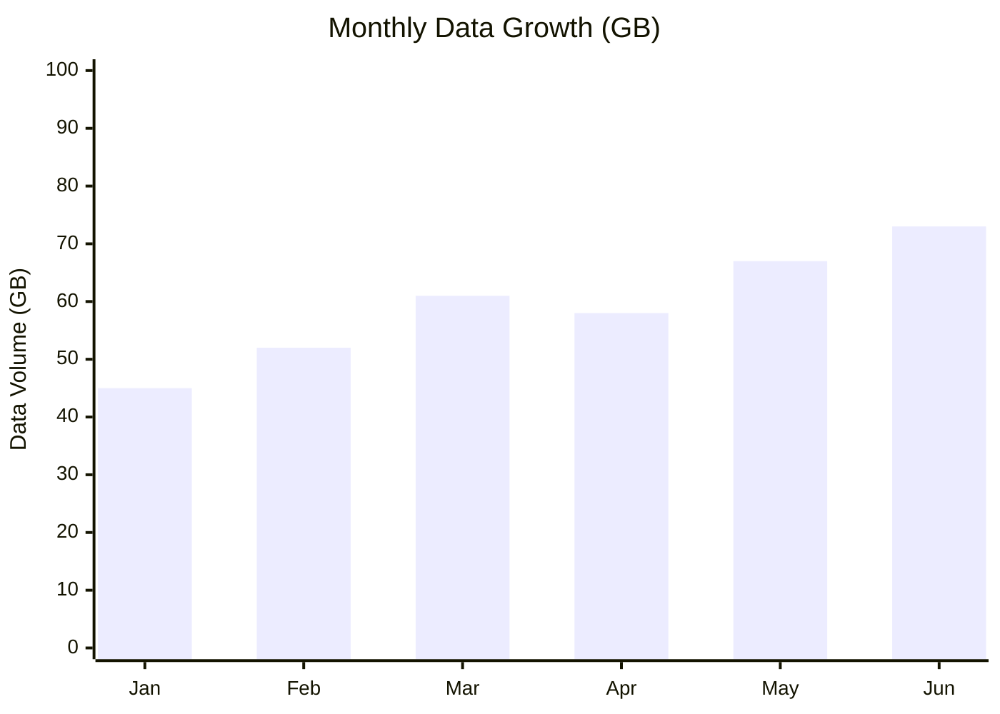

### **API Usage Distribution**
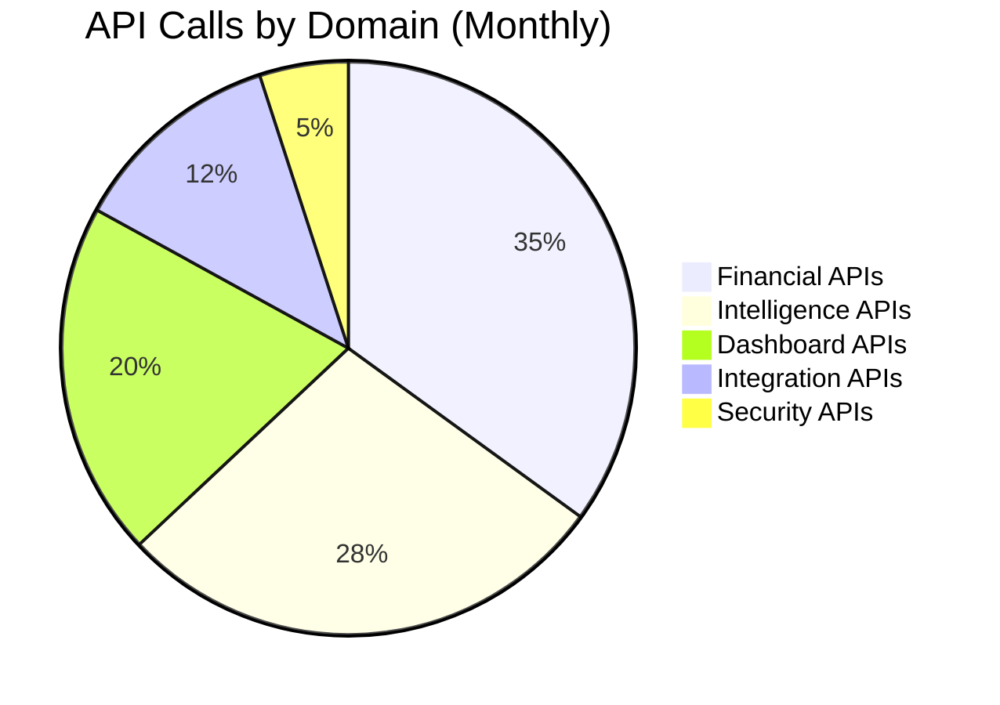

## 🎯 Integration Optimization Opportunities

### **High-Impact Optimizations**
1. **Redis Clustering** → Handle increased intelligence API load
2. **PostgreSQL Read Replicas** → Distribute dashboard query load  
3. **API Gateway** → Centralize rate limiting and monitoring
4. **Background Processing** → Move heavy operations off request path

### **Rate Limit Optimization**
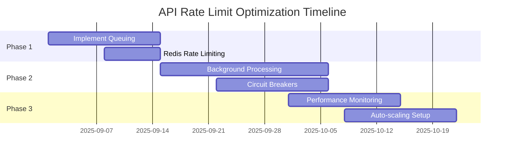

## 📋 Integration Checklist

### **Current State ✅**
- [x] Centralized Integration Registry
- [x] Health Monitoring System
- [x] Field-Level Encryption
- [x] Rate Limit Awareness
- [x] Error Taxonomy
- [x] Multi-layer Caching

### **Optimization Targets 🎯**
- [ ] API Gateway Implementation
- [ ] Enhanced Monitoring Dashboards  
- [ ] Automated Scaling Triggers
- [ ] Cross-Source Data Validation
- [ ] Performance Benchmarking
- [ ] Integration Testing Suite

### **Documentation Targets 📚**
- [ ] Complete OpenAPI Coverage (6/626 currently)
- [ ] Integration Playbooks
- [ ] Troubleshooting Guides
- [ ] Performance Tuning Documentation

This visual integration map provides clear insights into the complex data flows and relationships within the ACT Platform, enabling better understanding, maintenance, and optimization of the system architecture.