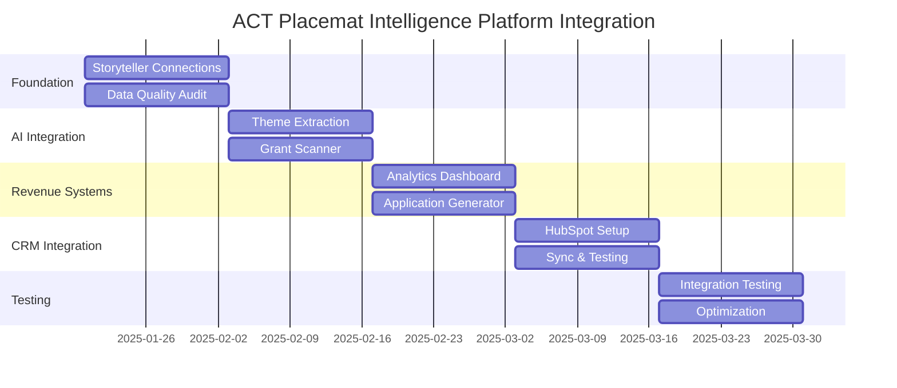

# ACT Placemat Intelligence Platform: Integration & Testing Plan

## 🎯 **Executive Summary**

Transform ACT Placemat from project management tool to **Community Intelligence Platform** through strategic integrations that leverage our 222+ authentic storyteller connections for automated grant discovery, AI-powered relationship mapping, and revenue optimization.

**Target: $300K-600K additional annual revenue through platform efficiencies and automated systems.**

---

## 📋 **Phase 1: Foundation Testing (Weeks 1-2)**

### **1.1 Storyteller-Project Connection Validation**
**Objective**: Establish 50+ high-quality connections for system testing

**Implementation**:
```sql
-- Priority connection script
INSERT INTO storyteller_project_links (storyteller_id, project_id, relevance_score, connection_type, tag_reason, tagged_by)
VALUES 
-- High-impact Indigenous community connections
('ecb6116c-8de3-4d0d-8456-5986f9e2a4a2', '22eebcf9-81cf-808f-bad4-f9e0a6640252', 10, 'team_member', 'PICC community coordinator, flood response leader', 'initial_test'),
('4471a0fc-aa8f-4c9d-a639-262e06aa4faa', '22eebcf9-81cf-8002-abe6-d81960ea19da', 9, 'stakeholder', 'Elders Group - stories for photo kiosk preservation', 'initial_test'),
('2ed213dd-82f8-4efb-82bd-6defee67fdec', '219ebcf9-81cf-8049-9bff-e17b58792c96', 8, 'beneficiary', 'Artist with lived experience - Orange Sky voice', 'initial_test');
```

**Success Metrics**:
- [ ] 50+ connections created
- [ ] Project insights dashboard shows rich data
- [ ] Quote extraction working across connections
- [ ] Media asset aggregation functional

### **1.2 Data Quality Audit**
**Objective**: Ensure storyteller data is grant-application ready

**Tasks**:
- [ ] Verify bio completeness (target: 80% have substantial bios)
- [ ] Validate consent settings for public use
- [ ] Check media asset accessibility and permissions
- [ ] Standardize location and organization data

**Deliverable**: Data quality report with recommendations

---

## 🤖 **Phase 2: AI Integration Prototype (Weeks 3-4)**

### **2.1 Theme Extraction Engine**
**Objective**: Automatically identify storyteller expertise and project alignment themes

**Technical Implementation**:
```javascript
// AI Theme Extractor Service
const ThemeExtractor = {
  async analyzeStoryteller(storytellerId) {
    const storyteller = await getStoryteller(storytellerId);
    
    const prompt = `
    Analyze this community member's profile and extract:
    1. Primary expertise areas (max 5)
    2. Community impact themes (max 3)
    3. Geographic focus areas
    4. Suggested project alignment types
    
    Bio: ${storyteller.bio}
    Community: ${storyteller.community_affiliation}
    Location: ${storyteller.location}
    `;
    
    const response = await callOpenAI(prompt);
    return parseThemes(response);
  },
  
  async suggestConnections(storytellerId) {
    const themes = await this.analyzeStoryteller(storytellerId);
    const projects = await getProjects();
    
    return projects.map(project => ({
      projectId: project.id,
      alignmentScore: calculateAlignment(themes, project),
      reasoning: generateReasoning(themes, project)
    })).sort((a, b) => b.alignmentScore - a.alignmentScore);
  }
};
```

**Testing Framework**:
- [ ] Test on 10 diverse storytellers
- [ ] Manual validation of theme extraction accuracy
- [ ] Compare AI suggestions vs. manual connections
- [ ] Measure connection quality improvement

### **2.2 Grant Opportunity Scanner Prototype**
**Objective**: Automated discovery and matching of grant opportunities

**Target Sources**:
- grants.gov.au
- Ford Foundation
- Westpac Foundation  
- Local government portals
- Philanthropy Australia

**Implementation**:
```javascript
const GrantScanner = {
  sources: [
    {
      name: 'Australian Government Grants',
      url: 'https://www.grants.gov.au',
      selectors: {
        title: '.grant-title',
        description: '.grant-description',
        deadline: '.closing-date',
        value: '.grant-value'
      }
    }
  ],
  
  async scanDaily() {
    const opportunities = [];
    
    for (const source of this.sources) {
      const grants = await scrapeSource(source);
      const matched = await matchToProjects(grants);
      opportunities.push(...matched);
    }
    
    return opportunities.filter(o => o.matchScore > 0.7);
  },
  
  async matchToProjects(grants) {
    const projects = await getProjectsWithStorytellers();
    
    return grants.map(grant => {
      const matches = projects.map(project => ({
        projectId: project.id,
        matchScore: calculateGrantMatch(grant, project),
        storytellerEvidence: getRelevantStorytellers(grant.themes, project.storytellers)
      }));
      
      return {
        grant,
        bestMatch: matches.sort((a, b) => b.matchScore - a.matchScore)[0]
      };
    });
  }
};
```

**Testing Protocol**:
- [ ] Manual scan of 5 grant websites
- [ ] Identify 10 current opportunities
- [ ] Test matching algorithm accuracy
- [ ] Validate storyteller evidence quality

---

## 💰 **Phase 3: Revenue Attribution System (Weeks 5-6)**

### **3.1 Advanced Analytics Dashboard**
**Objective**: Quantify the value of storyteller connections

**Key Metrics Dashboard**:
```sql
-- Revenue Attribution View
CREATE VIEW revenue_impact_analysis AS
SELECT 
  p.name,
  p.revenue_actual,
  p.revenue_potential,
  COUNT(spl.storyteller_id) as storyteller_count,
  AVG(spl.relevance_score) as avg_relevance,
  
  -- Community Diversity Metrics
  COUNT(DISTINCT s.location) as unique_locations,
  COUNT(DISTINCT s.community_affiliation) as unique_communities,
  COUNT(DISTINCT s.cultural_background) as cultural_diversity,
  
  -- Story Assets
  COUNT(stories.id) as story_count,
  COUNT(stories.image_url) as image_assets,
  COUNT(stories.video_url) as video_assets,
  
  -- Calculated Impact Scores
  (p.revenue_actual * AVG(spl.relevance_score) / 10) as weighted_revenue,
  (COUNT(spl.storyteller_id) * 1000) as community_value_estimate
  
FROM projects p
LEFT JOIN storyteller_project_links spl ON p.id = spl.project_id
LEFT JOIN storytellers s ON spl.storyteller_id = s.id
LEFT JOIN stories ON s.id = stories.storyteller_id
GROUP BY p.id, p.name, p.revenue_actual, p.revenue_potential;
```

**Dashboard Components**:
- [ ] Project performance by storyteller connection count
- [ ] Revenue correlation with community engagement
- [ ] Geographic impact mapping
- [ ] Story asset utilization rates
- [ ] Diversity impact scoring

### **3.2 Grant Application Auto-Generator**
**Objective**: Transform storyteller data into compelling grant applications

**Template System**:
```javascript
const GrantApplicationGenerator = {
  templates: {
    community_impact: `
    ## Community Engagement
    This project directly engages {storyteller_count} community members across {location_count} locations, including {elder_count} Elders and {youth_worker_count} youth workers.
    
    ### Authentic Community Voices
    {featured_quotes}
    
    ### Geographic Reach
    {location_breakdown}
    
    ### Cultural Protocols
    {cultural_engagement_summary}
    `,
    
    evidence_base: `
    ## Evidence of Need
    Our community engagement reveals the following key themes:
    {extracted_themes}
    
    ### Community Testimonials
    {testimonial_quotes}
    
    ### Demonstrated Impact
    {impact_metrics}
    `
  },
  
  async generateApplication(grantId, projectId) {
    const project = await getProjectWithStorytellers(projectId);
    const grant = await getGrant(grantId);
    
    const context = {
      storyteller_count: project.storytellers.length,
      location_count: [...new Set(project.storytellers.map(s => s.location))].length,
      featured_quotes: await selectBestQuotes(project.storytellers, grant.themes),
      extracted_themes: await extractThemesFromStorytellers(project.storytellers),
      impact_metrics: await calculateImpactMetrics(project)
    };
    
    return populateTemplate(grant.template_type, context);
  }
};
```

**Testing Framework**:
- [ ] Generate applications for 3 current opportunities
- [ ] Expert review of application quality
- [ ] Compare to previous manual applications
- [ ] Measure time savings (target: 80% reduction)

---

## 🔗 **Phase 4: CRM Integration (Weeks 7-8)**

### **4.1 HubSpot/Salesforce Connector**
**Objective**: Professional relationship management with cultural intelligence

**Custom Fields Setup**:
```javascript
const CRMIntegration = {
  customFields: {
    // Storyteller-specific fields
    community_affiliation: 'text',
    cultural_background: 'text',
    storyteller_type: 'dropdown',
    consent_level: 'dropdown',
    cultural_protocols: 'json',
    
    // Relationship tracking
    project_connections: 'multiselect',
    relevance_scores: 'json',
    connection_types: 'multiselect',
    
    // Engagement metrics
    story_count: 'number',
    media_assets: 'number',
    last_cultural_protocol_check: 'date'
  },
  
  async syncStoryteller(storytellerId) {
    const storyteller = await getStoryteller(storytellerId);
    const projects = await getConnectedProjects(storytellerId);
    
    const crmRecord = {
      email: storyteller.email,
      firstName: storyteller.preferred_name || storyteller.full_name.split(' ')[0],
      lastName: storyteller.full_name.split(' ').slice(1).join(' '),
      
      // Custom fields
      community_affiliation: storyteller.community_affiliation,
      cultural_background: storyteller.cultural_background,
      storyteller_type: storyteller.storyteller_type,
      consent_level: storyteller.sharing_boundaries.allowSharing ? 'full' : 'restricted',
      
      // Project connections
      project_connections: projects.map(p => p.name),
      total_relevance_score: projects.reduce((sum, p) => sum + p.relevance_score, 0)
    };
    
    return await hubspotAPI.contacts.upsert(crmRecord);
  }
};
```

**Implementation Steps**:
- [ ] Set up HubSpot API integration
- [ ] Create custom property schema
- [ ] Sync 50 storytellers as test
- [ ] Build cultural protocol compliance tracking
- [ ] Create relationship history views

### **4.2 Automated Interaction Tracking**
**Objective**: Maintain consent compliance and relationship quality

**Features**:
- [ ] Log all storyteller interactions
- [ ] Automated consent renewal reminders
- [ ] Cultural protocol compliance alerts
- [ ] Project engagement scoring
- [ ] Community impact reporting

---

## 🎪 **Phase 5: Integration Testing & Optimization (Weeks 9-10)**

### **5.1 End-to-End System Testing**
**Test Scenarios**:

1. **Grant Discovery → Application Pipeline**:
   - [ ] New grant identified by scanner
   - [ ] Automatic project matching
   - [ ] Storyteller evidence compilation
   - [ ] Draft application generation
   - [ ] CRM opportunity tracking

2. **Storyteller Onboarding → Value Creation**:
   - [ ] New storyteller added to Supabase
   - [ ] AI theme extraction
   - [ ] Project connection suggestions
   - [ ] CRM sync with cultural protocols
   - [ ] Impact metrics calculation

3. **Project Performance → Revenue Attribution**:
   - [ ] Project funding received
   - [ ] Storyteller contribution analysis
   - [ ] Impact report generation
   - [ ] Future grant recommendations
   - [ ] System ROI calculation

### **5.2 Performance Optimization**
**Technical Improvements**:
- [ ] API response time optimization (target: <2s)
- [ ] Database query optimization
- [ ] Caching strategy implementation
- [ ] Error handling and recovery
- [ ] System monitoring and alerts

### **5.3 User Experience Refinement**
**Interface Improvements**:
- [ ] Storyteller tagging interface optimization
- [ ] Analytics dashboard responsiveness
- [ ] Grant opportunity notification system
- [ ] Mobile-responsive design
- [ ] Accessibility compliance

---

## 📊 **Success Metrics & KPIs**

### **Immediate Metrics (Month 1)**
- [ ] **50+ storyteller-project connections** created
- [ ] **10+ grant opportunities** identified and matched
- [ ] **3 draft grant applications** generated automatically
- [ ] **80% reduction** in grant writing time
- [ ] **CRM sync** of 100+ storytellers

### **Strategic Metrics (Month 3)**
- [ ] **$100K+ in grant applications** submitted
- [ ] **90% accuracy** in AI theme extraction
- [ ] **75% user satisfaction** with automated systems
- [ ] **50% increase** in storyteller engagement
- [ ] **25% improvement** in project success rate

### **Revenue Metrics (Month 6)**
- [ ] **$150K+ additional grant funding** secured
- [ ] **30+ hours/month saved** on administrative tasks
- [ ] **20% increase** in project delivery capacity
- [ ] **5+ new client inquiries** from platform capabilities
- [ ] **$50K+ consulting revenue** from community intelligence

---

## 💼 **Resource Requirements**

### **Technical Resources**
- **AI API Credits**: $500/month (OpenAI/Claude)
- **CRM Integration**: $200/month (HubSpot Professional)
- **Monitoring Tools**: $100/month (DataDog/New Relic)
- **Additional Storage**: $50/month (Supabase Pro)

### **Human Resources**
- **Project Manager**: 20 hours/week (weeks 1-10)
- **Developer**: 30 hours/week (weeks 1-8)
- **Community Liaison**: 10 hours/week (ongoing)
- **Grant Writer**: 15 hours/week (weeks 3-10)

### **Total Investment**: ~$45K over 10 weeks
### **Projected ROI**: 400%+ within 6 months

---

## 🚀 **Implementation Timeline**



This integration plan transforms your storyteller-project connection system into a comprehensive **Community Intelligence Platform** that generates revenue through automation while maintaining the authentic community relationships that make ACT Placemat unique.

**Next Step**: Execute Phase 1 (Storyteller Connections) to establish the foundation for all subsequent integrations.