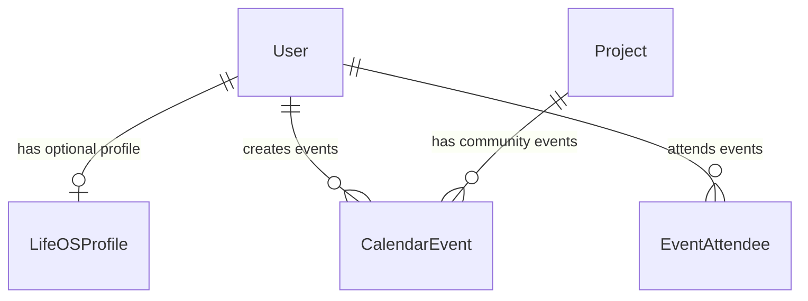
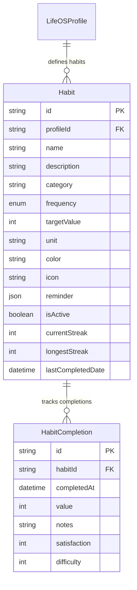
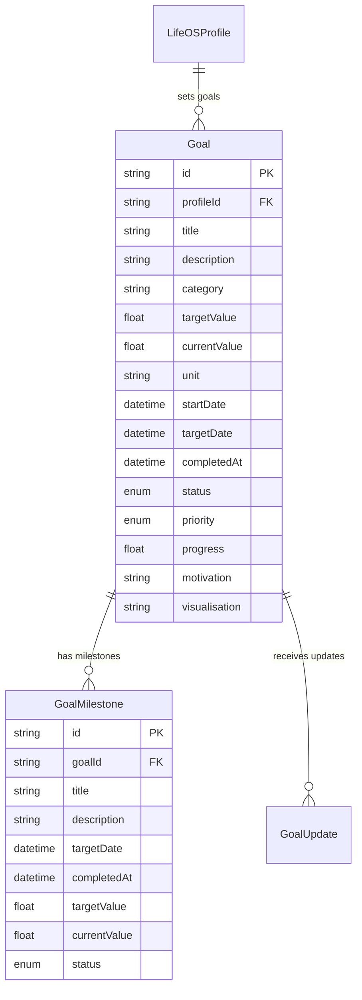
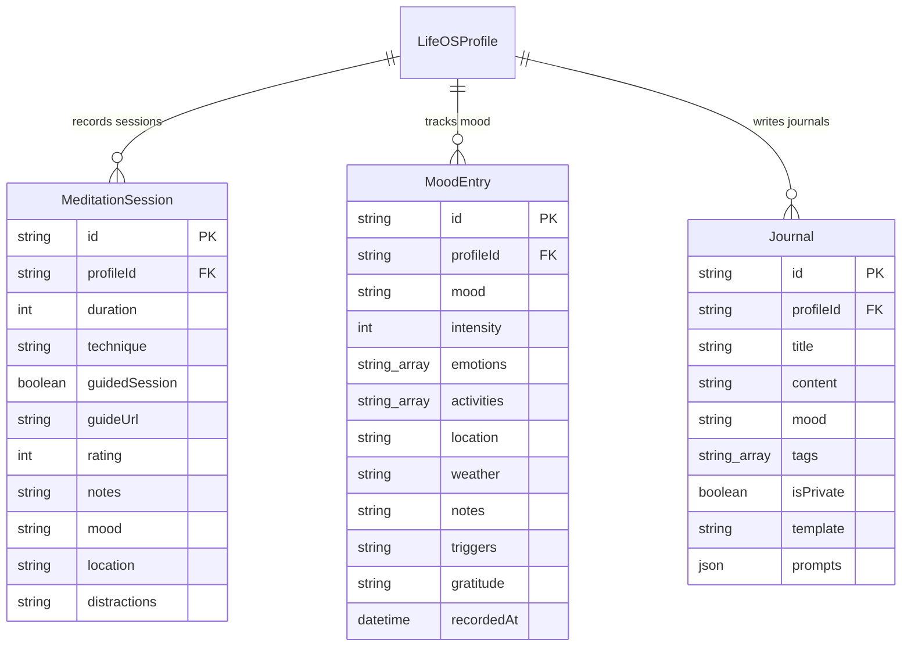
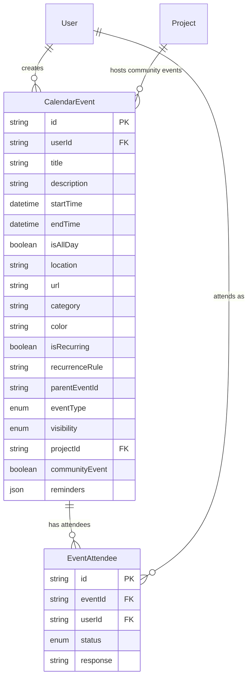
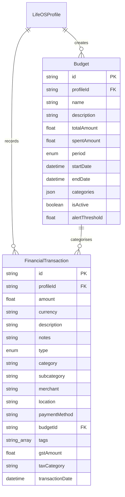

# Life OS Database Schema - Entity-Relationship Diagram

## Overview

The Life OS database schema extends the existing ACT Placemat platform with personal life management capabilities while maintaining compatibility with the community-centered architecture. The design follows Beautiful Obsolescence principles with Australian compliance requirements.

## Core Design Principles

1. **Data Sovereignty**: User data remains under user control with Australian residency preferences
2. **Privacy First**: Default to private/encrypted storage with explicit consent for sharing
3. **Community Integration**: Seamless connection with existing ACT platform features
4. **Beautiful Obsolescence**: Target extractive personal data practices for obsolescence by 2027
5. **Normalization**: Third normal form (3NF) compliance for data integrity

## Schema Architecture

### Core Extensions



### Life OS Profile System

The **LifeOSProfile** extends the existing User model with Life OS specific preferences and settings:

- **Primary Key**: `id` (CUID)
- **Foreign Key**: `userId` → `User.id` (unique, cascade delete)
- **Australian Compliance**: Default timezone (Australia/Sydney), locale (en-AU), currency (AUD)
- **Beautiful Obsolescence**: Tracking flags for extractive systems targeting
- **Privacy**: Granular privacy and notification settings stored as JSONB

### Habit Tracking System



**Key Features**:
- Flexible frequency patterns (daily, weekly, monthly, custom)
- Automatic streak calculation and tracking
- Quality metrics (satisfaction, difficulty ratings)
- Unique constraint on `(habitId, completedAt)` prevents duplicate completions

### Goal Management System



**SMART Goal Attributes**:
- **Specific**: Title, description, category
- **Measurable**: Target/current values with units
- **Achievable**: Priority levels and motivation tracking
- **Relevant**: Category classification and visualisation
- **Time-bound**: Start/target dates with milestone tracking

### Mindfulness and Wellbeing



**Privacy Design**:
- Journals default to private (`isPrivate: true`)
- Mood entries include contextual factors (weather, location, activities)
- Meditation sessions support both guided and self-directed practices

### Calendar and Event Management



**Community Integration**:
- Events can link to Projects for community activities
- Visibility controls (public, private, community-only)
- Support for recurring events with RRULE format
- Australian timezone handling by default

### Financial Management System



**Australian Compliance Features**:
- Default currency: AUD
- GST amount tracking for tax compliance
- Tax category classification (business, personal, deductible)
- Support for Australian financial year reporting

## Data Types and Constraints

### Custom Enums

```sql
-- Habit tracking
CREATE TYPE "HabitFrequency" AS ENUM ('DAILY', 'WEEKLY', 'MONTHLY', 'CUSTOM');

-- Goal management
CREATE TYPE "GoalStatus" AS ENUM ('DRAFT', 'ACTIVE', 'ON_HOLD', 'COMPLETED', 'CANCELLED');
CREATE TYPE "Priority" AS ENUM ('LOW', 'MEDIUM', 'HIGH', 'URGENT');
CREATE TYPE "MilestoneStatus" AS ENUM ('PENDING', 'IN_PROGRESS', 'COMPLETED', 'CANCELLED');

-- Calendar system
CREATE TYPE "EventType" AS ENUM ('PERSONAL', 'WORK', 'COMMUNITY', 'HEALTH', 'EDUCATION', 'SOCIAL');
CREATE TYPE "AttendeeStatus" AS ENUM ('PENDING', 'ACCEPTED', 'DECLINED', 'TENTATIVE');

-- Financial system
CREATE TYPE "TransactionType" AS ENUM ('INCOME', 'EXPENSE', 'TRANSFER', 'INVESTMENT');
CREATE TYPE "BudgetPeriod" AS ENUM ('WEEKLY', 'MONTHLY', 'QUARTERLY', 'YEARLY', 'CUSTOM');
```

### JSONB Fields

1. **LifeOSProfile.notificationSettings**:
   ```json
   {
     "email": { "habits": true, "goals": true, "calendar": true },
     "push": { "meditation": false, "budget": true },
     "frequency": "daily"
   }
   ```

2. **LifeOSProfile.privacySettings**:
   ```json
   {
     "dataSharing": "minimal",
     "analyticsOptOut": true,
     "communityVisibility": "friends",
     "exportEnabled": true
   }
   ```

3. **CalendarEvent.reminders**:
   ```json
   [
     { "type": "email", "minutesBefore": 60 },
     { "type": "push", "minutesBefore": 15 }
   ]
   ```

4. **Budget.categories**:
   ```json
   [
     { "name": "Groceries", "allocated": 800, "spent": 650 },
     { "name": "Transport", "allocated": 400, "spent": 320 }
   ]
   ```

## Performance Indexes

### Primary Performance Indexes
```sql
-- Habit tracking performance
CREATE INDEX "idx_habits_profile_active" ON "habits"("profileId", "isActive");
CREATE INDEX "idx_habit_completions_habit_date" ON "habit_completions"("habitId", "completedAt" DESC);

-- Goal management performance
CREATE INDEX "idx_goals_profile_status" ON "goals"("profileId", "status");
CREATE INDEX "idx_goal_milestones_goal_status" ON "goal_milestones"("goalId", "status");

-- Mindfulness tracking
CREATE INDEX "idx_meditation_sessions_profile_date" ON "meditation_sessions"("profileId", "createdAt" DESC);
CREATE INDEX "idx_mood_entries_profile_recorded" ON "mood_entries"("profileId", "recordedAt" DESC);

-- Calendar performance
CREATE INDEX "idx_calendar_events_user_start" ON "calendar_events"("userId", "startTime");
CREATE INDEX "idx_calendar_events_project_start" ON "calendar_events"("projectId", "startTime");

-- Financial performance
CREATE INDEX "idx_financial_transactions_profile_date" ON "financial_transactions"("profileId", "transactionDate" DESC);
CREATE INDEX "idx_financial_transactions_category" ON "financial_transactions"("category", "type");
```

### Australian Compliance Indexes
```sql
CREATE INDEX "idx_financial_transactions_tax" ON "financial_transactions"("taxCategory", "gstAmount");
CREATE INDEX "idx_life_os_profiles_residency" ON "life_os_profiles"("dataResidencyPreference", "currency");
```

### Beautiful Obsolescence Tracking
```sql
CREATE INDEX "idx_life_os_profiles_community_control" ON "life_os_profiles"("communityControlEnabled", "extractiveSystemsTargeting");
```

## Data Integrity Rules

### Referential Integrity
- All foreign keys use CASCADE DELETE for user-owned data
- Project relations use SET NULL to preserve historical data
- Unique constraints prevent duplicate habit completions and event attendance

### Business Logic Constraints
- Progress values: 0-100 percentage range
- Rating scales: 1-5 for meditation quality, 1-10 for mood intensity
- Currency amounts: Support for decimal precision with Australian GST calculations
- Streak tracking: Automatic calculation based on completion patterns

### Data Validation
- Australian timezone validation (default: Australia/Sydney)
- Currency code validation (default: AUD)
- Email format validation for user accounts
- RRULE format validation for recurring events

## Security and Privacy

### Row Level Security (RLS)
While not implemented in this initial schema, RLS policies should be applied to ensure:
- Users can only access their own Life OS data
- Community event visibility respects project permissions
- Financial data remains strictly private to the user

### Data Encryption
- Sensitive fields (journal content, financial data) should be encrypted at rest
- JSONB fields containing personal preferences encrypted
- Australian data residency compliance maintained

### Audit Trail
- All tables include `createdAt` and `updatedAt` timestamps
- Financial transactions include immutable transaction dates
- Goal and habit progress changes are logged through update records

## Integration Points

### Existing ACT Platform
- **User Model**: Extended with Life OS profile relationship
- **Project Model**: Enhanced with calendar event support
- **Community Features**: Calendar events can be community-focused
- **Media System**: Profile pictures and goal visualisations use existing media management

### External Integrations
- **Calendar Sync**: RRULE support for external calendar integration
- **Financial APIs**: Australian bank integration via Open Banking
- **Health Platforms**: Meditation and mood data export capabilities
- **Community Platforms**: Event sharing with existing ACT community features

## Beautiful Obsolescence Alignment

### Extractive System Replacement
1. **Personal Data Mining**: Local-first storage with user-controlled export
2. **Attention Economy**: Mindfulness tracking promotes conscious technology use
3. **Financial Surveillance**: Private budgeting without external tracking
4. **Social Pressure Metrics**: Community-positive goal sharing without comparison metrics

### Community Control Features
1. **Data Portability**: Full data export in standard formats
2. **Open Source Compatibility**: Schema supports self-hosted deployments
3. **Australian Sovereignty**: Data residency controls and local currency defaults
4. **Transparent Analytics**: User-controlled sharing of anonymised insights

This schema provides a solid foundation for the Life OS platform while maintaining the collaborative, community-focused values of the broader ACT ecosystem.